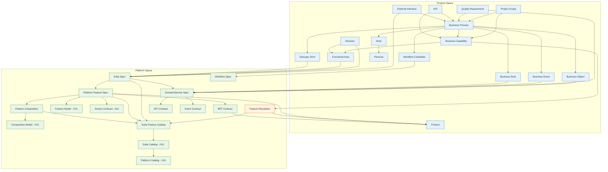

# Artifact Flow Graph

> Every artifact must flow into at least one other artifact. An artifact that flows nowhere is unnecessary.
> Every edge must state WHY the input is needed — what becomes incomplete without it.

---

## 1. Flow Diagram

---

## 2. Edge Definitions — Why Each Input Is Needed

### Product-Internal Edges

| From | To | Purpose of Input | Without It |
|------|-----|-----------------|-----------|
| Project Scope | Business Process | Processes are scoped by the project's goals and boundaries. Scope determines which processes are in/out. | Processes lack boundary — no way to decide if a process belongs to this product. |
| Project Scope | Business Capability | Capabilities are derived from what the project aims to achieve (goals → what the business must be able to do). | Capabilities are ungrounded — no link to business justification. |
| Business Process | Actor | Each process step names the actor who performs it (lanes in BPMN). Actors are discovered through processes. | Steps have no performer — BPMN has empty lanes. |
| Business Process | Business Object | Process steps declare which objects they read and write (data flow). Objects are discovered through step I/O analysis. | No data flow — steps are opaque boxes with unknown inputs/outputs. |
| Business Process | Business Event | Processes trigger and produce events. Events chain processes together (one process's output event triggers another). | Process chains are invisible — no way to see how processes connect. |
| Business Process | Business Rule | Process steps are constrained by rules (e.g., "student must be ≥17"). Rules are discovered by asking "what constraints apply here?" | Steps have no constraints — validation rules are missing from the spec. |
| Business Process | Glossary Term | Processes use domain vocabulary. Terms are discovered when ambiguity arises ("what do you mean by 'Anmeldung'?"). | Business vocabulary is implicit — same word may mean different things in different contexts. |
| Business Process | Business Capability | Processes fulfill capabilities. A capability ("Enroll Students") is exercised by one or more processes. | Capabilities are abstract claims with no evidence of how they're actually performed. |
| Business Process | Workflow Candidate | During process analysis, patterns emerge that are better handled as technical workflows (batch, saga, scheduled). | Technical workflow needs go undetected — everything is forced into BPMN even when inappropriate. |
| Actor | Persona | Personas are enriched actors — they add UX context (IAM roles, frequency, comfort, pain points) to business roles. | Product has roles but no UX understanding — can't design appropriate UI. |
| Business Capability | Functional Area | Capabilities cluster into functional areas based on shared vocabulary and actor overlap. | No structure — capabilities are a flat list with no organization principle. |
| Business Capability | Feature Resolution | Capabilities are the product's input to the Platform: "I need the capability to do X." The Platform resolves this into features. | **THE bridge is broken** — Product cannot express its needs to the Platform. |
| Quality Requirement | Business Process | QRs apply to specific processes or areas ("booking must respond in <2s"). | NFRs are floating — not tied to what they constrain. |
| KPI | Business Process / Capability | KPIs measure specific processes or capabilities ("pass rate per quarter"). | Success metrics exist but aren't linked to what they measure — unverifiable. |
| External Interface | Business Process | Interfaces are referenced by process steps that interact with external systems. | Process steps reference undefined external systems. |
| Decision | Functional Area / Process | Decisions affect area boundaries and process structure ("we decided to split education into theory and practice"). | Structural choices are undocumented — future teams don't know why the model looks this way. |

### Product → Platform Edges (The Bridge)

| From | To | Purpose of Input | Without It |
|------|-----|-----------------|-----------|
| Business Capability | Feature Resolution | Product declares which capabilities it requires. Platform resolves these against the Feature Catalog. | Platform doesn't know what the product needs — cannot propose features. |
| Feature Resolution | Suite Feature Catalog | Resolution matches capabilities against the catalog's available features. | Resolution has nothing to match against — capability mapping impossible. |
| Feature Resolution | Product | Resolution returns: matched features, partial matches, gaps. Product PO confirms/overrides. | Product doesn't know which platform-features fulfill its needs. |
| Functional Area | Suite Spec | Functional Areas from the product map to Suites in the platform. Areas sharing vocabulary become one suite. | Suite boundaries have no business justification — they're arbitrary technical groupings. |
| Glossary Term | Suite Spec | Product glossary terms feed into the Suite's Ubiquitous Language (UBL). The UBL IS the suite boundary. | Suite has no vocabulary — the defining characteristic of a suite is missing. |
| Business Object | Domain/Service Spec | Business objects become aggregate candidates in the domain model. Object attributes → entity attributes. Lifecycle states → aggregate state machine. | Domain model has no business grounding — aggregates are invented by developers, not derived from business reality. |
| Business Event | Domain/Service Spec | Business events become domain events. "Student angemeldet" → `enrollment.student.enrolled` event with routing key and payload. | Domain events are technical inventions, not reflections of what actually happens in the business. |
| Business Rule | Domain/Service Spec | Business rules become service-level business rules with enforcement strategy and error codes. | Services have no business constraints — validation is ad-hoc, not specification-driven. |
| Quality Requirement | Domain/Service Spec | Quality requirements become service-level NFRs (performance targets, availability SLAs, compliance requirements). | Services have no quality targets — performance and availability are undefined. |
| External Interface | Suite Spec | Product's external interfaces become the suite's external interface definitions (outbound/inbound to other suites or systems). | Suite doesn't know what external systems it must integrate with. |
| Decision | Suite Spec | Product-level decisions trace to suite-level ADRs. "We split education into theory and practice" → suite boundary decision. | Architecture decisions lack business traceability — no one knows why the suite is structured this way. |
| Workflow Candidate | Workflow Spec | Candidates flagged during discovery (batch, saga, scheduled patterns) become formal Workflow Specs with steps, compensation, retry policies. | Technical workflows are specified without business context — architects don't know why this workflow exists. |

### Platform-Internal Edges

| From | To | Purpose of Input | Without It |
|------|-----|-----------------|-----------|
| Suite Spec | Domain/Service Spec | Suite defines the vocabulary boundary and service landscape. Each domain/service belongs to exactly one suite. | Services exist without organizational context — no suite structure, no UBL alignment. |
| Suite Spec | Platform-Feature Spec | Features are owned by suites. The suite's UBL determines which features belong here. | Features have no owner — no way to enforce "mutations stay within suite." |
| Suite Spec | Suite Feature Catalog | The catalog lists all features available in this suite — it's the "shelf" the Product selects from. | No catalog → Product has nothing to select from. |
| Domain/Service Spec | API Contract (OpenAPI) | The service spec's contract section (endpoints, request/response, auth) produces the OpenAPI spec. | No formal API contract — frontend and backend diverge. |
| Domain/Service Spec | Event Contract (AsyncAPI) | The service spec's event section (outbound/inbound events, routing keys, payloads) produces the event contract. | No formal event contract — consumers and producers disagree on event structure. |
| Platform-Feature Spec | Feature Model (UVL) | The feature spec's §8 (dependencies, variability points) produces the UVL declaration. Cross-suite reads from §5 become `requires` constraints. | Feature variability is informal — no machine-readable model, UVL validation impossible. |
| Platform-Feature Spec | Screen Contract (AUI) | Feature spec's §2 (journey) → task operators, §3 (fields/actions) → zones, §4 (edge cases) → absent-rules. AUI IS the UI dimension of the feature. | Feature has no UI specification — frontend developers invent the screen layout. |
| Platform-Feature Spec | BFF Contract | Feature spec's §5 (backend deps) → aggregated service calls, §5.2 (view-model shape) → BFF response structure. BFF Contract IS the backend integration dimension of the feature. | Frontend calls backend services directly without aggregation — no view-model contract, tight coupling. |
| Platform-Feature Spec | Feature Composition | Features are grouped into capability hierarchies (composition nodes). The composition defines variability structure (mandatory/optional/alternative/or groups). | Features are a flat list — no hierarchical organization, no variability structure. |
| Feature Composition | Composition Model (UVL) | The composition spec's children and group types produce the UVL tree structure. | Variability structure is prose — not machine-validatable. |
| Platform-Feature + Composition | Suite Feature Catalog | All features and compositions are listed in the catalog — the complete "shelf" for this suite. | No central registry of what the suite offers. |
| Suite Feature Catalog | Suite Catalog (UVL) | The catalog's feature tree produces the suite root UVL file that imports all composition nodes and leaves. | No machine-readable suite root — UVL tooling can't validate product configs against the suite. |
| Suite Catalog (UVL) | Platform Catalog (UVL) | All suite catalogs are imported into the platform root. This is the top of the variability tree. | No platform-wide validation — cross-suite constraints can't be checked. |
| Platform-Feature | Product | Product selects platform-features (via Feature Resolution). This closes the loop between the two spaces. | Product can express needs but can't receive concrete features from the platform. |
| BFF Contract | Product | Product's BFF Configuration is derived from the BFF Contracts of selected features. | Product has no BFF config — frontend can't talk to backend through the BFF. |

---

## 3. Validation

| Check | Result |
|-------|--------|
| Every artifact flows into at least one other | ✅ All 30 artifacts have outgoing edges |
| Every edge has a stated purpose | ✅ All edges explain why the input is needed |
| Every edge explains what breaks without it | ✅ All edges state the consequence of missing the input |
| No circular dependencies between spaces | ✅ Product → Platform → Product is the intended loop (via Feature Resolution) |
