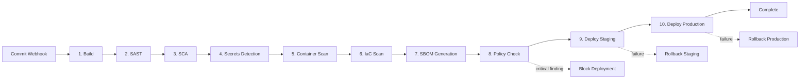
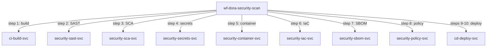

<!-- Template Meta
     Template-ID:   TPL-WF
     Version:       1.0.0
     Last Updated:  2026-04-03
     Changelog:
       1.0.0 (2026-04-03) — Initial versioned baseline.
-->

# wf-dora-security-scan --- Security Scan Pipeline

> **Conceptual Stack Layer:** Workflow Spec
> **Space:** Platform
> **Owner:** Platform Security Team
> **Source:** Operational DevSecOps Workflow
> **References:** GOV-DORA-004, GOV-DORA-005

> **Meta Information**
> - **Version:** 2026-04-15
> - **Template:** `workflow-spec.md` v1.0.0
> - **Template Compliance:** 100% — fully compliant
> - **Author(s):** Platform Security Team
> - **Status:** PROPOSED
> - **Workflow ID:** `wf-dora-security-scan`
> - **Suite:** `platform`
> - **Type:** orchestration
> - **Companion ADRs:** `ADR-WF-DORA-001`

> **What this document is**
> A Workflow Spec describes a **process that does not fit BPMN** --- it has no
> interactive actors, no human decisions, and no user-facing screens. Instead,
> it is a scheduled, event-driven, or API-triggered sequence of steps executed
> by backend services, typically orchestrated by Temporal.
>
> **Heuristic:**
> - Actors + decisions + interactions --> BPMN --> Elara (Business Process)
> - Scheduled + step-based + retry-aware --> Temporal --> Telos (Workflow Spec)

---

<!-- ============================================================
     SS0 --- WORKFLOW IDENTITY
     ============================================================ -->

## SS0. Workflow Identity

### 0.1 Purpose

This workflow enforces a comprehensive security scan pipeline on every code commit, ensuring that no code reaches production without passing static analysis, dependency checks, secrets detection, container scanning, infrastructure-as-code validation, SBOM generation, and policy compliance. It guarantees that critical security findings block deployment, maintaining DORA compliance for ICT risk management (Art. 9).

### 0.2 Workflow Type

**Type:** orchestration

**Rationale for type choice:**

Orchestration was chosen because the pipeline steps execute in a defined sequence with a central coordinator (CI/CD engine). Each step depends on the output of the previous step, and a single critical finding at any stage must halt the entire pipeline. There is no need for saga-style compensation since the pipeline is a gate, not a set of distributed mutations.

### 0.3 Trigger

| Trigger type | Detail | Conditions |
|---|---|---|
| event | Code commit (webhook event from SCM) | All branches targeting `main`, `release/*`, or `hotfix/*` |

### 0.4 SLA & Expectations

| Metric | Target |
|---|---|
| Expected duration | < 10 minutes for standard commits |
| Maximum duration (before alert) | 15 minutes |
| Expected throughput | 100 pipeline runs/hour |
| Acceptable failure rate | < 1% (infrastructure failures; security findings are expected gates) |

---

<!-- ============================================================
     SS1 --- STEPS
     ============================================================ -->

## SS1. Steps

| Step | Name | Action | Service | Endpoint / Event | Compensation | Retry | Timeout | Condition |
|---|---|---|---|---|---|---|---|---|
| 1 | Build | Compile and package application artifacts | `ci-build-svc` | `POST /api/platform/ci/v1/builds` | none | default | 120s | |
| 2 | SAST | Run static application security testing (SonarQube/Semgrep) | `security-sast-svc` | `POST /api/platform/security/v1/sast/scans` | none | default | 120s | |
| 3 | SCA | Run software composition analysis (Snyk/Dependabot) | `security-sca-svc` | `POST /api/platform/security/v1/sca/scans` | none | default | 120s | |
| 4 | Secrets Detection | Scan for leaked secrets (gitleaks) | `security-secrets-svc` | `POST /api/platform/security/v1/secrets/scans` | none | default | 60s | |
| 5 | Container Scan | Scan container images for vulnerabilities (Trivy) | `security-container-svc` | `POST /api/platform/security/v1/container/scans` | none | default | 120s | Build produces container image |
| 6 | IaC Scan | Validate infrastructure-as-code (Checkov) | `security-iac-svc` | `POST /api/platform/security/v1/iac/scans` | none | default | 60s | IaC files present in changeset |
| 7 | SBOM Generation | Generate software bill of materials (CycloneDX) | `security-sbom-svc` | `POST /api/platform/security/v1/sbom/generate` | none | default | 60s | |
| 8 | Policy Check | Evaluate security policy compliance (OPA/Conftest) | `security-policy-svc` | `POST /api/platform/security/v1/policy/evaluate` | Block deployment | default | 30s | |
| 9 | Deploy to Staging | Deploy verified artifacts to staging environment | `cd-deploy-svc` | `POST /api/platform/cd/v1/deployments` | Rollback staging deployment | default | 300s | All scans passed |
| 10 | Deploy to Production | Deploy verified artifacts to production environment | `cd-deploy-svc` | `POST /api/platform/cd/v1/deployments` | Rollback production deployment | default | 300s | Staging deployment healthy |

### 1.1 Step Flow Diagram

### 1.2 Step Details

#### Step 8: Policy Check

**Input:** `{ "pipelineId": "string", "scanResults": { "sast": "object", "sca": "object", "secrets": "object", "container": "object", "iac": "object" }, "sbom": "object" }`
**Output:** `{ "policyResult": "PASS|FAIL", "violations": [{ "rule": "string", "severity": "string", "detail": "string" }] }`
**Side effects:** Pipeline blocked if any critical violation detected; findings recorded in compliance audit log.

| Error | Retryable? | Action |
|---|---|---|
| 503 Service Unavailable | Yes | Retry with backoff |
| Policy FAIL (critical finding) | No | Block deployment, notify security team |

---

<!-- ============================================================
     SS2 --- RETRY & COMPENSATION STRATEGY
     ============================================================ -->

## SS2. Retry & Compensation Strategy

### 2.1 Workflow-Level Retry Policy

| Parameter | Value | Rationale |
|---|---|---|
| Max attempts | 3 | Balance between resilience and pipeline speed |
| Initial backoff | 2s | Allow transient issues to resolve |
| Backoff multiplier | 2.0 | Exponential backoff |
| Max backoff interval | 30s | Cap to stay within SLA |
| Non-retryable errors | 400, 404, 422, policy violation | Client errors and policy failures should not be retried |

### 2.2 Compensation Strategy

**Strategy:** forward_recovery

**Rationale:** The pipeline is a gate --- steps 1-8 are read-only scans that produce no mutations requiring rollback. Steps 9-10 (deployments) use rollback as compensation if they fail after being initiated.

| Failed at step | Compensate step | Compensation action | Idempotent? |
|---|---|---|---|
| 9 | 9 | Rollback staging deployment via `POST /api/platform/cd/v1/deployments/{id}/rollback` | Yes |
| 10 | 10 | Rollback production deployment via `POST /api/platform/cd/v1/deployments/{id}/rollback` | Yes |

### 2.3 Dead Letter & Manual Intervention

| Field | Value |
|---|---|
| Dead letter destination | `wf-dora-security-scan.dead-letter` queue |
| Notification | Alert to #security-pipeline Slack channel + PagerDuty |
| Manual resolution | Operator can retry pipeline, skip non-critical scan, or force-block via admin API |
| Resolution SLA | Within 2 business hours |

---

<!-- ============================================================
     SS3 --- REFERENCED SERVICES
     ============================================================ -->

## SS3. Referenced Services

| Service ID | Service Name | Suite | Tier | Role | Endpoints Used | Events Consumed / Produced |
|---|---|---|---|---|---|---|
| `ci-build-svc` | CI Build Service | platform | T3 | producer | POST /builds | Produces: platform.ci.build.completed |
| `security-sast-svc` | SAST Scanner | platform | T2 | producer | POST /sast/scans | Produces: platform.security.sast.completed |
| `security-sca-svc` | SCA Scanner | platform | T2 | producer | POST /sca/scans | Produces: platform.security.sca.completed |
| `security-secrets-svc` | Secrets Detector | platform | T2 | producer | POST /secrets/scans | Produces: platform.security.secrets.completed |
| `security-container-svc` | Container Scanner | platform | T2 | producer | POST /container/scans | Produces: platform.security.container.completed |
| `security-iac-svc` | IaC Scanner | platform | T2 | producer | POST /iac/scans | Produces: platform.security.iac.completed |
| `security-sbom-svc` | SBOM Generator | platform | T2 | producer | POST /sbom/generate | Produces: platform.security.sbom.generated |
| `security-policy-svc` | Policy Engine | platform | T3 | producer | POST /policy/evaluate | Produces: platform.security.policy.evaluated |
| `cd-deploy-svc` | CD Deployment Service | platform | T3 | producer | POST /deployments, POST /deployments/{id}/rollback | Produces: platform.cd.deployment.completed |

### 3.1 Service Dependency Diagram

### 3.2 Cross-Suite Interactions

| From suite | To suite | Interaction | Consistency model |
|---|---|---|---|
| platform | platform | All interactions are within the platform suite | Sequential pipeline |

---

<!-- ============================================================
     SS4 --- OBSERVABILITY
     ============================================================ -->

## SS4. Observability

### 4.1 Metrics

| Metric name | Type | Description | Labels |
|---|---|---|---|
| `wf_dora_security_scan_started_total` | counter | Pipeline instances started | `trigger_type`, `branch` |
| `wf_dora_security_scan_failed_total` | counter | Instances failed (after all retries) | `trigger_type`, `failed_step` |
| `wf_dora_security_scan_blocked_total` | counter | Deployments blocked by security findings | `finding_severity`, `scan_type` |
| `wf_dora_security_scan_duration_seconds` | histogram | End-to-end pipeline duration | `trigger_type`, `outcome` |
| `wf_dora_security_scan_findings_total` | counter | Security findings detected | `scan_type`, `severity` |

### 4.2 Alerts

| Alert name | Condition | Severity | Response |
|---|---|---|---|
| `wf_dora_security_scan_failure_rate_high` | > 5% infrastructure failure rate in 1h window | critical | Check dead letter queue, investigate failing scan services |
| `wf_dora_security_scan_duration_exceeded` | p99 duration > 15 minutes | warning | Check service latencies, review step timeouts |
| `wf_dora_security_scan_critical_findings` | Critical finding detected | warning | Review finding, assess deployment impact |

### 4.3 Logging & Tracing

| Field | Value |
|---|---|
| Correlation ID | `wf-dora-security-scan-{instanceId}` |
| Trace propagation | W3C TraceContext via Temporal headers |
| Log level | INFO for start/complete, WARN for non-critical findings, ERROR for critical findings and failures |

---

<!-- ============================================================
     SS5 --- ELARA CROSS-REFERENCE
     ============================================================ -->

## SS5. Elara Cross-Reference

### 5.1 Originating Business Process

| Field | Value |
|---|---|
| Elara Process ID | N/A |
| Process name | N/A |
| Process step(s) | N/A |
| Workflow Candidate ID | N/A |
| Rationale for extraction | No Elara origin --- operational DevSecOps workflow |

### 5.2 Divergence from BPMN

No Elara origin --- operational DevSecOps workflow. This workflow is a purely technical CI/CD security pipeline with no corresponding business process model.

### 5.3 Hybrid Process Boundaries

Not applicable --- no BPMN handoff points.

---

<!-- ============================================================
     SS6 --- DECISIONS & CHANGE LOG
     ============================================================ -->

## SS6. Decisions & Change Log

### 6.1 Architecture Decision Records

#### ADR-WF-DORA-001: Sequential Pipeline over Parallel Scans

**Context:** Security scans (SAST, SCA, secrets, container, IaC) could run in parallel to reduce pipeline duration.
**Decision:** Run scans sequentially in the initial implementation.
**Rationale:** Sequential execution simplifies failure handling and provides deterministic ordering of findings. Parallel execution can be introduced as an optimization once the pipeline is stable.
**Alternatives considered:**
- Parallel scan execution: Rejected initially due to complexity in aggregating findings from concurrent steps.
**Consequences:** Pipeline duration is longer than theoretically possible but easier to debug and maintain.

### 6.2 Open Questions

| ID | Question | Impact | Owner | Needed by |
|---|---|---|---|---|
| Q-001 | Should SAST/SCA/secrets scans run in parallel to reduce pipeline time? | Pipeline duration vs. complexity | Platform Security Team | 2026-Q3 |
| Q-002 | Should non-critical findings create warnings but allow deployment? | Developer velocity vs. security posture | Platform Security Team | 2026-Q2 |

### 6.3 Change Log

| Date | Version | Author | Changes |
|------|---------|--------|---------|
| 2026-04-15 | 1.0 | Platform Security Team | Initial workflow specification |

---

## Review & Approval

**Status:** PROPOSED

**Reviewers:**
- Suite Architect: --- pending
- Platform Engineer: --- pending
- DevOps Lead: --- pending

**Approval:**
- Suite Architect: --- pending --- [ ] Approved
- Platform Engineer: --- pending --- [ ] Approved
- DevOps Lead: --- pending --- [ ] Approved
