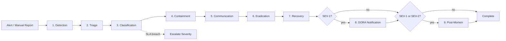
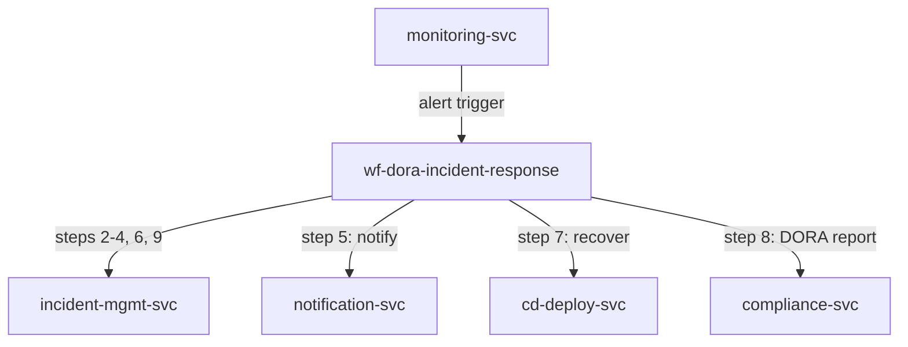

<!-- Template Meta
     Template-ID:   TPL-WF
     Version:       1.0.0
     Last Updated:  2026-04-03
     Changelog:
       1.0.0 (2026-04-03) — Initial versioned baseline.
-->

# wf-dora-incident-response --- Incident Response Workflow

> **Conceptual Stack Layer:** Workflow Spec
> **Space:** Platform
> **Owner:** Platform Reliability Team
> **Source:** Operational Incident Management Workflow
> **References:** GOV-DORA-003, TPL-IRS, TPL-SLO

> **Meta Information**
> - **Version:** 2026-04-15
> - **Template:** `workflow-spec.md` v1.0.0
> - **Template Compliance:** 100% — fully compliant
> - **Author(s):** Platform Reliability Team
> - **Status:** PROPOSED
> - **Workflow ID:** `wf-dora-incident-response`
> - **Suite:** `platform`
> - **Type:** orchestration
> - **Companion ADRs:** `ADR-WF-DORA-002`

> **What this document is**
> A Workflow Spec describes a **process that does not fit BPMN** --- it has no
> interactive actors, no human decisions, and no user-facing screens. Instead,
> it is a scheduled, event-driven, or API-triggered sequence of steps executed
> by backend services, typically orchestrated by Temporal.
>
> **Heuristic:**
> - Actors + decisions + interactions --> BPMN --> Elara (Business Process)
> - Scheduled + step-based + retry-aware --> Temporal --> Telos (Workflow Spec)

---

<!-- ============================================================
     SS0 --- WORKFLOW IDENTITY
     ============================================================ -->

## SS0. Workflow Identity

### 0.1 Purpose

This workflow orchestrates the end-to-end incident response process from detection through resolution and post-mortem, ensuring that ICT-related incidents are handled within DORA-mandated timeframes. For SEV-1 incidents, it ensures mandatory notification to regulatory authorities per DORA Art. 19, and guarantees that post-mortem reviews are completed within 5 business days for SEV-1/SEV-2 incidents.

### 0.2 Workflow Type

**Type:** orchestration

**Rationale for type choice:**

Orchestration was chosen because the incident response process follows a defined sequence of steps coordinated by a central workflow engine. While some steps involve human decision-making (triage, classification), these are modeled as workflow activities with human task assignment rather than BPMN swim lanes. The workflow ensures SLA enforcement and automatic escalation, which requires centralized orchestration.

### 0.3 Trigger

| Trigger type | Detail | Conditions |
|---|---|---|
| event | Alert from monitoring system (SLO breach) | SLO error budget exhausted or burn rate exceeds threshold |
| manual | Manual incident report via incident management API | Any team member can initiate |

### 0.4 SLA & Expectations

| Metric | Target |
|---|---|
| SEV-1 resolution time | < 4 hours |
| SEV-2 resolution time | < 24 hours |
| SEV-3 resolution time | < 3 business days |
| SEV-4 resolution time | < 5 business days |
| Post-mortem completion (SEV-1/SEV-2) | Within 5 business days of resolution |
| DORA notification (SEV-1) | Within 4 hours of detection |

---

<!-- ============================================================
     SS1 --- STEPS
     ============================================================ -->

## SS1. Steps

| Step | Name | Action | Service | Endpoint / Event | Compensation | Retry | Timeout | Condition |
|---|---|---|---|---|---|---|---|---|
| 1 | Detection | Receive automated alert or manual incident report | `monitoring-svc` | `Event: platform.monitoring.alert.fired` | none | default | 30s | |
| 2 | Triage | Classify incident severity (SEV-1 to SEV-4) | `incident-mgmt-svc` | `POST /api/platform/incidents/v1/triage` | none | default | 300s | |
| 3 | Classification | Assign severity per GOV-DORA-003 classification matrix | `incident-mgmt-svc` | `POST /api/platform/incidents/v1/{id}/classify` | none | default | 60s | |
| 4 | Containment | Isolate affected service to prevent further impact | `incident-mgmt-svc` | `POST /api/platform/incidents/v1/{id}/contain` | Reverse containment measures | default | 600s | |
| 5 | Communication | Notify stakeholders per escalation matrix | `notification-svc` | `POST /api/platform/notify/v1/incident-broadcast` | none (fire-and-forget) | 1 attempt | 30s | |
| 6 | Eradication | Fix root cause of the incident | `incident-mgmt-svc` | `POST /api/platform/incidents/v1/{id}/eradicate` | none | default | varies | |
| 7 | Recovery | Restore affected service to normal operation | `cd-deploy-svc` | `POST /api/platform/cd/v1/deployments` | Rollback recovery deployment | default | 600s | |
| 8 | DORA Notification | Report major incident to regulatory authorities | `compliance-svc` | `POST /api/platform/compliance/v1/dora-notifications` | none | 3 attempts, 10s backoff | 120s | SEV-1 only |
| 9 | Post-Mortem | Schedule and track post-mortem review | `incident-mgmt-svc` | `POST /api/platform/incidents/v1/{id}/post-mortem` | none | default | 30s | SEV-1 or SEV-2 |

### 1.1 Step Flow Diagram

### 1.2 Step Details

#### Step 3: Classification

**Input:** `{ "incidentId": "string", "triageNotes": "string", "affectedServices": ["string"], "impactScope": "string" }`
**Output:** `{ "severity": "SEV-1|SEV-2|SEV-3|SEV-4", "classificationRationale": "string", "slaDeadline": "ISO-8601 datetime" }`
**Side effects:** SLA timer starts; escalation matrix activated based on severity level.

| Error | Retryable? | Action |
|---|---|---|
| 503 Service Unavailable | Yes | Retry with backoff |
| Classification timeout | No | Default to SEV-1 (fail-safe) and escalate |

#### Step 8: DORA Notification

**Input:** `{ "incidentId": "string", "severity": "SEV-1", "detectionTime": "ISO-8601", "affectedServices": ["string"], "impactDescription": "string" }`
**Output:** `{ "notificationId": "string", "submittedAt": "ISO-8601", "acknowledgedAt": "ISO-8601" }`
**Side effects:** Regulatory notification submitted; audit trail created for compliance evidence.

| Error | Retryable? | Action |
|---|---|---|
| 503 Service Unavailable | Yes | Retry with backoff; alert compliance team if all retries exhausted |
| 400 Validation Error | No | Alert compliance team for manual submission |

---

<!-- ============================================================
     SS2 --- RETRY & COMPENSATION STRATEGY
     ============================================================ -->

## SS2. Retry & Compensation Strategy

### 2.1 Workflow-Level Retry Policy

| Parameter | Value | Rationale |
|---|---|---|
| Max attempts | 3 | Incidents require fast resolution; excessive retries waste time |
| Initial backoff | 1s | Minimize delay during active incidents |
| Backoff multiplier | 2.0 | Exponential backoff |
| Max backoff interval | 15s | Short cap due to time-critical nature of incidents |
| Non-retryable errors | 400, 404, 422 | Client errors should not be retried |

### 2.2 Compensation Strategy

**Strategy:** forward_recovery

**Rationale:** Incident response is a forward-moving process. If a step fails, the workflow escalates rather than rolling back. Containment measures can be reversed if they prove incorrect, but the overall process always moves toward resolution.

**Escalation as compensation:**

| Failed at step | Compensate action | Idempotent? |
|---|---|---|
| Any step exceeds SLA | Escalate to next severity level | Yes |
| 4 (Containment) | Reverse containment measures if misapplied | Yes |
| 7 (Recovery) | Rollback recovery deployment | Yes |

### 2.3 Dead Letter & Manual Intervention

| Field | Value |
|---|---|
| Dead letter destination | `wf-dora-incident-response.dead-letter` queue |
| Notification | Alert to #incident-response Slack channel + PagerDuty (SEV-1 priority) |
| Manual resolution | Incident commander can override workflow state via admin API |
| Resolution SLA | Immediate for SEV-1, within 1 business hour for others |

---

<!-- ============================================================
     SS3 --- REFERENCED SERVICES
     ============================================================ -->

## SS3. Referenced Services

| Service ID | Service Name | Suite | Tier | Role | Endpoints Used | Events Consumed / Produced |
|---|---|---|---|---|---|---|
| `monitoring-svc` | Monitoring Service | platform | T3 | producer | Event subscription | Consumes: platform.monitoring.alert.fired |
| `incident-mgmt-svc` | Incident Management Service | platform | T3 | bidirectional | POST /triage, POST /classify, POST /contain, POST /eradicate, POST /post-mortem | Produces: platform.incident.created, platform.incident.resolved |
| `notification-svc` | Notification Service | platform | T2 | consumer | POST /incident-broadcast | |
| `cd-deploy-svc` | CD Deployment Service | platform | T3 | producer | POST /deployments | Produces: platform.cd.deployment.completed |
| `compliance-svc` | Compliance Service | platform | T3 | producer | POST /dora-notifications | Produces: platform.compliance.dora.notification.submitted |

### 3.1 Service Dependency Diagram

### 3.2 Cross-Suite Interactions

| From suite | To suite | Interaction | Consistency model |
|---|---|---|---|
| platform | platform | All interactions are within the platform suite | Orchestrated sequence |

---

<!-- ============================================================
     SS4 --- OBSERVABILITY
     ============================================================ -->

## SS4. Observability

### 4.1 Metrics

| Metric name | Type | Description | Labels |
|---|---|---|---|
| `wf_dora_incident_response_started_total` | counter | Incident workflow instances started | `trigger_type`, `severity` |
| `wf_dora_incident_response_failed_total` | counter | Instances failed (after all retries) | `trigger_type`, `failed_step` |
| `wf_dora_incident_response_resolved_total` | counter | Incidents successfully resolved | `severity` |
| `wf_dora_incident_response_duration_seconds` | histogram | End-to-end incident resolution time | `severity`, `outcome` |
| `wf_dora_incident_response_sla_breach_total` | counter | Incidents that breached their severity SLA | `severity` |
| `wf_dora_incident_response_escalated_total` | counter | Incidents escalated to higher severity | `from_severity`, `to_severity` |

### 4.2 Alerts

| Alert name | Condition | Severity | Response |
|---|---|---|---|
| `wf_dora_incident_response_sla_at_risk` | Incident at 75% of SLA deadline without resolution | critical | Escalate to incident commander, notify management |
| `wf_dora_incident_response_sla_breached` | Incident exceeded SLA deadline | critical | Auto-escalate severity, page on-call leadership |
| `wf_dora_incident_response_dora_notification_failed` | DORA regulatory notification failed all retries | critical | Alert compliance team for manual submission |

### 4.3 Logging & Tracing

| Field | Value |
|---|---|
| Correlation ID | `wf-dora-incident-response-{instanceId}` |
| Trace propagation | W3C TraceContext via Temporal headers |
| Log level | INFO for step transitions, WARN for SLA warnings, ERROR for failures and SLA breaches |

---

<!-- ============================================================
     SS5 --- ELARA CROSS-REFERENCE
     ============================================================ -->

## SS5. Elara Cross-Reference

### 5.1 Originating Business Process

| Field | Value |
|---|---|
| Elara Process ID | N/A |
| Process name | N/A |
| Process step(s) | N/A |
| Workflow Candidate ID | N/A |
| Rationale for extraction | No Elara origin --- operational incident management workflow |

### 5.2 Divergence from BPMN

No Elara origin --- operational incident management workflow. This workflow is a purely technical incident response process with no corresponding business process model.

### 5.3 Hybrid Process Boundaries

Not applicable --- no BPMN handoff points.

---

<!-- ============================================================
     SS6 --- DECISIONS & CHANGE LOG
     ============================================================ -->

## SS6. Decisions & Change Log

### 6.1 Architecture Decision Records

#### ADR-WF-DORA-002: Forward Recovery over Backward Recovery

**Context:** Incident response steps could theoretically be compensated (e.g., undo containment), but the nature of incident handling is inherently forward-moving.
**Decision:** Use forward recovery with automatic severity escalation as the compensation mechanism.
**Rationale:** Rolling back incident response steps would leave the system in an unprotected state. Escalation ensures that stalled incidents receive additional attention rather than being abandoned.
**Alternatives considered:**
- Backward recovery with full undo: Rejected because undoing containment during an active incident would re-expose the vulnerability.
- No compensation (manual only): Rejected because SLA enforcement requires automated escalation.
**Consequences:** The workflow never "gives up" on an incident; it escalates until resolution is achieved or manual override is applied.

### 6.2 Open Questions

| ID | Question | Impact | Owner | Needed by |
|---|---|---|---|---|
| Q-001 | Should classification timeout default to SEV-1 or require manual override? | Fail-safe behavior vs. alert fatigue | Platform Reliability Team | 2026-Q2 |
| Q-002 | How should overlapping incidents be handled (incident storms)? | Resource allocation during multi-incident scenarios | Platform Reliability Team | 2026-Q3 |

### 6.3 Change Log

| Date | Version | Author | Changes |
|------|---------|--------|---------|
| 2026-04-15 | 1.0 | Platform Reliability Team | Initial workflow specification |

---

## Review & Approval

**Status:** PROPOSED

**Reviewers:**
- Suite Architect: --- pending
- Platform Engineer: --- pending
- DevOps Lead: --- pending

**Approval:**
- Suite Architect: --- pending --- [ ] Approved
- Platform Engineer: --- pending --- [ ] Approved
- DevOps Lead: --- pending --- [ ] Approved
