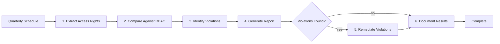
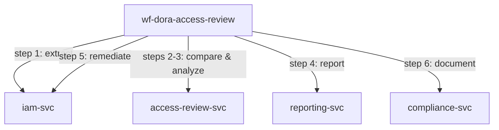

<!-- Template Meta
     Template-ID:   TPL-WF
     Version:       1.0.0
     Last Updated:  2026-04-03
     Changelog:
       1.0.0 (2026-04-03) — Initial versioned baseline.
-->

# wf-dora-access-review --- Quarterly Access Review

> **Conceptual Stack Layer:** Workflow Spec
> **Space:** Platform
> **Owner:** Platform Security Team
> **Source:** Operational Access Governance Workflow
> **References:** GOV-DORA-002, TPL-SVC SS9.2

> **Meta Information**
> - **Version:** 2026-04-15
> - **Template:** `workflow-spec.md` v1.0.0
> - **Template Compliance:** 100% — fully compliant
> - **Author(s):** Platform Security Team
> - **Status:** PROPOSED
> - **Workflow ID:** `wf-dora-access-review`
> - **Suite:** `platform`
> - **Type:** scheduled_job
> - **Companion ADRs:** `ADR-WF-DORA-003`

> **What this document is**
> A Workflow Spec describes a **process that does not fit BPMN** --- it has no
> interactive actors, no human decisions, and no user-facing screens. Instead,
> it is a scheduled, event-driven, or API-triggered sequence of steps executed
> by backend services, typically orchestrated by Temporal.
>
> **Heuristic:**
> - Actors + decisions + interactions --> BPMN --> Elara (Business Process)
> - Scheduled + step-based + retry-aware --> Temporal --> Telos (Workflow Spec)

---

<!-- ============================================================
     SS0 --- WORKFLOW IDENTITY
     ============================================================ -->

## SS0. Workflow Identity

### 0.1 Purpose

This workflow performs a quarterly review of all access rights across the platform, comparing current IAM state against defined RBAC policies (per TPL-SVC SS9.2). It identifies violations such as excess permissions, orphaned accounts, and privilege drift, then remediates violations and produces audit evidence for DORA compliance (Art. 9 --- ICT risk management framework).

### 0.2 Workflow Type

**Type:** scheduled_job

**Rationale for type choice:**

Scheduled job was chosen because this workflow runs on a fixed quarterly cadence with no external triggering event. It is primarily a read-heavy assessment process that extracts, compares, and reports on access rights. Remediation (step 5) is the only mutating step and runs only when violations are found.

### 0.3 Trigger

| Trigger type | Detail | Conditions |
|---|---|---|
| scheduled | `0 8 1 */3 *` (quarterly, 1st day of quarter, 08:00 UTC) | None --- always runs on schedule |

### 0.4 SLA & Expectations

| Metric | Target |
|---|---|
| Expected duration | < 3 business days |
| Maximum duration (before alert) | 5 business days |
| Expected throughput | 1 run per quarter |
| Acceptable failure rate | 0% (must complete every quarter for compliance) |

---

<!-- ============================================================
     SS1 --- STEPS
     ============================================================ -->

## SS1. Steps

| Step | Name | Action | Service | Endpoint / Event | Compensation | Retry | Timeout | Condition |
|---|---|---|---|---|---|---|---|---|
| 1 | Extract Access Rights | Pull current access rights from IAM service | `iam-svc` | `GET /api/platform/iam/v1/access-rights` | none | default | 120s | |
| 2 | Compare Against RBAC | Compare extracted rights against RBAC definitions (TPL-SVC SS9.2) | `access-review-svc` | `POST /api/platform/access-review/v1/compare` | none | default | 300s | |
| 3 | Identify Violations | Flag excess permissions, orphaned accounts, privilege drift | `access-review-svc` | `POST /api/platform/access-review/v1/analyze` | none | default | 120s | |
| 4 | Generate Review Report | Create detailed report with findings and recommendations | `reporting-svc` | `POST /api/platform/reports/v1/access-review` | none | default | 60s | |
| 5 | Remediate Violations | Revoke excess permissions, disable orphaned accounts | `iam-svc` | `POST /api/platform/iam/v1/access-rights/remediate` | Restore revoked permissions | default | 600s | Violations found |
| 6 | Document Results | Store review results as audit evidence | `compliance-svc` | `POST /api/platform/compliance/v1/audit-evidence` | none | default | 60s | |

### 1.1 Step Flow Diagram

### 1.2 Step Details

#### Step 3: Identify Violations

**Input:** `{ "currentRights": "object", "rbacDefinitions": "object", "comparisonResult": "object" }`
**Output:** `{ "violations": [{ "type": "excess_permission|orphaned_account|privilege_drift", "userId": "string", "detail": "string", "severity": "HIGH|MEDIUM|LOW" }], "totalViolations": "number" }`
**Side effects:** None (read-only analysis).

| Error | Retryable? | Action |
|---|---|---|
| 503 Service Unavailable | Yes | Retry with backoff |
| 500 Analysis Engine Error | Yes | Retry; if persistent, alert security team |

#### Step 5: Remediate Violations

**Input:** `{ "violations": [{ "type": "string", "userId": "string", "action": "revoke|disable|adjust" }] }`
**Output:** `{ "remediationResults": [{ "violationId": "string", "action": "string", "status": "success|failed", "detail": "string" }] }`
**Side effects:** Access rights modified in IAM system; affected users may lose access.

| Error | Retryable? | Action |
|---|---|---|
| 503 Service Unavailable | Yes | Retry with backoff |
| 403 Insufficient Permissions | No | Alert security team for manual remediation |
| 409 Conflict (user currently active) | No | Flag for manual review |

---

<!-- ============================================================
     SS2 --- RETRY & COMPENSATION STRATEGY
     ============================================================ -->

## SS2. Retry & Compensation Strategy

### 2.1 Workflow-Level Retry Policy

| Parameter | Value | Rationale |
|---|---|---|
| Max attempts | 3 | Quarterly job has time to retry without SLA pressure |
| Initial backoff | 5s | No urgency; allow services to recover |
| Backoff multiplier | 2.0 | Exponential backoff |
| Max backoff interval | 60s | Generous cap for batch processing |
| Non-retryable errors | 400, 403, 404, 422 | Client errors and permission errors should not be retried |

### 2.2 Compensation Strategy

**Strategy:** none

**Rationale:** Steps 1-4 and 6 are read-only operations that produce no mutations requiring rollback. Step 5 (remediation) has targeted rollback capability (restore revoked permissions) but is only triggered if the remediation itself was incorrect, not as part of a compensation chain.

### 2.3 Dead Letter & Manual Intervention

| Field | Value |
|---|---|
| Dead letter destination | `wf-dora-access-review.dead-letter` queue |
| Notification | Alert to #security-governance Slack channel |
| Manual resolution | Security team can rerun specific steps or complete review manually |
| Resolution SLA | Within 2 business days (must complete within the quarter) |

---

<!-- ============================================================
     SS3 --- REFERENCED SERVICES
     ============================================================ -->

## SS3. Referenced Services

| Service ID | Service Name | Suite | Tier | Role | Endpoints Used | Events Consumed / Produced |
|---|---|---|---|---|---|---|
| `iam-svc` | IAM Service | platform | T3 | bidirectional | GET /access-rights, POST /access-rights/remediate | Produces: platform.iam.access.remediated |
| `access-review-svc` | Access Review Service | platform | T2 | producer | POST /compare, POST /analyze | |
| `reporting-svc` | Reporting Service | platform | T1 | consumer | POST /access-review | |
| `compliance-svc` | Compliance Service | platform | T3 | consumer | POST /audit-evidence | Produces: platform.compliance.evidence.stored |

### 3.1 Service Dependency Diagram

### 3.2 Cross-Suite Interactions

| From suite | To suite | Interaction | Consistency model |
|---|---|---|---|
| platform | platform | All interactions are within the platform suite | Sequential batch |

---

<!-- ============================================================
     SS4 --- OBSERVABILITY
     ============================================================ -->

## SS4. Observability

### 4.1 Metrics

| Metric name | Type | Description | Labels |
|---|---|---|---|
| `wf_dora_access_review_started_total` | counter | Review instances started | `trigger_type` |
| `wf_dora_access_review_failed_total` | counter | Instances failed (after all retries) | `trigger_type`, `failed_step` |
| `wf_dora_access_review_violations_total` | gauge | Number of violations found in latest review | `violation_type`, `severity` |
| `wf_dora_access_review_duration_seconds` | histogram | End-to-end review duration | `trigger_type`, `outcome` |
| `wf_dora_access_review_remediated_total` | counter | Number of violations remediated | `action_type` |

### 4.2 Alerts

| Alert name | Condition | Severity | Response |
|---|---|---|---|
| `wf_dora_access_review_not_started` | Scheduled run did not start within 1 hour of cron time | critical | Check scheduler, manually trigger review |
| `wf_dora_access_review_duration_exceeded` | Review not complete within 5 business days | critical | Investigate blocking step, escalate to security team |
| `wf_dora_access_review_high_violations` | > 50 HIGH severity violations detected | warning | Prioritize remediation, investigate root cause |

### 4.3 Logging & Tracing

| Field | Value |
|---|---|
| Correlation ID | `wf-dora-access-review-{instanceId}` |
| Trace propagation | W3C TraceContext via Temporal headers |
| Log level | INFO for step transitions, WARN for violations found, ERROR for failures |

---

<!-- ============================================================
     SS5 --- ELARA CROSS-REFERENCE
     ============================================================ -->

## SS5. Elara Cross-Reference

### 5.1 Originating Business Process

| Field | Value |
|---|---|
| Elara Process ID | N/A |
| Process name | N/A |
| Process step(s) | N/A |
| Workflow Candidate ID | N/A |
| Rationale for extraction | No Elara origin --- operational access governance workflow |

### 5.2 Divergence from BPMN

No Elara origin --- operational access governance workflow. This workflow is a purely technical access review process with no corresponding business process model.

### 5.3 Hybrid Process Boundaries

Not applicable --- no BPMN handoff points.

---

<!-- ============================================================
     SS6 --- DECISIONS & CHANGE LOG
     ============================================================ -->

## SS6. Decisions & Change Log

### 6.1 Architecture Decision Records

#### ADR-WF-DORA-003: Automated Remediation with Safeguards

**Context:** Access violations could be remediated automatically or flagged for manual review only.
**Decision:** Automate remediation for clear-cut violations (orphaned accounts, expired permissions) but flag ambiguous cases (active users with excess permissions) for manual review.
**Rationale:** Fully manual review does not scale and introduces delays that could leave violations open across quarters. Fully automated remediation risks disrupting active users.
**Alternatives considered:**
- Fully manual remediation: Rejected due to SLA risk and scaling concerns.
- Fully automated remediation: Rejected due to risk of disrupting active users with legitimate access needs.
**Consequences:** Two remediation paths are needed --- automated for clear violations, manual approval for ambiguous cases.

### 6.2 Open Questions

| ID | Question | Impact | Owner | Needed by |
|---|---|---|---|---|
| Q-001 | Should the review include service account credentials in addition to user accounts? | Scope of access review | Platform Security Team | 2026-Q2 |
| Q-002 | Should remediation require approval for HIGH severity violations? | Automation vs. control balance | Platform Security Team | 2026-Q3 |

### 6.3 Change Log

| Date | Version | Author | Changes |
|------|---------|--------|---------|
| 2026-04-15 | 1.0 | Platform Security Team | Initial workflow specification |

---

## Review & Approval

**Status:** PROPOSED

**Reviewers:**
- Suite Architect: --- pending
- Platform Engineer: --- pending
- DevOps Lead: --- pending

**Approval:**
- Suite Architect: --- pending --- [ ] Approved
- Platform Engineer: --- pending --- [ ] Approved
- DevOps Lead: --- pending --- [ ] Approved
