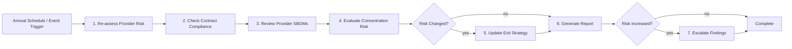
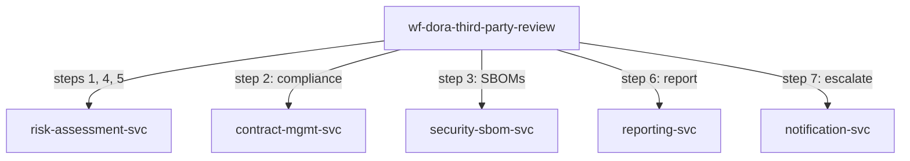

<!-- Template Meta
     Template-ID:   TPL-WF
     Version:       1.0.0
     Last Updated:  2026-04-03
     Changelog:
       1.0.0 (2026-04-03) — Initial versioned baseline.
-->

# wf-dora-third-party-review --- Third-Party Provider Review

> **Conceptual Stack Layer:** Workflow Spec
> **Space:** Platform
> **Owner:** Platform Risk Management Team
> **Source:** Operational Third-Party Risk Workflow
> **References:** GOV-DORA-005, TPL-TPR

> **Meta Information**
> - **Version:** 2026-04-15
> - **Template:** `workflow-spec.md` v1.0.0
> - **Template Compliance:** 100% — fully compliant
> - **Author(s):** Platform Risk Management Team
> - **Status:** PROPOSED
> - **Workflow ID:** `wf-dora-third-party-review`
> - **Suite:** `platform`
> - **Type:** scheduled_job
> - **Companion ADRs:** `ADR-WF-DORA-004`

> **What this document is**
> A Workflow Spec describes a **process that does not fit BPMN** --- it has no
> interactive actors, no human decisions, and no user-facing screens. Instead,
> it is a scheduled, event-driven, or API-triggered sequence of steps executed
> by backend services, typically orchestrated by Temporal.
>
> **Heuristic:**
> - Actors + decisions + interactions --> BPMN --> Elara (Business Process)
> - Scheduled + step-based + retry-aware --> Temporal --> Telos (Workflow Spec)

---

<!-- ============================================================
     SS0 --- WORKFLOW IDENTITY
     ============================================================ -->

## SS0. Workflow Identity

### 0.1 Purpose

This workflow performs periodic reviews of third-party ICT service providers as required by DORA Art. 28-30. It re-assesses provider risk, verifies contract compliance with DORA Art. 30 clauses, reviews software supply chain dependencies via SBOMs, evaluates concentration risk, and updates exit strategies. The workflow ensures that third-party risk posture is continuously monitored and that findings are escalated when risk increases.

### 0.2 Workflow Type

**Type:** scheduled_job

**Rationale for type choice:**

Scheduled job was chosen because the primary trigger is an annual cadence. The workflow is an assessment process with no distributed mutations requiring saga compensation. Event-based triggers (security incident at provider, contract renewal) supplement the schedule but follow the same step sequence.

### 0.3 Trigger

| Trigger type | Detail | Conditions |
|---|---|---|
| scheduled | `0 8 1 1 *` (annually, January 1st, 08:00 UTC) | None --- always runs on schedule |
| event | Security incident reported at a third-party provider | When `platform.security.third-party.incident.reported` event is received |
| event | Contract renewal approaching (90 days before expiry) | When `platform.procurement.contract.renewal.approaching` event is received |

### 0.4 SLA & Expectations

| Metric | Target |
|---|---|
| Expected duration | < 7 business days |
| Maximum duration (before alert) | 10 business days |
| Expected throughput | 1 scheduled run per year + ad-hoc event-triggered runs |
| Acceptable failure rate | 0% (must complete for regulatory compliance) |

---

<!-- ============================================================
     SS1 --- STEPS
     ============================================================ -->

## SS1. Steps

| Step | Name | Action | Service | Endpoint / Event | Compensation | Retry | Timeout | Condition |
|---|---|---|---|---|---|---|---|---|
| 1 | Re-assess Provider Risk | Update risk assessment using TPL-TPR framework | `risk-assessment-svc` | `POST /api/platform/risk/v1/third-party/assess` | none | default | 300s | |
| 2 | Check Contract Compliance | Verify DORA Art. 30 clause compliance | `contract-mgmt-svc` | `POST /api/platform/contracts/v1/compliance-check` | none | default | 120s | |
| 3 | Review Provider SBOMs | Analyze SBOMs for provider dependency chain risks | `security-sbom-svc` | `POST /api/platform/security/v1/sbom/analyze` | none | default | 300s | |
| 4 | Evaluate Concentration Risk | Assess dependency concentration across providers | `risk-assessment-svc` | `POST /api/platform/risk/v1/concentration/evaluate` | none | default | 120s | |
| 5 | Update Exit Strategy | Review and update provider exit strategy if needed | `risk-assessment-svc` | `POST /api/platform/risk/v1/exit-strategy/update` | none | default | 120s | Risk level changed |
| 6 | Generate Assessment Report | Compile comprehensive provider assessment report | `reporting-svc` | `POST /api/platform/reports/v1/third-party-review` | none | default | 60s | |
| 7 | Escalate Findings | Escalate to risk committee if risk level increased | `notification-svc` | `POST /api/platform/notify/v1/risk-escalation` | none | 1 attempt | 30s | Risk increased |

### 1.1 Step Flow Diagram

### 1.2 Step Details

#### Step 1: Re-assess Provider Risk

**Input:** `{ "providerId": "string", "previousAssessment": "object", "triggerType": "scheduled|incident|renewal" }`
**Output:** `{ "riskScore": "number", "riskLevel": "LOW|MEDIUM|HIGH|CRITICAL", "riskFactors": [{ "factor": "string", "score": "number", "detail": "string" }], "previousRiskLevel": "string", "riskChanged": "boolean" }`
**Side effects:** Risk assessment record updated in risk registry.

| Error | Retryable? | Action |
|---|---|---|
| 503 Service Unavailable | Yes | Retry with backoff |
| 404 Provider Not Found | No | Alert risk team; provider may have been offboarded |

#### Step 4: Evaluate Concentration Risk

**Input:** `{ "providerAssessments": [{ "providerId": "string", "riskLevel": "string", "servicesProvided": ["string"] }] }`
**Output:** `{ "concentrationRisk": "LOW|MEDIUM|HIGH|CRITICAL", "singlePointsOfFailure": [{ "capability": "string", "providers": ["string"] }], "recommendations": ["string"] }`
**Side effects:** None (read-only analysis).

| Error | Retryable? | Action |
|---|---|---|
| 503 Service Unavailable | Yes | Retry with backoff |
| Incomplete data (some providers missing) | No | Proceed with available data, flag gap in report |

---

<!-- ============================================================
     SS2 --- RETRY & COMPENSATION STRATEGY
     ============================================================ -->

## SS2. Retry & Compensation Strategy

### 2.1 Workflow-Level Retry Policy

| Parameter | Value | Rationale |
|---|---|---|
| Max attempts | 3 | Annual review has time buffer; retries acceptable |
| Initial backoff | 5s | No urgency for batch assessment |
| Backoff multiplier | 2.0 | Exponential backoff |
| Max backoff interval | 60s | Generous cap for assessment processing |
| Non-retryable errors | 400, 404, 422 | Client errors should not be retried |

### 2.2 Compensation Strategy

**Strategy:** none

**Rationale:** All steps are assessment and reporting operations with no distributed mutations requiring rollback. The workflow produces analysis and documentation; if a step fails, retrying the step is sufficient.

### 2.3 Dead Letter & Manual Intervention

| Field | Value |
|---|---|
| Dead letter destination | `wf-dora-third-party-review.dead-letter` queue |
| Notification | Alert to #risk-management Slack channel |
| Manual resolution | Risk management team can rerun individual steps or complete assessment manually |
| Resolution SLA | Within 5 business days (must complete within review window) |

---

<!-- ============================================================
     SS3 --- REFERENCED SERVICES
     ============================================================ -->

## SS3. Referenced Services

| Service ID | Service Name | Suite | Tier | Role | Endpoints Used | Events Consumed / Produced |
|---|---|---|---|---|---|---|
| `risk-assessment-svc` | Risk Assessment Service | platform | T3 | producer | POST /third-party/assess, POST /concentration/evaluate, POST /exit-strategy/update | Produces: platform.risk.assessment.completed |
| `contract-mgmt-svc` | Contract Management Service | platform | T2 | producer | POST /compliance-check | |
| `security-sbom-svc` | SBOM Service | platform | T2 | producer | POST /sbom/analyze | |
| `reporting-svc` | Reporting Service | platform | T1 | consumer | POST /third-party-review | |
| `notification-svc` | Notification Service | platform | T2 | consumer | POST /risk-escalation | |

### 3.1 Service Dependency Diagram

### 3.2 Cross-Suite Interactions

| From suite | To suite | Interaction | Consistency model |
|---|---|---|---|
| platform | platform | All interactions are within the platform suite | Sequential assessment |

---

<!-- ============================================================
     SS4 --- OBSERVABILITY
     ============================================================ -->

## SS4. Observability

### 4.1 Metrics

| Metric name | Type | Description | Labels |
|---|---|---|---|
| `wf_dora_third_party_review_started_total` | counter | Review instances started | `trigger_type` |
| `wf_dora_third_party_review_failed_total` | counter | Instances failed (after all retries) | `trigger_type`, `failed_step` |
| `wf_dora_third_party_review_providers_assessed_total` | gauge | Number of providers assessed in latest run | |
| `wf_dora_third_party_review_duration_seconds` | histogram | End-to-end review duration | `trigger_type`, `outcome` |
| `wf_dora_third_party_review_risk_escalations_total` | counter | Providers with escalated risk findings | `risk_level` |

### 4.2 Alerts

| Alert name | Condition | Severity | Response |
|---|---|---|---|
| `wf_dora_third_party_review_not_started` | Annual review did not start within 1 day of schedule | critical | Check scheduler, manually trigger review |
| `wf_dora_third_party_review_duration_exceeded` | Review not complete within 10 business days | critical | Investigate blocking step, escalate to risk team |
| `wf_dora_third_party_review_critical_risk` | Any provider assessed as CRITICAL risk | critical | Immediate escalation to risk committee and management |

### 4.3 Logging & Tracing

| Field | Value |
|---|---|
| Correlation ID | `wf-dora-third-party-review-{instanceId}` |
| Trace propagation | W3C TraceContext via Temporal headers |
| Log level | INFO for step transitions, WARN for risk level changes, ERROR for failures |

---

<!-- ============================================================
     SS5 --- ELARA CROSS-REFERENCE
     ============================================================ -->

## SS5. Elara Cross-Reference

### 5.1 Originating Business Process

| Field | Value |
|---|---|
| Elara Process ID | N/A |
| Process name | N/A |
| Process step(s) | N/A |
| Workflow Candidate ID | N/A |
| Rationale for extraction | No Elara origin --- operational third-party risk workflow |

### 5.2 Divergence from BPMN

No Elara origin --- operational third-party risk workflow. This workflow is a purely technical risk assessment process with no corresponding business process model.

### 5.3 Hybrid Process Boundaries

Not applicable --- no BPMN handoff points.

---

<!-- ============================================================
     SS6 --- DECISIONS & CHANGE LOG
     ============================================================ -->

## SS6. Decisions & Change Log

### 6.1 Architecture Decision Records

#### ADR-WF-DORA-004: Event-Triggered Reviews Supplement Annual Schedule

**Context:** DORA requires ongoing monitoring of third-party providers, not just annual reviews. Security incidents at providers or contract renewals require immediate re-assessment.
**Decision:** Support both scheduled (annual) and event-triggered reviews using the same workflow steps.
**Rationale:** Reusing the same assessment workflow for event-triggered reviews ensures consistency in methodology and avoids maintaining parallel assessment processes.
**Alternatives considered:**
- Separate workflows for scheduled and event-triggered reviews: Rejected due to code duplication and risk of methodology divergence.
- Continuous monitoring only (no scheduled reviews): Rejected because DORA requires formal periodic assessments.
**Consequences:** The workflow must handle both full annual reviews (all providers) and targeted event-triggered reviews (single provider).

### 6.2 Open Questions

| ID | Question | Impact | Owner | Needed by |
|---|---|---|---|---|
| Q-001 | Should concentration risk evaluation include fourth-party dependencies (providers of providers)? | Depth of risk analysis | Platform Risk Management Team | 2026-Q3 |
| Q-002 | How should provider SBOM freshness be validated? | Data quality of dependency analysis | Platform Risk Management Team | 2026-Q2 |

### 6.3 Change Log

| Date | Version | Author | Changes |
|------|---------|--------|---------|
| 2026-04-15 | 1.0 | Platform Risk Management Team | Initial workflow specification |

---

## Review & Approval

**Status:** PROPOSED

**Reviewers:**
- Suite Architect: --- pending
- Platform Engineer: --- pending
- DevOps Lead: --- pending

**Approval:**
- Suite Architect: --- pending --- [ ] Approved
- Platform Engineer: --- pending --- [ ] Approved
- DevOps Lead: --- pending --- [ ] Approved
