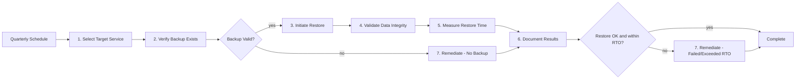
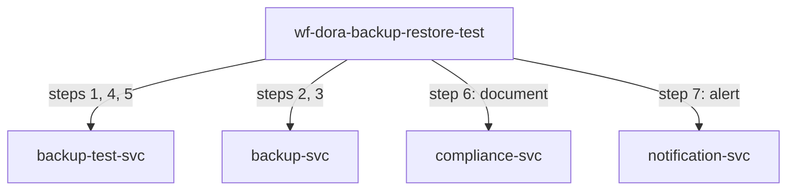

<!-- Template Meta
     Template-ID:   TPL-WF
     Version:       1.0.0
     Last Updated:  2026-04-03
     Changelog:
       1.0.0 (2026-04-03) — Initial versioned baseline.
-->

# wf-dora-backup-restore-test --- Backup & Restore Verification

> **Conceptual Stack Layer:** Workflow Spec
> **Space:** Platform
> **Owner:** Platform Reliability Team
> **Source:** Operational Backup Verification Workflow
> **References:** GOV-DORA-002, TPL-RES SS5

> **Meta Information**
> - **Version:** 2026-04-15
> - **Template:** `workflow-spec.md` v1.0.0
> - **Template Compliance:** 100% — fully compliant
> - **Author(s):** Platform Reliability Team
> - **Status:** PROPOSED
> - **Workflow ID:** `wf-dora-backup-restore-test`
> - **Suite:** `platform`
> - **Type:** scheduled_job
> - **Companion ADRs:** `ADR-WF-DORA-005`

> **What this document is**
> A Workflow Spec describes a **process that does not fit BPMN** --- it has no
> interactive actors, no human decisions, and no user-facing screens. Instead,
> it is a scheduled, event-driven, or API-triggered sequence of steps executed
> by backend services, typically orchestrated by Temporal.
>
> **Heuristic:**
> - Actors + decisions + interactions --> BPMN --> Elara (Business Process)
> - Scheduled + step-based + retry-aware --> Temporal --> Telos (Workflow Spec)

---

<!-- ============================================================
     SS0 --- WORKFLOW IDENTITY
     ============================================================ -->

## SS0. Workflow Identity

### 0.1 Purpose

This workflow performs quarterly backup and restore verification tests for all platform services, ensuring that backups are valid and can be restored within the defined Recovery Time Objective (RTO). It rotates through all services over the quarter, validates data integrity via checksums and record counts, measures actual restore times against RTO targets, and produces compliance evidence per DORA Art. 11 (ICT business continuity management).

### 0.2 Workflow Type

**Type:** scheduled_job

**Rationale for type choice:**

Scheduled job was chosen because this workflow runs on a fixed quarterly cadence. It performs a structured test sequence per service: verify backup, restore to an isolated test environment, validate integrity, and document results. No saga compensation is needed since restores target isolated test environments with no production impact.

### 0.3 Trigger

| Trigger type | Detail | Conditions |
|---|---|---|
| scheduled | `0 6 15 */3 *` (quarterly, 15th day of quarter month, 06:00 UTC) | None --- always runs on schedule |

### 0.4 SLA & Expectations

| Metric | Target |
|---|---|
| Expected duration | < 4 hours per service |
| Maximum duration (before alert) | 1 business day per service |
| Expected throughput | All services tested within the quarter |
| Acceptable failure rate | 0% (all services must be tested; restore failures are findings, not workflow failures) |

---

<!-- ============================================================
     SS1 --- STEPS
     ============================================================ -->

## SS1. Steps

| Step | Name | Action | Service | Endpoint / Event | Compensation | Retry | Timeout | Condition |
|---|---|---|---|---|---|---|---|---|
| 1 | Select Target Service | Choose next service in rotation schedule | `backup-test-svc` | `POST /api/platform/backup-test/v1/select-target` | none | default | 30s | |
| 2 | Verify Backup Exists | Confirm backup exists and is within freshness threshold | `backup-svc` | `GET /api/platform/backup/v1/services/{id}/latest` | none | default | 60s | |
| 3 | Initiate Restore | Restore backup to isolated test environment | `backup-svc` | `POST /api/platform/backup/v1/services/{id}/restore-test` | Tear down test environment | default | 3600s | Backup verified |
| 4 | Validate Data Integrity | Compare checksums and record counts against source | `backup-test-svc` | `POST /api/platform/backup-test/v1/validate` | none | default | 600s | Restore completed |
| 5 | Measure Restore Time | Record restore duration and compare against RTO | `backup-test-svc` | `POST /api/platform/backup-test/v1/measure-rto` | none | default | 30s | |
| 6 | Document Results | Store test results as compliance audit evidence | `compliance-svc` | `POST /api/platform/compliance/v1/audit-evidence` | none | default | 60s | |
| 7 | Remediate | Alert and escalate if restore failed or exceeded RTO | `notification-svc` | `POST /api/platform/notify/v1/backup-alert` | none | 1 attempt | 30s | Restore failed or RTO exceeded |

### 1.1 Step Flow Diagram

### 1.2 Step Details

#### Step 3: Initiate Restore

**Input:** `{ "serviceId": "string", "backupId": "string", "targetEnvironment": "test-restore-{serviceId}-{timestamp}" }`
**Output:** `{ "restoreId": "string", "status": "success|failed", "startTime": "ISO-8601", "endTime": "ISO-8601", "durationSeconds": "number" }`
**Side effects:** Test environment provisioned with restored data; environment is ephemeral and will be torn down after validation.

| Error | Retryable? | Action |
|---|---|---|
| 503 Service Unavailable | Yes | Retry with backoff |
| Restore timeout (> 3600s) | No | Record as RTO failure, proceed to document and remediate |
| Restore data corruption | No | Record as integrity failure, proceed to document and remediate |

#### Step 4: Validate Data Integrity

**Input:** `{ "restoreId": "string", "serviceId": "string", "validationChecks": ["checksum", "record_count", "schema_consistency"] }`
**Output:** `{ "validationResult": "PASS|FAIL", "checks": [{ "type": "string", "expected": "string", "actual": "string", "status": "PASS|FAIL" }] }`
**Side effects:** None (read-only validation against restored data).

| Error | Retryable? | Action |
|---|---|---|
| 503 Service Unavailable | Yes | Retry with backoff |
| Validation FAIL | No | Record failure, proceed to document and remediate |

---

<!-- ============================================================
     SS2 --- RETRY & COMPENSATION STRATEGY
     ============================================================ -->

## SS2. Retry & Compensation Strategy

### 2.1 Workflow-Level Retry Policy

| Parameter | Value | Rationale |
|---|---|---|
| Max attempts | 3 | Quarterly job allows time for retries |
| Initial backoff | 5s | No urgency for test operations |
| Backoff multiplier | 2.0 | Exponential backoff |
| Max backoff interval | 60s | Generous cap for batch processing |
| Non-retryable errors | 400, 404, 422 | Client errors should not be retried |

### 2.2 Compensation Strategy

**Strategy:** forward_recovery

**Rationale:** The workflow operates against isolated test environments. If a restore fails, the result is a finding (not a system inconsistency). The only cleanup action is tearing down the test environment, which is handled by step 3's compensation. The workflow always moves forward to document results regardless of test outcome.

| Failed at step | Compensate step | Compensation action | Idempotent? |
|---|---|---|---|
| 3 (Restore) or later | 3 | Tear down test environment via `DELETE /api/platform/backup/v1/restore-test/{restoreId}` | Yes |

### 2.3 Dead Letter & Manual Intervention

| Field | Value |
|---|---|
| Dead letter destination | `wf-dora-backup-restore-test.dead-letter` queue |
| Notification | Alert to #platform-reliability Slack channel |
| Manual resolution | Reliability team can rerun test for specific service or complete documentation manually |
| Resolution SLA | Within 3 business days (must complete within the quarter) |

---

<!-- ============================================================
     SS3 --- REFERENCED SERVICES
     ============================================================ -->

## SS3. Referenced Services

| Service ID | Service Name | Suite | Tier | Role | Endpoints Used | Events Consumed / Produced |
|---|---|---|---|---|---|---|
| `backup-test-svc` | Backup Test Orchestrator | platform | T2 | producer | POST /select-target, POST /validate, POST /measure-rto | Produces: platform.backup-test.completed |
| `backup-svc` | Backup Service | platform | T3 | producer | GET /services/{id}/latest, POST /services/{id}/restore-test, DELETE /restore-test/{id} | Produces: platform.backup.restore.completed |
| `compliance-svc` | Compliance Service | platform | T3 | consumer | POST /audit-evidence | Produces: platform.compliance.evidence.stored |
| `notification-svc` | Notification Service | platform | T2 | consumer | POST /backup-alert | |

### 3.1 Service Dependency Diagram

### 3.2 Cross-Suite Interactions

| From suite | To suite | Interaction | Consistency model |
|---|---|---|---|
| platform | platform | All interactions are within the platform suite | Sequential test execution |

---

<!-- ============================================================
     SS4 --- OBSERVABILITY
     ============================================================ -->

## SS4. Observability

### 4.1 Metrics

| Metric name | Type | Description | Labels |
|---|---|---|---|
| `wf_dora_backup_restore_test_started_total` | counter | Test instances started | `trigger_type` |
| `wf_dora_backup_restore_test_failed_total` | counter | Workflow instances failed (infrastructure, not test failures) | `trigger_type`, `failed_step` |
| `wf_dora_backup_restore_test_result` | gauge | Test result per service (1=pass, 0=fail) | `service_id` |
| `wf_dora_backup_restore_test_duration_seconds` | histogram | End-to-end test duration per service | `service_id`, `outcome` |
| `wf_dora_backup_restore_test_restore_time_seconds` | histogram | Actual restore time per service | `service_id` |
| `wf_dora_backup_restore_test_rto_ratio` | gauge | Actual restore time / RTO target (< 1.0 = within RTO) | `service_id` |

### 4.2 Alerts

| Alert name | Condition | Severity | Response |
|---|---|---|---|
| `wf_dora_backup_restore_test_not_started` | Scheduled run did not start within 1 hour of cron time | critical | Check scheduler, manually trigger test |
| `wf_dora_backup_restore_test_restore_failed` | Restore failed for any service | critical | Investigate backup integrity, escalate to service owner |
| `wf_dora_backup_restore_test_rto_exceeded` | Restore time exceeded RTO target | warning | Review backup strategy, consider optimization |
| `wf_dora_backup_restore_test_no_backup` | No recent backup found for target service | critical | Investigate backup job for that service |

### 4.3 Logging & Tracing

| Field | Value |
|---|---|
| Correlation ID | `wf-dora-backup-restore-test-{instanceId}` |
| Trace propagation | W3C TraceContext via Temporal headers |
| Log level | INFO for step transitions, WARN for RTO exceeded, ERROR for restore failures |

---

<!-- ============================================================
     SS5 --- ELARA CROSS-REFERENCE
     ============================================================ -->

## SS5. Elara Cross-Reference

### 5.1 Originating Business Process

| Field | Value |
|---|---|
| Elara Process ID | N/A |
| Process name | N/A |
| Process step(s) | N/A |
| Workflow Candidate ID | N/A |
| Rationale for extraction | No Elara origin --- operational backup verification workflow |

### 5.2 Divergence from BPMN

No Elara origin --- operational backup verification workflow. This workflow is a purely technical backup testing process with no corresponding business process model.

### 5.3 Hybrid Process Boundaries

Not applicable --- no BPMN handoff points.

---

<!-- ============================================================
     SS6 --- DECISIONS & CHANGE LOG
     ============================================================ -->

## SS6. Decisions & Change Log

### 6.1 Architecture Decision Records

#### ADR-WF-DORA-005: Rotating Service Selection over Full Parallel Testing

**Context:** All services need backup/restore testing quarterly. Testing all services simultaneously would require significant infrastructure capacity for parallel test environments.
**Decision:** Rotate through services sequentially within the quarter, testing one service per scheduled run, with the ability to run additional ad-hoc tests.
**Rationale:** Sequential rotation keeps infrastructure costs manageable while ensuring all services are tested within each quarter. Services with higher criticality are tested first in each rotation.
**Alternatives considered:**
- Parallel testing of all services: Rejected due to infrastructure cost and complexity of provisioning many test environments simultaneously.
- Random selection: Rejected because it does not guarantee all services are covered within a quarter.
**Consequences:** Some services are tested earlier in the quarter than others. Service priority order must be maintained and documented.

### 6.2 Open Questions

| ID | Question | Impact | Owner | Needed by |
|---|---|---|---|---|
| Q-001 | Should the test include point-in-time recovery validation in addition to full backup restore? | Test coverage depth | Platform Reliability Team | 2026-Q3 |
| Q-002 | How should the rotation schedule handle newly onboarded services? | Completeness of quarterly coverage | Platform Reliability Team | 2026-Q2 |

### 6.3 Change Log

| Date | Version | Author | Changes |
|------|---------|--------|---------|
| 2026-04-15 | 1.0 | Platform Reliability Team | Initial workflow specification |

---

## Review & Approval

**Status:** PROPOSED

**Reviewers:**
- Suite Architect: --- pending
- Platform Engineer: --- pending
- DevOps Lead: --- pending

**Approval:**
- Suite Architect: --- pending --- [ ] Approved
- Platform Engineer: --- pending --- [ ] Approved
- DevOps Lead: --- pending --- [ ] Approved
