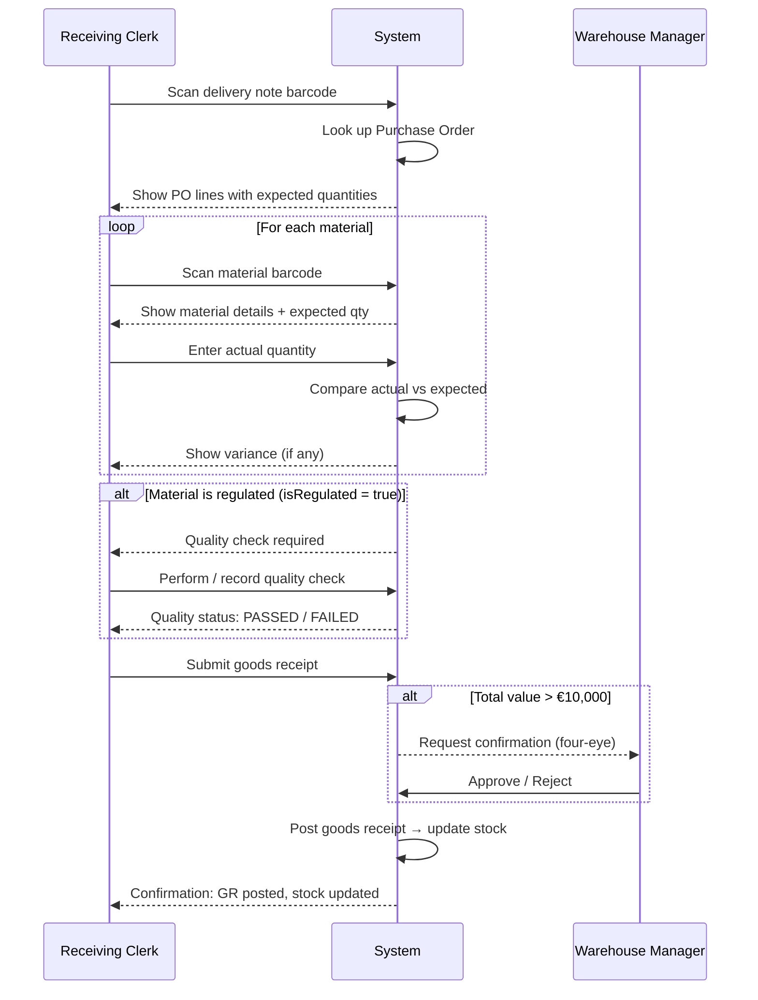

# Platform-Feature Spec: F-PPS-IM-001 — Post Goods Receipt

> **Template:** [Platform-Feature Spec](../../../concepts/artifacts/platform/platform-feature-spec.md)
> **Suite:** [PPS](../pps-suite/suite-spec.md)
> **Domain:** [pps-im-svc](../pps-im-domain/domain-spec.md)
> **Companions:** [feature.uvl](feature.uvl) · [screen-contract-aui.yaml](screen-contract-aui.yaml) · [bff-contract.md](bff-contract.md)

---

## Identity

| Field | Value |
|-------|-------|
| id | F-PPS-IM-001 |
| suite | pps |
| name | Post Goods Receipt |
| status | approved |

---

## §0 Orientation

**Summary:** Enables a receiving clerk to record an inbound material delivery, verify quantities against the purchase order, perform quality checks for regulated materials, and post the goods receipt to update inventory.

**Non-goals:**
- Does NOT create or manage purchase orders (that's PPS-PUR)
- Does NOT assign bin locations (that's PPS-WM, triggered after posting via event)
- Does NOT perform laboratory quality testing (that's PPS-QM, triggered via extension point)

**Entry points:** From the Inbound task list (pending deliveries) or by scanning a delivery note barcode.

**Exit points:** Goods receipt posted → inventory updated → event emitted → triggers Put-Away (F-PPS-WM-001).

---

## §1 User Goal & Scenarios

**Goal:** As a Receiving Clerk, I want to record an inbound delivery against its purchase order so that inventory is accurate and procurement knows the goods have arrived.

**Scenarios:**

1. **Happy path — standard delivery:** Clerk scans delivery note → system finds matching PO → clerk counts materials → quantities match → clerk posts GR → stock updated → event triggers put-away.

2. **Partial delivery:** Clerk counts fewer items than PO expected → posts partial GR with actual quantities → PO remains open for remaining items.

3. **Over-delivery:** Clerk counts more items than PO expected → system warns but allows posting with override → PO updated.

4. **Regulated material:** Material is flagged as regulated → quality check step is mandatory before posting → clerk cannot skip.

5. **High-value delivery (>€10k):** Clerk completes receipt → system requires Warehouse Manager confirmation before posting (four-eye principle, BR-004).

---

## §2 User Journey



**Screen layouts:**

```
┌──────────────────────────────────────────────┐
│  GOODS RECEIPT                         [Scan] │
├──────────────────────────────────────────────┤
│  PO: PO-2026-00431     Supplier: Acme Corp   │
│  Expected: 2026-03-29   Status: RECEIVED      │
├──────────────────────────────────────────────┤
│  Material        Expected  Actual  Variance   │
│  ──────────────  ────────  ──────  ────────── │
│  Steel Rod M12   500 pcs   500     ✓ match    │
│  Bearing SKF6205 200 pcs   195     ⚠ -5       │
│  [+ Scan next material]                       │
├──────────────────────────────────────────────┤
│  ⚠ Quality check required: Steel Rod M12      │
│    Status: [PASSED ✓]                         │
├──────────────────────────────────────────────┤
│  [Cancel]              [Post Goods Receipt →] │
└──────────────────────────────────────────────┘
```

---

## §3 Interaction Requirements

### Form Fields

| Field | Domain/Ref | Type | Required | Validation | Source |
|-------|-----------|------|----------|-----------|--------|
| Delivery Note Number | (scan input) | string | ✓ | Barcode format | Scanner |
| Purchase Order | goodsReceipt.referenceId | lookup | ✓ | Must exist in PPS-PUR | pps-pur-svc |
| Supplier | goodsReceipt.supplierRef | display | ✓ | From PO | bp-svc |
| Material (per line) | goodsReceiptLine.materialRef | scan/lookup | ✓ | Must exist in PPS-PD | pps-pd-svc |
| Expected Quantity | goodsReceiptLine.expectedQuantity | display | | From PO line | pps-pur-svc |
| Actual Quantity | goodsReceiptLine.actualQuantity | number | ✓ | ≥ 0, decimal | User input |
| Unit | goodsReceiptLine.unit | display | ✓ | From material master | pps-pd-svc / si-svc |
| Lot Number | goodsReceiptLine.lotNumber | string | if tracked | Material-specific | User input |
| Quality Status | goodsReceiptLine.qualityStatus | select | if regulated | PASSED/FAILED | Quality check |

### Actions

| Action | Trigger | Precondition | Effect |
|--------|---------|-------------|--------|
| Scan Delivery Note | Barcode scan | — | Loads PO + expected lines |
| Scan Material | Barcode scan | PO loaded | Adds/selects material line |
| Enter Quantity | Number input | Material selected | Sets actualQuantity |
| Perform Quality Check | Button (if regulated) | Material is regulated | Triggers ext.qualityCheckHook |
| Post Goods Receipt | Button | All lines have actualQty, quality checks passed | POST to pps-im-svc, updates stock |
| Cancel | Button | — | Discard and return to task list |

### Cross-Field Rules

- If material.isRegulated == true → Quality Check step is mandatory, Post button disabled until PASSED
- If sum of line values > €10,000 → four-eye confirmation required before posting

---

## §4 Edge Cases & Screen States

| State | Condition | Behavior |
|-------|-----------|----------|
| Loading | PO lookup in progress | Spinner, scan disabled |
| Empty | No PO found for barcode | Error message: "No purchase order found for this delivery note" |
| Populated | PO loaded, lines displayed | Normal interaction |
| Partial | Some lines entered, not all | Post button disabled, shows "X of Y lines completed" |
| Error: PO mismatch | Scanned material not on PO | Warning: "Material not expected on this PO — add as free receipt?" |
| Error: Quality failed | Quality check status = FAILED | Line highlighted red, Post disabled until resolved (quarantine or re-check) |
| Error: Network | Backend unavailable | Offline message, retry button |
| Variance | actual ≠ expected | Yellow warning per line, posting still allowed |

---

## §5 Backend Dependencies

| Service | Tier | Endpoint | Method | Purpose | isMutation | Failure Mode |
|---------|------|----------|--------|---------|-----------|-------------|
| pps-im-svc | T3 | /goods-receipts | POST | Create new GR | ✓ | Block: cannot proceed |
| pps-im-svc | T3 | /goods-receipts/{id}/post | PUT | Post (confirm) GR | ✓ | Block: cannot post |
| pps-im-svc | T3 | /goods-receipts/{id} | GET | Load existing GR | | Retry then error |
| pps-pur-svc | T3 | /purchase-orders/{id} | GET | Load PO for verification | | Degrade: manual entry |
| pps-pd-svc | T3 | /materials/{id} | GET | Material details (name, unit, isRegulated) | | Degrade: show ID only |
| bp-svc | T2 | /parties/{id} | GET | Supplier name | | Degrade: show ID only |
| si-svc | T1 | /units/{code} | GET | Unit validation | | Degrade: accept input |

**Cross-suite reads → UVL `requires` constraints:**
- Reads bp-svc → requires F-BP-001 (Business Partner Search)
- Reads pps-pur-svc → requires F-PPS-PUR-001 (Purchase Order Overview) *(if it exists in catalog)*

---

## §5.2 View-Model Shape (BFF Response)

```jsonc
{
  "goodsReceipt": {
    "id": "uuid",
    "referenceType": "PURCHASE_ORDER",
    "referenceId": "PO-2026-00431",
    "status": "RECEIVED",
    "receivedAt": "2026-03-29T08:15:00Z",
    "receivedBy": "user:clerk-01",
    "lines": [
      {
        "lineId": "uuid",
        "material": {
          "id": "MAT-001",
          "name": "Steel Rod M12",        // from pps-pd-svc
          "sku": "SR-M12-500",
          "unit": "pcs",                   // from si-svc
          "isRegulated": true              // from pps-pd-svc
        },
        "expectedQuantity": 500,           // from pps-pur-svc (PO line)
        "actualQuantity": 500,
        "lotNumber": "LOT-2026-0329-A",
        "qualityStatus": "PASSED",
        "variance": 0
      }
    ]
  },
  "supplier": {
    "id": "SUP-001",
    "name": "Acme Corp"                    // from bp-svc
  },
  "purchaseOrder": {
    "id": "PO-2026-00431",
    "status": "PARTIALLY_RECEIVED"         // from pps-pur-svc
  }
}
```

---

## §6 i18n & Permissions

### Permissions

| Action / Element | Condition | Required Role |
|-----------------|-----------|---------------|
| View goods receipt list | always | ROLE_IM_VIEWER |
| Create goods receipt | always | ROLE_IM_CLERK |
| Post goods receipt | value ≤ €10k | ROLE_IM_CLERK |
| Post goods receipt | value > €10k | ROLE_IM_CLERK + ROLE_IM_MANAGER (four-eye) |
| Cancel goods receipt | status = RECEIVED | ROLE_IM_CLERK |

---

## §7 Acceptance Criteria

| # | Given | When | Then |
|---|-------|------|------|
| AC-01 | A delivery arrives with a valid PO | Clerk scans the delivery note | System shows PO with expected material lines |
| AC-02 | All lines have actual quantities entered | Clerk clicks "Post Goods Receipt" | GR status → POSTED, stock incremented per line, event `pps.im.goodsreceipt.posted` emitted |
| AC-03 | Actual qty < expected qty on a line | Clerk enters the actual amount | System shows variance warning (yellow), posting still allowed |
| AC-04 | Material has isRegulated = true | Line is displayed | Quality check field is mandatory, Post button disabled until quality = PASSED |
| AC-05 | Quality check fails | Clerk records FAILED status | Line highlighted red, Post disabled, option to quarantine |
| AC-06 | Total line values > €10,000 | Clerk clicks Post | System requires Warehouse Manager confirmation before posting |
| AC-07 | Network error during posting | System loses connection | Offline message shown, GR saved locally, retry on reconnect |
| AC-08 | Barcode not matching any PO | Clerk scans unknown delivery note | Error: "No purchase order found" with option for free receipt |

---

## §8 Dependencies, Variability & Extension Points

### Feature Dependencies (UVL `requires`)

| Required Feature | Suite | Reason |
|-----------------|-------|--------|
| F-BP-001 | bp | Supplier data lookup (READ_ONLY) |

### Variability Points (UVL attributes)

| Attribute | Type | Default | Binding Time | Effect |
|-----------|------|---------|-------------|--------|
| qualityCheckEnabled | boolean | true | deploy | If false, quality check step is hidden for all materials |
| autoPostThreshold | integer | 0 | deploy | If > 0 and all lines match exactly, GR is auto-posted without manual confirmation |
| fourEyeValueThreshold | decimal | 10000 | deploy | EUR value above which four-eye principle applies |

### Extension Points

| Extension Point | Description | Interface |
|----------------|-------------|-----------|
| ext.qualityCheckHook | Called when a regulated material needs quality verification. Default: inline pass/fail. Can be extended to call PPS-QM API. | `(materialRef, lotNumber) → qualityStatus` |
| ext.customFieldsOnReceipt | Additional fields on the GR form (e.g., delivery temperature, damage notes). Rendered as extension zone in AUI. | `(goodsReceiptId) → customFieldValues` |
