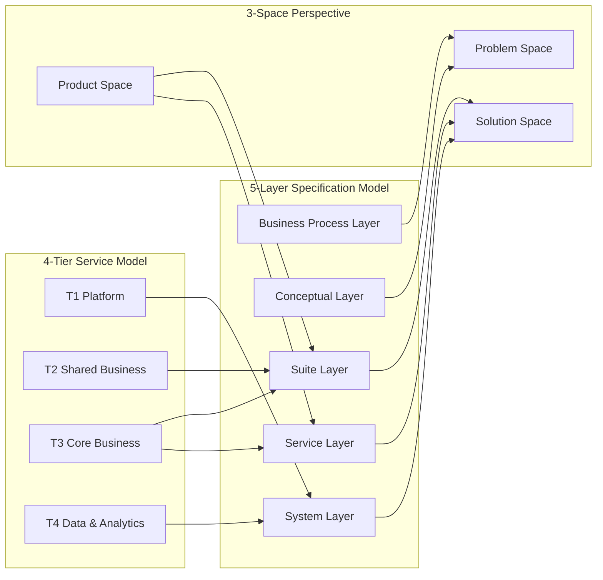

# Conceptual Reconciliation

This document formally maps the three conceptual models used across the OpenLeap ecosystem to each other, resolves terminology conflicts, and defines the unified glossary that all other documents should reference.

---

## 1. The Three Models

OpenLeap uses three overlapping but distinct models. Each answers a different question:

| Model | Question | Defined In | Scope |
|-------|----------|-----------|-------|
| **4-Tier Service Model** | "Where does this service sit in the platform?" | `spec/OPENLEAP_PLATFORM_GENERAL.md` | Runtime deployment and dependency governance |
| **5-Layer Specification Model** | "At what level of abstraction is this knowledge?" | `concepts/CONCEPTUAL_STACK.md` §2 | Specification authoring and artifact taxonomy |
| **3-Space Perspective** | "Who owns this concern and when is it defined?" | Derived from Agora, UI-SPLE, and platform specs | Lifecycle and tooling responsibility |

These models are **orthogonal, not competing**. A single artifact can be located in all three:

> *Example:* The `fi-gl` General Ledger Service Spec is a **Tier 3** service (4-Tier), authored at the **Service Layer** (5-Layer), and belongs to the **Solution Space** (3-Space).

---

## 2. Reconciliation Matrix



### Detailed Mapping Table

| 4-Tier | 5-Layer | 3-Space | Responsible Tool | Artifact Examples |
|--------|---------|---------|-----------------|-------------------|
| — | Business Process | Problem Space | Elara (Discover/Compose) | BPMN processes, actors, glossary, business rules, KPIs |
| — | Conceptual | Problem Space → Freeze | Elara (Specify/Engineer) | Domains, requirements, workflow candidates, Conceptual Freeze |
| T1 Platform | System | Solution Space | Telos (System View) | IAM specs, DMS specs, infra ADRs, deployment configs |
| T2 Shared Business | Suite + Service | Solution Space | Telos (Suite/Service Spec) | BP suite spec, BP service spec, shared event contracts |
| T3 Core Business | Suite + Service | Solution Space | Telos (Suite/Service Spec) | PPS suite spec, fi-gl service spec, domain event contracts |
| T4 Data & Analytics | System + Service | Solution Space | Telos (System/Service Spec) | BI service spec, ETL workflow specs, data pipeline configs |
| — | — | Product Space | Elara (ProductConfig) + Telos (Feature Specs) + UI-SPLE (UVL) | Product configs, feature selections, screen contracts |

### Key Insights

1. **Business Process and Conceptual layers have no tier** — they exist before service decomposition. They live entirely in Elara and are handed off via Conceptual Freeze.

2. **Suite and System layers are orthogonal at the same depth** — Suite is the logical/domain perspective, System is the technical/platform perspective. Both map to Telos but serve different personas (domain architect vs. platform engineer).

3. **T4 was missing from the Agora spec's tier model** — the Agora spec (§3) defined only T1–T3. T4 (Data & Analytics) has been added to align with the platform spec. T4 maps to both the System layer (infrastructure for data pipelines) and Service layer (BI APIs).

4. **Product Space cuts across layers** — it's not a layer but a cross-cutting concern that binds features from the Suite/Service layers into user-facing products. Product Space is jointly owned by Elara (ProductConfig, Personas) and Telos (Feature Specs, Feature Catalog).

---

## 3. Unified Glossary

These terms have appeared with subtly different meanings across documents. The definitions below are authoritative.

### Core Architecture Terms

| Term | Definition | Scope |
|------|-----------|-------|
| **Tier** | A deployment and dependency governance layer (T1–T4). Determines which services can depend on which. Higher tiers may depend on lower tiers but not vice versa. | Runtime |
| **Layer** | A specification abstraction level (Business Process → Conceptual → Suite/System → Service). Determines what kind of knowledge an artifact captures. | Authoring |
| **Space** | A lifecycle perspective (Problem/Solution/Product). Determines who owns the concern and when it's defined. | Ownership |

### Domain and Grouping Terms

| Term | Definition | NOT the same as |
|------|-----------|-----------------|
| **Suite** | A logical grouping of related T3 domain services that together cover a business capability area (e.g., `fi` = Finance, `pps` = Production). Suites own features and define the boundary for mutating service calls. | Product (a suite has no UI) |
| **Domain** | A bounded context within a suite. One suite contains multiple domains (e.g., `fi` contains `gl`, `ap`, `ar`, `tax`, `pay`). Each domain typically maps to one microservice. | Suite (a domain is one piece of a suite) |
| **Service** | A deployable microservice implementing one domain's bounded context. Has its own API, events, data store, and lifecycle. | Domain (a service is the implementation of a domain) |

### Product Line Terms

| Term | Definition | Owned By | Stored In |
|------|-----------|----------|-----------|
| **Product** | The UI face of a single T3 suite. A product selects features from its suite's catalog, assigns personas, and defines navigation. One suite can have multiple products (e.g., "Sales Workbench" and "Sales Mobile" both belong to `sd`). | Elara | `ProductConfig` |
| **Feature** | A user-facing capability owned by a suite, not a product. Features are reusable — multiple products can include the same feature. Identified as `F-{SUITE}-{NNN}` (composition node) or `F-{SUITE}-{NNN}-{NN}` (leaf). | Telos (catalog) / Elara (selection) | Feature Spec (Telos) + UVL (UI-SPLE) |
| **Feature Spec** | The human-readable specification of a feature in Telos. Covers: user goal, scenarios, journey, interaction requirements, edge cases, backend dependencies, view-model shape, i18n, permissions, acceptance criteria. Sections §0–§4 are Problem Space, §5 is Solution Space. | Telos | `F-{SUITE}-{NNN}.md` |
| **Feature (UVL)** | The machine-readable variability declaration of a feature in UI-SPLE. Defines the feature's position in the variability tree, group type (mandatory/optional/alternative/or), attributes with binding times, and cross-tree constraints. | UI-SPLE / Telos | `F-{SUITE}-{NNN}.uvl` |
| **Persona** | A UX-enriched version of a business actor. Adds IAM roles, job-to-be-done, usage frequency, technical comfort, and pain points. Derived from Elara Actors. | Elara | `personas` collection |
| **ProductConfig** | A project-scoped product assembly. Selects features from the catalog, resolves variability points, assigns personas, and defines navigation architecture. Validated against `catalog.uvl` by Decompose. | Elara | `{product-id}.product-config.md` + `.uvl` |
| **Screen Contract** | A machine-readable YAML document (UI-SPLE) that formally defines a screen's composition: zones, layout, task operators, absent-rules, and feature gates. | UI-SPLE | Per-feature YAML |

### Agora Platform Terms

| Term | Definition |
|------|-----------|
| **Agora** | The platform umbrella: Elara + Telos + Noa |
| **Elara** | Business Discovery & Product Configuration portal — Problem Space + Product Space |
| **Telos** | Technical Architecture Platform — Solution Space (Suite/Service/Feature/Workflow Specs) |
| **Noa** | Shared AI intelligence layer (Claude-powered), serves both Elara and Telos |
| **Conceptual Freeze** | The formal handoff artifact from Elara to Telos. Contains domains, processes, actors, glossary, rules, workflow candidates, products, personas, feature selections, and coverage matrix. Read-only in Telos. |
| **Perspektivwechsel** | The perspective break between Conceptual and Suite/System layers — above is process-driven (Elara), below is capability-driven (Telos) |

### Specification Lifecycle Terms

| Term | Definition |
|------|-----------|
| **Suite Spec** | Domain-level specification in Telos: ubiquitous language, domain model, service landscape, event conventions, integration patterns, ADRs |
| **Service Spec** | Individual microservice specification in Telos: aggregates, entities, value objects, REST API, events, data model, security, business rules |
| **Workflow Spec** | Non-actor process specification in Telos: batch, saga, orchestration, ETL. Has trigger, steps, compensation strategy, retry policy |
| **Registry** | Telos's inverted index for structural lookups (by_event, by_endpoint, by_entity, by_feature, etc.) |

---

## 4. Feature Specification: Three Complementary Artifacts

The term "Feature" appears in three contexts. These are not competing definitions but three complementary views of the same concept:

```
Feature Candidate (Elara)           Feature Spec (Telos)           Feature UVL (UI-SPLE)
"We discovered this need"    →     "This is what it does"    →    "This is how it varies"

Problem Space discovery            Full specification              Variability declaration
 · Identified during chat          · User goal & scenarios         · Position in feature tree
 · Linked to processes/rules       · Journey & screen layouts      · Group type (mandatory/optional/...)
 · Tagged for Telos catalog        · Form fields & actions         · Attributes with binding times
                                   · Backend dependencies          · Cross-tree constraints
                                   · Acceptance criteria           · Absent-rules for UI zones

Stored: Elara MongoDB             Stored: F-{SUITE}-{NNN}.md     Stored: F-{SUITE}-{NNN}.uvl
```

**Lifecycle:** A feature is first *discovered* in Elara (Feature Candidate), then *specified* in Telos (Feature Spec), then *declared for variability* in UI-SPLE (Feature UVL). The Feature ID (`F-{SUITE}-{NNN}`) is shared across all three.

**Ownership rule:** The Feature Spec (Telos) is the authoritative definition of what a feature does. The UVL file is the authoritative definition of how it varies. The Elara Feature Candidate is a transient artifact that gets promoted into the catalog.

---

## 5. Resolved Inconsistencies

| ID | Issue | Resolution |
|----|-------|-----------|
| I-1 | Agora spec defines 3 tiers (T1–T3), platform spec defines 4 (T1–T4) | **T4 added to Agora spec.** T4 (Data & Analytics) covers BI, ETL, and data pipeline services. See §3 update in Agora spec. |
| I-2 | "Suite" means different things across documents | **Unified definition:** Suite = logical grouping of T3 domain services. Suites own features. Products are the UI face of a suite. See glossary above. |
| I-4 | 5-Layer model appeared unrelated to 4-Tier model | **Formally mapped** in the reconciliation matrix above. Layers are about specification abstraction, tiers are about runtime deployment. They're orthogonal. |
| I-6 | Feature Spec vs UVL Feature vs Elara Feature Candidate overlap | **Resolved as three views** of the same concept at different lifecycle stages. See §4 above. |
