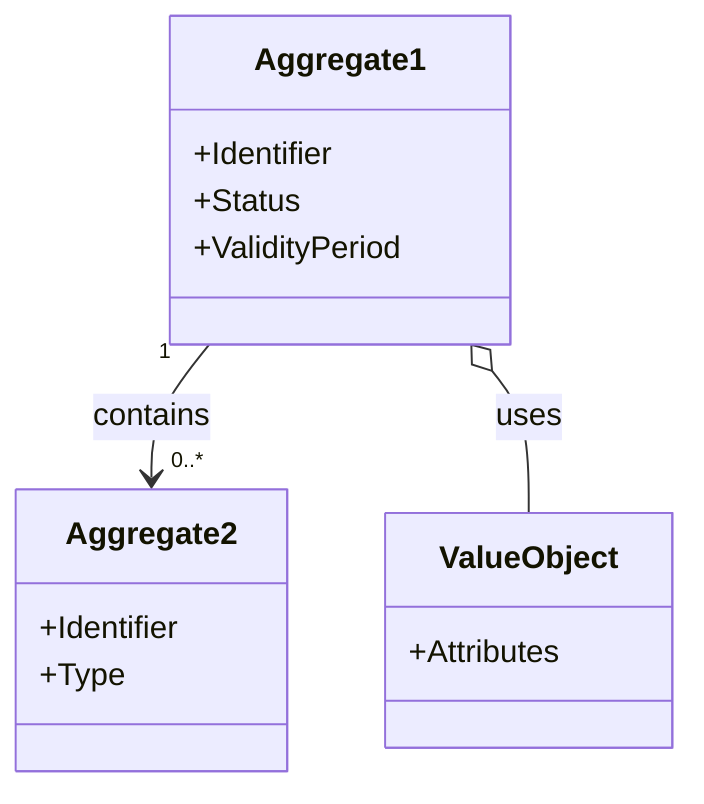
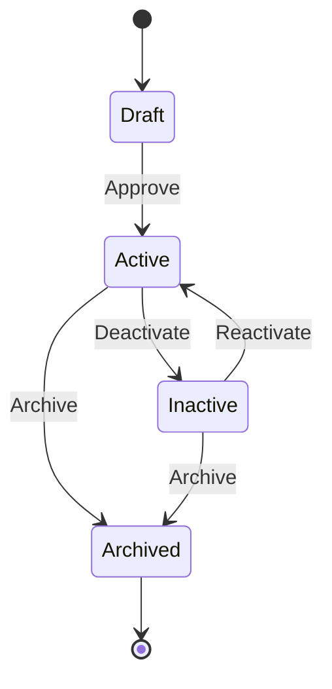
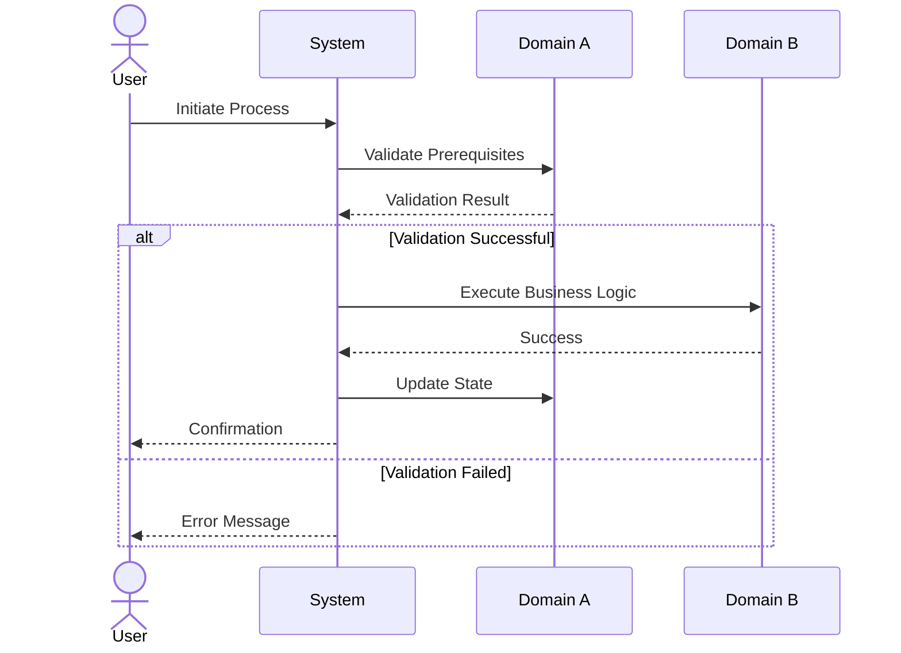
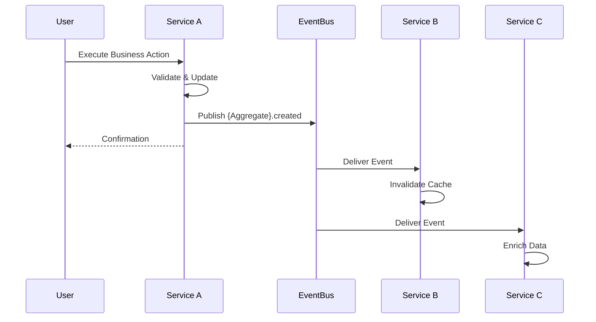
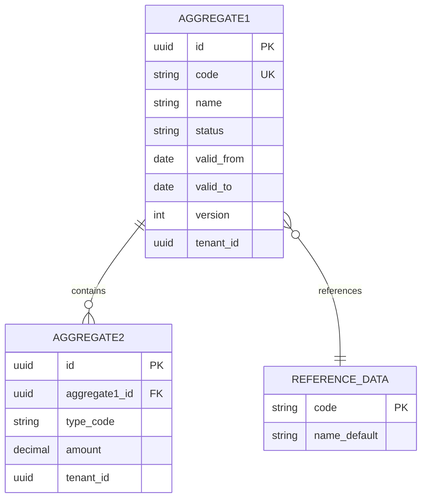

<!-- Template Meta
     Template-ID:   TPL-SVC
     Version:       1.0.0
     Last Updated:  2026-04-03
     Changelog:
       1.0.0 (2026-04-03) — Initial versioned baseline.
-->

# {DOMAIN} - {MODULE} Domain / Service Specification

> **Conceptual Stack Layer:** Domain / Service
> **Space:** Platform
> **Owner:** Domain Engineering Team
> **Schema alignment:** `service-layer.schema.json`
> **Companion files:** `openapi.yaml`, `*.schema.json` (event contracts)
> **Referenced by:** Platform-Feature Spec SS5 (backend dependencies), BFF Contract
> **Belongs to:** Suite Spec

> **Meta Information**
> - **Version:** YYYY-MM-DD
> - **Template:** `domain-service-spec.md` v1.0.0
> - **Template Compliance:** {score}% — {missing sections or "fully compliant"}
> - **Author(s):** Name(s)
> - **Status:** [DRAFT | REVIEW | APPROVED | DEPRECATED | RETIRED]
> - **Suite:** `{suite}` (e.g., fi, co, hr, pps, sd)
> - **Domain:** `{domain}` (e.g., gl, ar, ap, pd, order)
> - **Bounded Context Ref:** `bc:{bounded-context}` (e.g., bc:accounting, bc:reporting)
> - **Service ID:** `{suite}-{domain}-svc` (pattern: `^[a-z]+-[a-z]+-svc$`)
> - **basePackage:** `io.openleap.{suite}.{domain}`
> - **API Base Path:** `/api/{suite}/{domain}/v1`
> - **OpenLeap Starter Version:** `v{version}`
> - **Port:** `{port}`
> - **Repository:** `{repository-uri}`
> - **Tags:** `{tag1}`, `{tag2}`
> - **Team:**
>   - Name: `{team-name}`
>   - Email: `{team-email}`
>   - Slack: `{slack-channel}`

---

## Specification Guidelines Compliance

> ### Non-Negotiables
> - Never invent facts. If required info is missing, add an **OPEN QUESTION** entry.
> - Preserve intent and decisions. Only change meaning when explicitly requested.
> - Do not remove normative constraints unless they are explicitly replaced.
> - Keep the spec **self-contained**: no "see chat", no implicit context.
>
> ### Source of Truth Priority
> When sources conflict:
> 1. Spec (explicit) wins
> 2. Starter specs (implementation constraints) next
> 3. Guidelines (best practices) last
>
> Record conflicts in the **Decisions & Conflicts** section (see Section 14).
>
> ### Style Guide
> - Prefer short sentences and lists.
> - Use MUST/SHOULD/MAY for normative statements.
> - Keep terminology consistent (Aggregate, Domain Service, Application Service, Command, Event).
> - Avoid ambiguous words ("often", "maybe") unless explicitly noting uncertainty.
> - Keep examples minimal and clearly marked as examples.
> - Do not add implementation code unless the chapter explicitly requires it.

---

## 0. Document Purpose & Scope

<!-- Schema alignment: scope.purpose, scope.in_scope, scope.out_of_scope, scope.related_documents -->

### 0.1 Purpose
<!-- Brief 2-3 sentence description of what this domain specification covers.
     Maps to schema field: scope.purpose (min 20 chars).
     Write a concise elevator pitch of WHAT this service does. -->

### 0.2 Target Audience
- Product Owners & Business Stakeholders
- System Architects & Technical Leads
- Integration Engineers

### 0.3 Scope
**In Scope:**
<!-- Maps to schema field: scope.in_scope (array of strings) -->
- Business domain model and concepts
- Business rules and invariants
- API contracts and integration points
- Event catalog and data flows
- Multi-service workflows (if applicable)

**Out of Scope:**
<!-- Maps to schema field: scope.out_of_scope (array of strings) -->
- Implementation details (see Developer Guidelines)
- Infrastructure and deployment
- Code examples and technical patterns

### 0.4 Related Documents
<!-- Maps to schema field: scope.related_documents (array of {name, path, type}) -->
- [system-topology.md](https://github.com/openleap-io/io.openleap.dev.hub/blob/main/architecture/system-topology.md) - Platform architecture overview
- `{related_domain}_spec.md` - Related domain specifications
- `TECHNICAL_STANDARDS.md` - Cross-cutting technical standards
- `EVENT_STANDARDS.md` - Event envelope and routing conventions

---

## 1. Business Context

<!-- Schema alignment: business_context (problems_solved, business_value, stakeholders) -->

### 1.1 Domain Purpose
<!-- What business problem does this domain solve?
     Maps to schema field: business_context.problems_solved[].problem / .solution -->

### 1.2 Business Value
<!-- What value does this domain deliver to the organization?
     Maps to schema field: business_context.business_value (array of strings) -->

### 1.3 Key Stakeholders
<!-- Maps to schema field: business_context.stakeholders[].role / .interest -->

| Role | Responsibility | Primary Use Cases |
|------|----------------|-------------------|
| {Role} | {Responsibility} | {Use Cases} |

### 1.4 Strategic Positioning
<!-- How does this domain fit into the overall business architecture? -->

### 1.5 Service Context


| Property | Value |
|----------|-------|
| **Suite** | `{suite}` |
| **Domain** | `{domain}` |
| **Bounded Context** | `bc:{bounded-context}` |
| **Service ID** | `{suite}-{domain}-svc` |
| **Base Package** | `io.openleap.{suite}.{domain}` |

**Responsibilities:**
- {Primary responsibility}
- {Secondary responsibility}
- {Additional responsibilities as needed}

**Authoritative Sources:**
| Source Type | Description | Access Pattern |
|-------------|-------------|----------------|
| REST API | {Description of data exposed via REST} | Synchronous |
| Database | {Description of owned data} | Direct (owner) |
| Events | {Description of events published} | Asynchronous |

```mermaid
graph TB
    subgraph "Upstream Domains"
        A[{Domain A}]
        B[{Domain B}]
    end

    subgraph "This Domain"
        C[{This Domain}]
    end

    subgraph "Downstream Domains"
        D[{Domain D}]
        E[{Domain E}]
    end

    A --> C
    B --> C
    C --> D
    C --> E
```

---

## 2. Service Identity

<!-- Schema alignment: metadata (id, name, suite, domain, version, status, bounded_context_ref,
     api_base_path, team, repository, tags) -->

<!-- This section centralises all identity and operational metadata for the service.
     The meta block at the top of this document carries the same data in a compact form;
     this section adds the detail that tooling and registries need. -->

| Property | Value | Schema Field |
|----------|-------|-------------|
| **Service ID** | `{suite}-{domain}-svc` | `metadata.id` |
| **Display Name** | `{Human-readable name}` | `metadata.name` |
| **Suite** | `{suite}` | `metadata.suite` |
| **Domain** | `{domain}` | `metadata.domain` |
| **Bounded Context** | `bc:{bounded-context}` | `metadata.bounded_context_ref` |
| **Version** | `{semver}` | `metadata.version` |
| **Status** | DRAFT \| REVIEW \| ACTIVE \| DEPRECATED \| RETIRED | `metadata.status` |
| **API Base Path** | `/api/{suite}/{domain}/v1` | `metadata.api_base_path` |
| **Repository** | `{uri}` | `metadata.repository` |
| **Tags** | `{tag1}`, `{tag2}` | `metadata.tags` |

**Team:**
| Property | Value |
|----------|-------|
| **Name** | `{team-name}` |
| **Email** | `{team-email}` |
| **Slack Channel** | `{slack-channel}` |

---

## 3. Domain Model

<!-- Schema alignment: domain_model (overview, aggregates[], enumerations[], shared_types[]) -->

### 3.1 Conceptual Overview
<!-- High-level description of the domain's core concepts.
     Maps to schema field: domain_model.overview (Mermaid diagram or prose) -->

### 3.2 Core Concepts



### 3.3 Aggregate Definitions

<!-- Each aggregate MUST include the FULL detail below.
     Schema alignment: domain_model.aggregates[] — each item has id, name, description,
     business_purpose, root (aggregate_root), entities[] (domain_entity), value_objects[] (value_object).

     The aggregate root includes: attributes[], lifecycle_states, invariants[], domain_events[].
     Child entities include: id, name, relationship, attributes[], lifecycle_states, invariants[], constraints.
     Value objects include: id, name, attributes[], validation_rules[].

     Attributes follow the schema's attribute definition:
       name, type (string|integer|number|boolean|array|object), format (uuid|date|date-time|...),
       required, description, example, enum_ref, type_ref, items, constraints, default, read_only.

     Attribute constraints follow attribute_constraints:
       pattern, min_length, max_length, minimum, maximum, exclusive_minimum, exclusive_maximum,
       precision, min_items, max_items, unique_items, multiple_of.
-->

#### 3.3.1 {AggregateName}

<!-- Schema: aggregate.id = "agg:{aggregate-name}", aggregate.name = "{PascalCase}" -->

| Property | Value |
|----------|-------|
| **Aggregate ID** | `agg:{aggregate-name}` |
| **Name** | `{AggregateName}` |

**Business Purpose:**
<!-- What business entity does this represent?
     Maps to schema field: aggregate.business_purpose -->

##### Aggregate Root

<!-- Schema: aggregate.root (aggregate_root) — the single entry point for all mutations -->

**Key Attributes:**
| Attribute | Type | Format | Description | Constraints | Required | Read-Only |
|-----------|------|--------|-------------|-------------|----------|-----------|
| id | string | uuid | Unique identifier | Immutable | Yes | Yes |
| status | string | — | Current lifecycle state | enum_ref: `{StatusEnum}` | Yes | No |
| validFrom | string | date | Effective start date | — | Yes | No |
| validTo | string | date | Effective end date | minimum: validFrom | No | No |
| version | integer | int64 | Optimistic locking version | — | Yes | Yes |
| tenantId | string | uuid | Tenant ownership | — | Yes | Yes |

<!-- Add all attributes per the schema's attribute definition.
     For each attribute specify: name (camelCase), type, format, required, description,
     example, enum_ref (if applicable), type_ref (if applicable), constraints. -->

**Lifecycle States:**

<!-- Schema: aggregate_root.lifecycle_states — initial_state, states[], terminal_states[], transitions[] -->

| Property | Value |
|----------|-------|
| **Initial State** | `{initial}` |
| **Terminal States** | `{terminal1}`, `{terminal2}` |



**State Descriptions:**
| State | Description | Business Meaning |
|-------|-------------|------------------|
| Draft | Initial creation state | Being prepared, not yet effective |
| Active | Operational state | In use, fully effective |
| Inactive | Suspended state | Temporarily disabled |
| Archived | Final state | Historical record, read-only |

**Allowed Transitions:**
<!-- Schema: lifecycle_states.transitions[] — from, to, trigger, guard -->
| From State | To State | Trigger | Guard / Business Preconditions |
|------------|----------|---------|-------------------------------|
| Draft | Active | Approval process completed | All mandatory fields filled |
| Active | Inactive | Manual deactivation | No active dependent entities |
| Inactive | Active | Manual reactivation | Original preconditions still valid |
| Active/Inactive | Archived | Retention policy | Inactive for > 90 days |

**Invariants:**
<!-- Schema: aggregate_root.invariants[] — each references a BR-{NNN} from SS4 -->
| Rule ID | Description |
|---------|-------------|
| BR-001 | {Short description — full details in SS4} |
| BR-002 | {Short description} |

**Domain Events Emitted:**
<!-- Schema: aggregate_root.domain_events[] — references to contracts.events.outbound routing keys -->
- `{suite}.{domain}.{aggregate}.created`
- `{suite}.{domain}.{aggregate}.updated`
- `{suite}.{domain}.{aggregate}.statusChanged`

##### Child Entities

<!-- Schema: aggregate.entities[] (domain_entity) — have own identity, managed through root -->

###### Entity: {EntityName}

<!-- Schema: domain_entity.id = "ent:{entity-name}", relationship = one_to_one|one_to_many|many_to_many -->

| Property | Value |
|----------|-------|
| **Entity ID** | `ent:{entity-name}` |
| **Name** | `{EntityName}` |
| **Relationship to Root** | one_to_many |

**Business Purpose:**
<!-- Maps to schema field: domain_entity.business_purpose -->

**Attributes:**
| Attribute | Type | Format | Description | Constraints | Required |
|-----------|------|--------|-------------|-------------|----------|
| id | string | uuid | Unique identifier | — | Yes |
| {field} | {type} | {format} | {Description} | {Constraints} | {Yes/No} |

**Collection Constraints:**
<!-- Schema: domain_entity.constraints (e.g., min_items=1 for posting lines) -->
- Minimum items: {N}
- Maximum items: {M}

**Lifecycle States (if applicable):**
<!-- Only include if this entity has its own state machine -->

**Invariants:**
| Rule ID | Description |
|---------|-------------|
| BR-{NNN} | {Short description} |

##### Value Objects

<!-- Schema: aggregate.value_objects[] (value_object) — no identity, immutable, compared by value -->

###### Value Object: {ValueObjectName}

<!-- Schema: value_object.id = "vo:{vo-name}" -->

| Property | Value |
|----------|-------|
| **VO ID** | `vo:{vo-name}` |
| **Name** | `{ValueObjectName}` |

**Description:**
<!-- Maps to schema field: value_object.description -->

**Attributes:**
| Attribute | Type | Format | Description | Constraints |
|-----------|------|--------|-------------|-------------|
| {field} | {type} | {format} | {Description} | {Constraints} |

**Validation Rules:**
<!-- Schema: value_object.validation_rules[] (array of strings) -->
- {Rule 1, e.g., "amount must be non-negative"}
- {Rule 2, e.g., "currency must be valid ISO-4217"}

**Example Scenarios:**
<!-- Real-world examples of how this aggregate is used -->

---

#### 3.3.2 {NextAggregateName}

<!-- Repeat the full structure from 3.3.1 for each aggregate -->

---

### 3.4 Enumerations

<!-- Schema: domain_model.enumerations[] — referenced by attributes via enum_ref -->

#### {EnumName}

<!-- Schema: enumeration.name (PascalCase), enumeration.values[] -->

**Description:** {What this enumeration represents}

| Value | Description | Deprecated |
|-------|-------------|------------|
| `{VALUE_1}` | {Description} | No |
| `{VALUE_2}` | {Description} | No |

### 3.5 Shared Types

<!-- Schema: domain_model.shared_types[] — reusable VOs shared across aggregates.
     Each has id (type:{name}), name (PascalCase), attributes[], validation_rules[], used_by[]. -->

#### {SharedTypeName}

| Property | Value |
|----------|-------|
| **Type ID** | `type:{shared-type-name}` |
| **Name** | `{SharedTypeName}` |

**Description:** {What this shared type represents}

**Attributes:**
| Attribute | Type | Format | Description | Constraints |
|-----------|------|--------|-------------|-------------|
| {field} | {type} | {format} | {Description} | {Constraints} |

**Validation Rules:**
- {Rule 1}

**Used By:**
- `agg:{aggregate-1}`
- `agg:{aggregate-2}`

---

## 4. Business Rules & Constraints

<!-- Schema alignment: business_rules.catalog[] — each rule has id (BR-{NNN}), name, description,
     rationale, scope, enforcement, error_code, error_message -->

### 4.1 Business Rules Catalog

| ID | Rule Name | Description | Scope | Enforcement | Error Code |
|----|-----------|-------------|-------|-------------|------------|
| BR-001 | {Rule Name} | {Description} | {Aggregate/Process} | {Create/Update/Delete} | `{CODE}` |
| BR-002 | {Rule Name} | {Description} | {Aggregate/Process} | {Create/Update} | `{CODE}` |

### 4.2 Detailed Rule Definitions

#### BR-001: {Rule Name}

**Business Context:**
<!-- Why does this rule exist? What business need does it address?
     Maps to schema field: business_rule.rationale -->

**Rule Statement:**
<!-- Formal statement of the rule in business terms.
     Maps to schema field: business_rule.description -->

**Applies To:**
<!-- Maps to schema field: business_rule.scope -->
- Aggregate: {AggregateName}
- Operations: Create, Update

**Enforcement:**
<!-- Maps to schema field: business_rule.enforcement -->

**Validation Logic:**
<!-- Plain language description of how to check if rule is satisfied -->

**Error Handling:**
<!-- Maps to schema fields: business_rule.error_code, business_rule.error_message -->
- **Error Code:** `{CODE}`
- **Error Message:** "{Message}"
- **If violated:** System returns error code `{CODE}` with message "{Message}"
- **User action:** {What user should do to resolve}

**Examples:**
- **Valid:** {Example of valid scenario}
- **Invalid:** {Example of invalid scenario}

### 4.3 Data Validation Rules

**Field-Level Validations:**
| Field | Validation Rule | Error Message |
|-------|----------------|---------------|
| {Field} | Required, max 255 chars | "{Field} is required and cannot exceed 255 characters" |
| {Email} | Valid email format | "Invalid email format" |
| {Amount} | > 0 | "Amount must be positive" |

**Cross-Field Validations:**
- {Field A} and {Field B} cannot both be null
- {Date From} must be before {Date To}
- {Total} must equal sum of {LineItems}

### 4.4 Reference Data Dependencies

**Required Reference Data:**
| Catalog | Usage | Validation |
|---------|-------|------------|
| Countries (ISO 3166) | {Field} validation | Must exist in ref-data-svc |
| Currencies (ISO 4217) | {Field} validation | Must exist and be active |
| Units of Measure | {Field} conversion | Must be compatible dimension |

---

## 5. Use Cases

>
> This section defines explicit use cases (WRITE/READ), mapping to domain operations/services.
> Each use case MUST follow the canonical format for code generation.

### 5.1 Business Logic Placement

> Define where business logic resides for this domain.

| Logic Type | Placement | Examples |
|------------|-----------|----------|
| Aggregate invariants | Domain Object | Validation, state transitions |
| Cross-aggregate logic | Domain Service | Operations spanning multiple aggregates |
| Orchestration & transactions | Application Service | Use case coordination, event publishing |

### 5.2 Use Cases (Canonical Format)

> - `id`: stable identifier (PascalCase)
> - `type`: WRITE|READ
> - `trigger`: REST|Message|Internal
> - `aggregate`: primary aggregate (if any)
> - `domainOperation`: `Aggregate.method` (WRITE) or query name (READ)
> - `inputs`: list of inputs (names/types)
> - `outputs`: list of outputs (names/types)
> - `events`: list of events (WRITE only)
> - `rest`: `METHOD /path` (if REST)
> - `idempotency`: required|optional|none
> - `errors`: expected business errors (codes) if known
>
> **Never infer missing use cases; add OPEN QUESTIONS instead.**

#### UC-001: {UseCaseName}

| Field | Value |
|-------|-------|
| **id** | `{UseCaseName}` |
| **type** | WRITE \| READ |
| **trigger** | REST \| Message \| Internal |
| **aggregate** | `{AggregateName}` |
| **domainOperation** | `{Aggregate}.{method}` |
| **inputs** | `{inputName}: {Type}`, ... |
| **outputs** | `{outputName}: {Type}`, ... |
| **events** | `{EventName}` (WRITE only) |
| **rest** | `POST /api/{suite}/{domain}/v1/{resource}` |
| **idempotency** | required \| optional \| none |
| **errors** | `{ERROR_CODE}`: {description} |

**Actor:** {User Role}

**Preconditions:**
- User has required permissions
- Referenced entities exist

**Main Flow:**
1. Actor initiates {action}
2. System validates {criteria}
3. System creates/updates {entity}
4. System notifies {stakeholders}

**Postconditions:**
- {Entity} is in {state}
- Downstream systems are notified

**Business Rules Applied:**
- BR-001: {Rule name}
- BR-002: {Rule name}

**Alternative Flows:**
- **Alt-1:** If {condition}, then {alternative action}

**Exception Flows:**
- **Exc-1:** If {error condition}, then {error handling}

---

#### UC-002: {UseCaseName}

<!-- Repeat the canonical format for each use case -->

---

### 5.3 Process Flow Diagrams



### 5.4 Cross-Domain Workflows

**Does this domain participate in multi-service workflows?** [ ] YES [ ] NO

#### Workflow: {Workflow Name}

**Business Purpose:**
<!-- What business goal does this workflow achieve? -->

**Orchestration Pattern:** [ ] Choreography (EDA) [ ] Orchestration (Saga)

**Pattern Rationale:**
<!-- Why this pattern? Reference orchestration.md guidelines -->
- Choreography: Used when services react independently to facts
- Orchestration: Used when multi-step process requires coordination and compensation

**Participating Services:**
| Service | Role | Responsibilities |
|---------|------|------------------|
| {Service A} | Orchestrator | Coordinates workflow steps |
| {Service B} | Participant | Executes business logic, emits events |

**Workflow Steps:**
1. **Step 1:** {Service} performs {action}
   - Success: Emits `{event}`
   - Failure: Emits `{error_event}`

2. **Step 2:** {Service} reacts to `{event}` and performs {action}
   - Success: Emits `{event}`
   - Failure: Triggers compensation

3. **Compensation:** If step 2 fails, {Service} executes {compensating_action}

**Business Implications:**
- **Success Path:** {Business outcome}
- **Failure Path:** {Fallback behavior}
- **Compensation:** {How system recovers}

---

## 6. REST API

<!-- Schema alignment: contracts.rest_api (base_path, auth_scheme, endpoints[]) -->
<!-- Each endpoint: id (endpoint:{name}), method, path, summary, description,
     role_required, validation_rules[], events_published[],
     request_body, response, error_responses[] -->

### 6.1 API Overview

**Base Path:** `/api/{suite}/{domain}/v1`

**Authentication:** OAuth2/JWT (Bearer token)

**Authorization:**
- Read operations: Requires scope `{suite}.{domain}:read`
- Write operations: Requires scope `{suite}.{domain}:write`
- Admin operations: Requires scope `{suite}.{domain}:admin`

### 6.2 Resource Operations

#### 6.2.1 {Resource} - Create

<!-- Schema: endpoint.id = "endpoint:{resource}-create", method = "POST" -->

```http
POST /api/{suite}/{domain}/v1/{resources}
Authorization: Bearer {token}
Content-Type: application/json
```

**Request Body:**
```json
{
  "field1": "value",
  "field2": "value",
  "nestedObject": {
    "subfield": "value"
  }
}
```

**Success Response:** `201 Created`
```json
{
  "id": "uuid",
  "version": 1,
  "field1": "value",
  "field2": "value",
  "status": "DRAFT",
  "createdAt": "2025-12-05T10:30:00Z",
  "_links": {
    "self": { "href": "/api/{suite}/{domain}/v1/{resources}/{id}" }
  }
}
```

**Response Headers:**
- `Location: /api/{suite}/{domain}/v1/{resources}/{id}`
- `ETag: "1"`

**Business Rules Checked:**
- BR-001: {Rule name}
- BR-003: {Rule name}

**Events Published:**
<!-- Schema: endpoint.events_published[] -->
- `{suite}.{domain}.{aggregate}.created`

**Error Responses:**
<!-- Schema: endpoint.error_responses[] — status, error_code, description -->
- `400 Bad Request` - Validation error (see Business Rules)
- `409 Conflict` - Duplicate {unique_field}
- `422 Unprocessable Entity` - Business rule violation

#### 6.2.2 {Resource} - Retrieve

<!-- Schema: endpoint.id = "endpoint:{resource}-get", method = "GET" -->

```http
GET /api/{suite}/{domain}/v1/{resources}/{id}
Authorization: Bearer {token}
```

**Success Response:** `200 OK`
```json
{
  "id": "uuid",
  "version": 5,
  "field1": "value",
  "status": "ACTIVE",
  "validFrom": "2025-01-01",
  "validTo": null,
  "_links": {
    "self": { "href": "/api/{suite}/{domain}/v1/{resources}/{id}" },
    "related": { "href": "/api/{suite}/{domain}/v1/related/{id}" }
  }
}
```

**Response Headers:**
- `ETag: "5"`
- `Cache-Control: private, max-age=300`

**Error Responses:**
- `404 Not Found` - Resource does not exist

#### 6.2.3 {Resource} - Update

<!-- Schema: endpoint.id = "endpoint:{resource}-update", method = "PATCH" -->

```http
PATCH /api/{suite}/{domain}/v1/{resources}/{id}
Authorization: Bearer {token}
Content-Type: application/json
If-Match: "5"
```

**Request Body:**
```json
{
  "field1": "new-value"
}
```

**Success Response:** `200 OK`
```json
{
  "id": "uuid",
  "version": 6,
  "field1": "new-value",
  "updatedAt": "2025-12-05T11:00:00Z"
}
```

**Response Headers:**
- `ETag: "6"`

**Business Rules Checked:**
- BR-002: {Rule name}

**Events Published:**
- `{suite}.{domain}.{aggregate}.updated`

**Error Responses:**
- `412 Precondition Failed` - ETag mismatch (concurrent modification)
- `422 Unprocessable Entity` - Invalid state transition

#### 6.2.4 {Resource} - List

<!-- Schema: endpoint.id = "endpoint:{resource}-list", method = "GET" -->

```http
GET /api/{suite}/{domain}/v1/{resources}?page=0&size=50&sort=createdAt,desc&status=ACTIVE
Authorization: Bearer {token}
```

**Query Parameters:**
| Parameter | Type | Description | Default |
|-----------|------|-------------|---------|
| page | integer | Page number (0-based) | 0 |
| size | integer | Page size (max 200) | 50 |
| sort | string | Sort field and direction | createdAt,desc |
| status | string | Filter by status | (all) |
| validOn | date | Filter by validity | (today) |

**Success Response:** `200 OK`
```json
{
  "content": [
    { "id": "uuid1", "field1": "value1" },
    { "id": "uuid2", "field1": "value2" }
  ],
  "page": {
    "size": 50,
    "totalElements": 235,
    "totalPages": 5,
    "number": 0
  },
  "_links": {
    "first": { "href": "..." },
    "self": { "href": "..." },
    "next": { "href": "..." },
    "last": { "href": "..." }
  }
}
```

#### 6.2.5 {Resource} - Delete

<!-- Schema: endpoint.id = "endpoint:{resource}-delete", method = "DELETE" -->

```http
DELETE /api/{suite}/{domain}/v1/{resources}/{id}
Authorization: Bearer {token}
```

**Success Response:** `204 No Content`

**Business Rules Checked:**
- BR-005: Cannot delete if {condition}

**Events Published:**
- `{suite}.{domain}.{aggregate}.deleted`

**Error Responses:**
- `409 Conflict` - Cannot delete due to dependencies

### 6.3 Business Operations

**Beyond standard CRUD, this domain supports the following business operations:**

#### Operation: {OperationName}

<!-- Schema: endpoint.id = "endpoint:{resource}-{action}", method = "POST" -->

```http
POST /api/{suite}/{domain}/v1/{resources}/{id}/{action}
Authorization: Bearer {token}
Content-Type: application/json
```

**Business Purpose:**
<!-- What business goal does this operation achieve? -->

**Request Body:**
```json
{
  "parameter1": "value",
  "parameter2": "value"
}
```

**Success Response:** `200 OK` or `202 Accepted` (if async)

**Business Rules Checked:**
- BR-004: {Rule name}

**Events Published:**
- `{suite}.{domain}.{aggregate}.{action}Completed`

**Side Effects:**
- Updates {entity} status to {new_state}
- Triggers {downstream_process}
- Notifies {stakeholders}

### 6.4 OpenAPI Specification

**Location:** `contracts/http/{suite}/{domain}/openapi.yaml`

**Version:** OpenAPI 3.1

**Documentation URL:** `https://api.openleap.io/docs/{suite}/{domain}`

---

## 7. Events & Integration

<!-- Schema alignment: contracts.events (broker, outbound[], inbound[]) + integration
     (pattern_decision, outbound_dependencies[], follows_suite_pattern) -->

### 7.1 Event-Driven Architecture Pattern

<!-- Schema: integration.pattern_decision.pattern (event_driven|orchestration|hybrid),
     integration.pattern_decision.rationale -->

**Pattern Used:** [ ] Event-Driven (Choreography) [ ] Orchestration (Saga) [ ] Hybrid

**Follows Suite Pattern:** [ ] YES [ ] NO
<!-- Schema: integration.follows_suite_pattern (boolean) -->

**Pattern Rationale:**
<!-- Reference orchestration.md and temporal_vs_message_broker.md -->

**Choreography (EDA):**
- Used for: Broadcasting facts about state changes
- Consumers: Decide independently how to react
- No workflow coordination needed

**Orchestration (Saga):**
- Used for: Multi-step business processes requiring coordination
- Orchestrator: Coordinates commands and handles compensation
- Explicit workflow definition

**Message Broker:** `{broker}`
<!-- Schema: contracts.events.broker -->

### 7.2 Published Events

<!-- Schema: contracts.events.outbound[] — event_id, routing_key, business_meaning,
     when_published, payload_schema, payload_example, consumers[] -->

**Exchange:** `{suite}.{domain}.events` (topic)

#### Event: {Aggregate}.{ChangeType}

<!-- Schema: outbound_event.event_id = "event:{aggregate}-{changeType}" -->

**Routing Key:** `{suite}.{domain}.{aggregate}.{changeType}`

**Business Purpose:**
<!-- What business fact does this event communicate?
     Maps to schema field: outbound_event.business_meaning -->

**When Published:**
<!-- Maps to schema field: outbound_event.when_published -->
- Emitted when: {Business condition}
- After: Successful transaction commit

**Payload Structure:**
<!-- Schema: outbound_event.payload_schema -->
```json
{
  "aggregateType": "{suite}.{domain}.{aggregate}",
  "changeType": "{changeType}",
  "entityIds": ["uuid"],
  "version": 5,
  "occurredAt": "2025-12-05T10:30:00Z"
}
```

**Payload Example:**
<!-- Schema: outbound_event.payload_example -->
```json
{
  "aggregateType": "{suite}.{domain}.{aggregate}",
  "changeType": "created",
  "entityIds": ["550e8400-e29b-41d4-a716-446655440000"],
  "version": 1,
  "occurredAt": "2025-12-05T10:30:00Z"
}
```

**Event Envelope:**
```json
{
  "eventId": "uuid",
  "traceId": "string",
  "tenantId": "uuid",
  "occurredAt": "2025-12-05T10:30:00Z",
  "producer": "{suite}.{domain}",
  "schemaRef": "https://schemas.openleap.io/{suite}/{domain}/{aggregate}-{changeType}.schema.json",
  "payload": { ... }
}
```

**Known Consumers:**
<!-- Schema: outbound_event.consumers[] — service, handler, purpose -->
| Consumer Service | Handler | Purpose | Processing Type |
|-----------------|---------|---------|-----------------|
| {Service A} | {Handler} | Cache invalidation | Async/Immediate |
| {Service B} | {Handler} | Background enrichment | Async/Batch |
| {Service C} | {Handler} | Saga step continuation | Async/Immediate |

**Business Implications:**
- Consumer must: {Action required}
- Consumer should not: {Anti-pattern to avoid}

**Change Type Vocabulary:**
- `created` - New entity created
- `updated` - Entity modified (general change)
- `deleted` - Entity removed
- `statusChanged` - Status transition occurred
- `{action}Completed` - Business action finished successfully
- `{action}Failed` - Business action failed

### 7.3 Consumed Events

<!-- Schema: contracts.events.inbound[] — event_id, routing_key, producer, handler, purpose -->

#### Event: {SourceDomain}.{Aggregate}.{ChangeType}

**Source Service:** `{suite}.{domain}`
<!-- Schema: inbound_event.producer -->

**Routing Key:** `{suite}.{domain}.{aggregate}.{changeType}`

**Handler:** `{HandlerClassName}`
<!-- Schema: inbound_event.handler -->

**Business Purpose:**
<!-- Why does this service consume this event?
     Maps to schema field: inbound_event.purpose -->

**Processing Strategy:** [ ] Cache Invalidation [ ] Background Enrichment [ ] Saga Participation [ ] Read Model Update

**Business Logic:**
<!-- What does this service do in response to this event? -->

**Queue Configuration:**
- Name: `{suite}.{domain}.in.{source-suite}.{source-domain}.{topic}`
- Durable: Yes
- Auto-delete: No

**Failure Handling:**
- Retry: Up to 3 times with exponential backoff
- Dead Letter: After max retries, move to DLQ for manual intervention

### 7.4 Event Flow Diagrams



### 7.5 Integration Points Summary

<!-- Schema alignment: integration.outbound_dependencies[] — service, integration_type
     (sync_api|async_event|library), criticality (critical|high|medium|low),
     endpoints_used[], events_consumed[] -->

**Upstream Dependencies (Services this domain calls):**
| Service | Purpose | Integration Type | Criticality | Endpoints Used | Fallback |
|---------|---------|------------------|-------------|----------------|----------|
| ref-data-svc | Reference data validation | sync_api | high | `GET /api/.../countries` | Cached values |
| si-unit-svc | Unit conversions | sync_api | medium | `GET /api/.../convert` | Local conversion table |

**Downstream Consumers (Services that call this domain):**
| Service | Purpose | Integration Type | SLA |
|---------|---------|------------------|-----|
| {Service A} | Business process continuation | async_event | < 5 seconds |
| {Service B} | Reporting | sync_api + async_event | Best effort |

---

## 8. Data Model

<!-- Schema alignment: data_model (storage_technology, tables[], reference_data[]) -->

### 8.1 Storage Technology

<!-- Schema: data_model.storage_technology -->
**Database:** {PostgreSQL / ...}

### 8.2 Conceptual Data Model



### 8.3 Table Definitions

<!-- Schema: data_model.tables[] — name, description, columns[], indexes[] -->

#### Table: {table_name}

<!-- Schema: table.name, table.description -->

**Business Description:**
<!-- What does this table represent in business terms? -->

**Columns:**
<!-- Schema: table.columns[] — name, type, nullable, primary_key, foreign_key, description -->
| Column | Type | Nullable | PK | FK | Description |
|--------|------|----------|----|----|-------------|
| id | UUID | No | Yes | — | Unique identifier |
| {field}_code | VARCHAR(50) | No | — | — | {Business meaning} |
| status | VARCHAR(20) | No | — | — | Current lifecycle state |
| valid_from | DATE | No | — | — | Effective start date |
| valid_to | DATE | Yes | — | — | Effective end date |
| tenant_id | UUID | No | — | — | Tenant ownership (RLS) |
| version | INTEGER | No | — | — | Optimistic locking |
| created_at | TIMESTAMP | No | — | — | Creation timestamp |
| updated_at | TIMESTAMP | No | — | — | Last update timestamp |

**Indexes:**
<!-- Schema: table.indexes[] — name, columns[], unique -->
| Index Name | Columns | Unique |
|------------|---------|--------|
| pk_{table} | id | Yes |
| uk_{table}_tenant_code | tenant_id, {field}_code | Yes |
| idx_{table}_tenant_status | tenant_id, status | No |
| idx_{table}_validity | valid_from, valid_to | No |

**Relationships:**
- **To {RelatedTable}:** One-to-many via `{related}_id` FK
- **To {ReferenceTable}:** Many-to-one via `{reference}_code` FK

**Data Retention:**
- Soft delete: Status changed to ARCHIVED
- Hard delete: After {N} years in ARCHIVED state
- Audit trail: Retained indefinitely

### 8.4 Reference Data Dependencies

<!-- Schema: data_model.reference_data[] — table, data[] -->

**External Catalogs Required:**
| Catalog | Source Service | Fields Referencing | Validation |
|---------|----------------|-------------------|------------|
| countries | ref-data-svc | country_code | Must exist and be active |
| currencies | ref-data-svc | currency_code | Must exist and be active |
| units | si-unit-svc | unit_code | Must be valid UCUM code |

**Internal Code Lists:**
| Catalog | Managed By | Usage |
|---------|-----------|-------|
| {domain}_status | This service | Lifecycle states |
| {domain}_types | This service | Classification |

---

## 9. Security & Compliance

<!-- Schema alignment: security (data_classification, access_control[], compliance[],
     suite_compliance_refs[]) -->

### 9.1 Data Classification

<!-- Schema: security.data_classification (public|internal|confidential|restricted) -->

**Overall Classification:** {public | internal | confidential | restricted}

**Sensitivity Levels:**
| Data Element | Classification | Rationale | Protection Measures |
|--------------|----------------|-----------|---------------------|
| {Entity} ID | Public | Technical identifier | None required |
| {Entity} Name | Internal | Business name | Multi-tenancy isolation |
| {PII Field} | Confidential | Personal data | Encryption, audit trail |
| {Financial Field} | Restricted | Financial data | Encryption, RBAC, audit |

### 9.2 Access Control

<!-- Schema: security.access_control[] — role, permissions[], description -->

**Roles & Permissions:**
| Role | Permissions | Description |
|------|------------|-------------|
| {DOMAIN}_VIEWER | `read` | Read-only access |
| {DOMAIN}_USER | `read`, `create`, `update` | Standard user operations |
| {DOMAIN}_ADMIN | `read`, `create`, `update`, `delete`, `admin` | Full administrative access |

**Permission Matrix (expanded):**
| Role | Read | Create | Update | Delete | Admin Operations |
|------|------|--------|--------|--------|------------------|
| {DOMAIN}_VIEWER | Y | N | N | N | N |
| {DOMAIN}_USER | Y | Y | Y | N | N |
| {DOMAIN}_ADMIN | Y | Y | Y | Y | Y |

**Data Isolation:**
- Multi-tenancy: Row-Level Security (RLS) via `tenant_id`
- Users can only access data within their tenant
- Admin operations restricted to system administrators

### 9.3 Compliance Requirements

<!-- Schema: security.compliance[] (array of strings, e.g., "GDPR", "SOX") -->
<!-- Schema: security.suite_compliance_refs[] (references to suite-level policies) -->

**Regulations:**
- [ ] GDPR (EU) - Personal data protection
- [ ] CCPA (California) - Consumer privacy
- [ ] SOX (Financial) - Financial data integrity
- [ ] HIPAA (Healthcare) - Health data protection

**Suite Compliance References:**
<!-- Schema: security.suite_compliance_refs[] -->
- {Reference to suite-level compliance policy}

**Compliance Controls:**
1. **Data Retention:**
   - Personal data: {N} years or until deletion request
   - Financial data: {M} years per regulation

2. **Right to Erasure (GDPR Article 17):**
   - Endpoint: `DELETE /api/{suite}/{domain}/v1/gdpr/erase/{userId}`
   - Anonymizes or removes personal data
   - Retains aggregate statistics

3. **Data Portability (GDPR Article 20):**
   - Endpoint: `GET /api/{suite}/{domain}/v1/gdpr/export/{userId}`
   - Returns user data in machine-readable format (JSON)

4. **Audit Trail:**
   - All access to confidential/restricted data logged
   - Logs retained for {X} years
   - Includes: who, what, when, from where

---

## 10. Quality Attributes

### 10.1 Performance Requirements

**Response Time (95th percentile):**
- Read operations: < 100ms
- Write operations: < 200ms
- List operations: < 300ms (page size 50)

**Throughput:**
- Peak read requests: {X} req/sec
- Peak write requests: {Y} req/sec
- Event processing: {Z} events/sec

**Concurrency:**
- Simultaneous users: {N}
- Concurrent transactions: {M}

### 10.2 Availability & Reliability

**Availability Target:** 99.9% (excludes planned maintenance)

**Recovery Objectives:**
- RTO (Recovery Time Objective): < 15 minutes
- RPO (Recovery Point Objective): < 5 minutes

**Failure Scenarios:**
| Scenario | Impact | Mitigation |
|----------|--------|------------|
| Database failure | Service unavailable | Automatic failover to replica |
| Message broker outage | Event processing paused | Outbox retries when available |
| Downstream service unavailable | Degraded functionality | Circuit breaker, cached data |

### 10.3 Scalability

**Scaling Strategy:**
- Horizontal scaling: Add instances behind load balancer
- Database scaling: Read replicas for queries
- Event processing: Multiple consumers on same queue

**Capacity Planning:**
- Data growth: {X} entities per month
- Storage: {Y} GB per year
- Event volume: {Z} events per day

### 10.4 Maintainability

**Versioning Strategy:**
- API versioning: `/v1`, `/v2` in URL path
- Backward compatibility: Maintained for 12 months
- Deprecation notice: 6 months before removal

**Monitoring & Alerting:**
- Health checks: `/actuator/health` endpoint
- Metrics: Response times, error rates, queue depths
- Alerts: Error rate > 5%, response time > 500ms

---

## 11. Feature Dependencies

<!-- NEW CHAPTER — from Conceptual Stack.
     This section documents which platform-features (F-{SUITE}-{NNN}) depend on this service.
     It bridges the Platform-Feature Spec SS5 (backend dependencies) back to the service,
     giving the domain team visibility into who consumes what. -->

### 11.1 Purpose

<!-- This section answers: "Which product features depend on this service?"
     It provides the domain team with a consumer registry so they can assess the blast radius
     of API changes, plan deprecation, and coordinate with feature teams. -->

This section tracks all platform-features that call this service's endpoints or consume its events.
It is the inverse of the Platform-Feature Spec SS5 (Backend Dependencies & BFF Contract).

### 11.2 Feature Dependency Register

<!-- List every feature that depends on this service.
     Columns align with the Platform-Feature Spec SS5 "Service Calls" table. -->

| Feature ID | Feature Name | Suite | Tier | Dependency Type | Status |
|------------|-------------|-------|------|-----------------|--------|
| F-{SUITE}-{NNN} | {Feature Name} | {suite} | core \| supporting | sync_api \| async_event \| both | active \| planned |

### 11.3 Endpoints Used per Feature

<!-- For each feature, detail which endpoints it calls.
     This information feeds BFF aggregation and helps assess API change impact. -->

#### Feature: F-{SUITE}-{NNN} — {Feature Name}

| Endpoint | Method | Purpose | Is Mutation | Failure Mode |
|----------|--------|---------|-------------|-------------|
| `/api/{suite}/{domain}/v1/{resources}` | GET | List resources for selection | No | Show empty state |
| `/api/{suite}/{domain}/v1/{resources}` | POST | Create new resource | Yes | Show error, allow retry |
| `/api/{suite}/{domain}/v1/{resources}/{id}` | PATCH | Update resource | Yes | Show conflict resolution |

**Events Consumed by Feature:**
| Event Routing Key | Purpose | Processing |
|-------------------|---------|------------|
| `{suite}.{domain}.{aggregate}.created` | Refresh list view | Real-time via WebSocket |

### 11.4 BFF Aggregation Hints

<!-- Guidance for BFF layer on how to aggregate calls from this service with other services
     for a given feature's view-model. -->

| Feature ID | BFF View-Model Field | Source Endpoint | Caching | Notes |
|------------|---------------------|-----------------|---------|-------|
| F-{SUITE}-{NNN} | `{viewModelField}` | `GET /api/{suite}/{domain}/v1/{resources}/{id}` | 5 min | Combine with {other-service} data |

### 11.5 Impact Assessment

<!-- Use this table when planning breaking changes to understand which features are affected. -->

| Endpoint / Event | Breaking Change Planned | Affected Features | Migration Plan |
|-----------------|------------------------|-------------------|----------------|
| `GET /api/.../v1/{resources}` | Response field rename in v2 | F-{SUITE}-001, F-{SUITE}-005 | Dual-write for 6 months |

---

## 12. Extension Points

<!-- NEW CHAPTER — from Conceptual Stack.
     This section defines hooks for product customization following the Open-Closed Principle.
     Products can extend behaviour without modifying the core platform service. -->

### 12.1 Purpose

<!-- Extension points allow product teams to customize service behaviour without forking
     the platform code. They follow the Open-Closed Principle: the service is open for
     extension but closed for modification. -->

This section defines all hooks available for product-level customization of this service.
Products can listen to extension events, register aggregate hooks, or call extension API
endpoints to inject custom behaviour.

### 12.2 Extension Events

<!-- Events published specifically so that product-level services can react and extend behaviour.
     These differ from integration events (SS7) in that they are designed as extension hooks,
     not as facts about domain state changes. -->

| Event ID | Routing Key | Trigger | Payload | Extension Purpose |
|----------|-------------|---------|---------|-------------------|
| ext-{NNN} | `{suite}.{domain}.ext.{hook-name}` | {When this fires} | {Key payload fields} | {What a product can do in response} |

**Extension Event Contract:**
```json
{
  "eventId": "uuid",
  "extensionPoint": "{hook-name}",
  "tenantId": "uuid",
  "occurredAt": "2025-12-05T10:30:00Z",
  "producer": "{suite}.{domain}",
  "payload": {
    "aggregateId": "uuid",
    "aggregateType": "{AggregateName}",
    "context": { }
  }
}
```

**Design Rules:**
- Extension events MUST be fire-and-forget (no blocking the core flow)
- Extension events SHOULD include enough context for the consumer to act without callbacks
- Extension events MUST NOT carry sensitive data beyond what the consumer role can access

### 12.3 Aggregate Hooks

<!-- Points in the aggregate lifecycle where product-level logic can be injected.
     These are typically implemented as strategy patterns or plugin registries. -->

| Hook ID | Aggregate | Lifecycle Point | Hook Type | Description |
|---------|-----------|----------------|-----------|-------------|
| hook-{NNN} | {AggregateName} | pre-create \| post-create \| pre-update \| post-update \| pre-delete \| pre-transition | validation \| enrichment \| notification | {What this hook allows} |

**Hook Contract:**

```
Hook ID:       hook-{NNN}
Aggregate:     {AggregateName}
Trigger:       {lifecycle point}
Input:         {What data the hook receives}
Output:        {What the hook can return — e.g., validation errors, enriched data, void}
Timeout:       {max execution time, e.g., 500ms}
Failure Mode:  {fail-open | fail-closed}
```

**Design Rules:**
- Hooks MUST have a bounded timeout to prevent degrading core service performance
- `fail-open` hooks: failure is logged but does not block the operation
- `fail-closed` hooks: failure aborts the operation and returns an error
- Hooks MUST NOT modify aggregate state directly; they return instructions to the core

### 12.4 Extension API Endpoints

<!-- Additional API endpoints that exist solely for product-level extensions.
     These are typically used for custom queries, custom actions, or metadata endpoints. -->

| Endpoint | Method | Purpose | Auth Scope | Notes |
|----------|--------|---------|------------|-------|
| `/api/{suite}/{domain}/v1/extensions/{hook-name}` | POST | Register extension handler | `{suite}.{domain}:admin` | Product registers its callback |
| `/api/{suite}/{domain}/v1/extensions/{hook-name}/config` | GET/PUT | Extension configuration | `{suite}.{domain}:admin` | Per-tenant extension settings |

### 12.5 Extension Points Summary

<!-- Quick-reference matrix showing all extension points and their characteristics -->

| ID | Type | Aggregate | Lifecycle Point | Fail Mode | Timeout |
|----|------|-----------|----------------|-----------|---------|
| ext-{NNN} | event | {Aggregate} | {point} | fire-and-forget | N/A |
| hook-{NNN} | hook | {Aggregate} | {point} | fail-open \| fail-closed | {ms} |

### 12.6 Extension Guidelines for Product Teams

<!-- Guidance for product teams on how to use these extension points -->

1. **Prefer extension events** for asynchronous reactions that do not need to influence the core operation result.
2. **Use aggregate hooks** when the product needs to validate, enrich, or gate a core operation.
3. **Register via extension API** to enable/disable extensions per tenant at runtime.
4. **Test extensions in isolation** using the extension event contracts and hook contracts defined above.
5. **Version your extensions** — when the core service publishes a new extension event schema version, adapt accordingly.

---

## 13. Migration & Evolution

### 13.1 Data Migration

**From Legacy System:**
| Source | Target | Mapping | Data Quality Issues |
|--------|--------|---------|---------------------|
| {Legacy Table} | {Entity} | {Mapping description} | {Issues to address} |

**Migration Strategy:**
1. Export data from legacy system
2. Transform and validate
3. Import in batches with validation
4. Reconciliation report

**Rollback Plan:**
- Keep legacy system available for {N} months
- Ability to revert to legacy if critical issues found

### 13.2 Deprecation & Sunset

**Deprecated Features:**
| Feature | Deprecated Date | Removal Date | Alternative |
|---------|----------------|--------------|-------------|
| {Old API} | {YYYY-QN} | {YYYY-QN} | {New API} |

**Communication Plan:**
- 12 months notice to consumers
- Quarterly reminders
- Migration guide provided

---

## 14. Decisions & Open Questions

<!-- Schema alignment: adrs[], suite_adr_refs[] -->


### 14.1 Consistency Checks


| Check | Status | Notes |
|-------|--------|-------|
| Every REST WRITE endpoint maps to exactly one WRITE use case | [ ] Pass / [ ] Fail | |
| Every WRITE use case maps to exactly one domain operation or one domain service + domain operation | [ ] Pass / [ ] Fail | |
| Events listed in use cases appear in the Events & Integration chapter and have schema refs | [ ] Pass / [ ] Fail | |
| Persistence and multitenancy assumptions are consistent with starter constraints | [ ] Pass / [ ] Fail | |
| No chapter contradicts another (e.g., saga orchestration vs event-driven reactions) | [ ] Pass / [ ] Fail | |
| Feature dependencies (SS11) align with Platform-Feature Spec SS5 references | [ ] Pass / [ ] Fail | |
| Extension points (SS12) do not duplicate integration events (SS7) | [ ] Pass / [ ] Fail | |

### 14.2 Decisions & Conflicts

> Source priority: 1) Spec (explicit) -> 2) Starter specs -> 3) Guidelines

| ID | Conflict Description | Resolution | Rationale |
|----|---------------------|------------|-----------|
| DC-001 | {Description of conflict} | {How it was resolved} | {Why this resolution} |

### 14.3 Open Questions

> - Question
> - Why it matters (generator impact)
> - Suggested options (if safe)
> - Owner placeholder

| ID | Question | Why It Matters | Suggested Options | Owner |
|----|----------|----------------|-------------------|-------|
| Q-001 | {Question} | {Generator/implementation impact} | {Option A, Option B} | TBD |

### 14.4 Architectural Decision Records (ADRs)

<!-- Schema: adrs[] — id (ADR-{NNN}), title, status (proposed|accepted|deprecated|superseded),
     context, decision, rationale, alternatives_considered[], consequences (positive[], negative[]),
     supersedes, superseded_by -->

#### ADR-001: {Decision Title}

**Status:** [Proposed | Accepted | Deprecated | Superseded]

**Context:**
<!-- What is the issue we're facing? -->

**Decision:**
<!-- What did we decide? -->

**Rationale:**
<!-- Why did we make this decision? -->

**Consequences:**
<!-- What are the implications of this decision? -->
- **Positive:**
  - {Positive consequence}
- **Negative:**
  - {Negative consequence}

**Alternatives Considered:**
<!-- Schema: adr.alternatives_considered[] — option, reason_rejected -->
1. {Alternative 1} - Rejected because {reason}
2. {Alternative 2} - Rejected because {reason}

**Supersedes:** {ADR-NNN, if applicable}
**Superseded By:** {ADR-NNN, if applicable}

### 14.5 Suite-Level ADR References

<!-- Schema: suite_adr_refs[] — references to suite-level ADRs (pattern: ADR-{SUITE}-{NNN}) -->

| Suite ADR | Title | Relevance to This Service |
|-----------|-------|---------------------------|
| ADR-{SUITE}-{NNN} | {Title} | {How this suite-level decision affects this service} |

---

## 15. Appendix

### 15.1 Glossary

<!-- Schema alignment: glossary[] — term, definition, aliases[] -->

| Term | Definition | Aliases |
|------|------------|---------|
| Aggregate | Domain-Driven Design concept: cluster of objects treated as a unit | Aggregate Root |
| ETag | HTTP header for optimistic concurrency control | Entity Tag |
| Idempotency | Property where operation can be applied multiple times without changing result | - |

### 15.2 References

**Business Documents:**
- Business Requirements Document: `{link}`
- User Stories: `{link}`

**Technical Standards:**
- `TECHNICAL_STANDARDS.md` - Cross-cutting technical conventions
- `EVENT_STANDARDS.md` - Event structure and routing
- `microservice-developer-guideline.md` - Implementation guidelines
- `orchestration.md` - Orchestration patterns

**External Standards:**
- ISO 3166 (Countries)
- ISO 4217 (Currencies)
- UCUM (Units of Measure)
- RFC 3339 (Date/Time format)

**Schema:**
- `service-layer.schema.json` - Telos service layer schema (this template aligns to it)

**Companion Files:**
- `contracts/http/{suite}/{domain}/openapi.yaml` - OpenAPI contract (see SS6)
- `contracts/events/{suite}/{domain}/*.schema.json` - Event contracts (see SS7)

### 15.3 Status Output Requirements

>
> When this spec is updated, the following artifacts MUST be produced:

**Required Output Files:**
| File | Purpose | When Required |
|------|---------|---------------|
| Updated spec file | The modified specification | Always |
| `status/spec-changelog.md` | Structured change log | Always |
| `status/spec-open-questions.md` | Open questions list | If any open questions exist |

**Changelog Format (`status/spec-changelog.md`):**
```markdown
# Spec Changelog - {suite}.{domain}

## Summary
- {3-8 bullet points summarizing changes}

## Added Sections
- {List of new sections}

## Modified Sections
- {List of changed sections with brief description}

## Removed Sections
- {List of removed sections with justification}

## Decisions Taken
- {Key decisions made during update}

## Open Questions Raised
- {References to new open questions}
```

**Open Questions Format (`status/spec-open-questions.md`):**
```markdown
# Open Questions - {suite}.{domain}

## Q-001: {Question Title}
- **Question:** {The question}
- **Why it matters:** {Generator/implementation impact}
- **Suggested options:** {Option A, Option B, ...}
- **Owner:** TBD
```

### 15.4 Change Log

<!-- Schema alignment: changelog[] — version, date, author, changes[] -->

| Date | Version | Author | Changes |
|------|---------|--------|---------|
| YYYY-MM-DD | 1.0 | {Name} | Initial version |

---

## Document Review & Approval

**Status:** [DRAFT | IN REVIEW | APPROVED]

**Review Schedule:** Quarterly or on major changes

**Reviewers:**
- Product Owner: {Name} - {Date}
- System Architect: {Name} - {Date}
- Technical Lead: {Name} - {Date}

**Approval:**
- Product Owner: {Name} - {Date} - [ ] Approved
- CTO/VP Engineering: {Name} - {Date} - [ ] Approved
