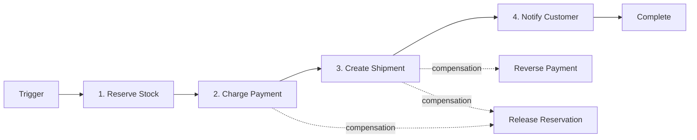

<!-- Template Meta
     Template-ID:   TPL-WF
     Version:       1.0.0
     Last Updated:  2026-04-03
     Changelog:
       1.0.0 (2026-04-03) — Initial versioned baseline.
-->

# wf-{name} --- {Workflow Name}

> **Conceptual Stack Layer:** Workflow Spec
> **Space:** Platform
> **Owner:** Domain Engineering Team
> **Source:** Elara Workflow Candidate (Product Space)
> **References:** Domain/Service Specs (referenced services)

> **Meta Information**
> - **Version:** YYYY-MM-DD
> - **Template:** `workflow-spec.md` v1.0.0
> - **Template Compliance:** {score}% — {missing sections or "fully compliant"}
> - **Author(s):** Name(s)
> - **Status:** [DRAFT | REVIEW | APPROVED | DEPRECATED]
> - **Workflow ID:** `wf-{name}` (e.g., `wf-order-fulfillment`)
> - **Suite:** `{suite}` (e.g., `sd`, `pps`, `fi`)
> - **Type:** [batch | saga | orchestration | etl | scheduled_job | integration]
> - **Companion ADRs:** `ADR-WF-{NNN}`

> **What this document is**
> A Workflow Spec describes a **process that does not fit BPMN** --- it has no
> interactive actors, no human decisions, and no user-facing screens. Instead,
> it is a scheduled, event-driven, or API-triggered sequence of steps executed
> by backend services, typically orchestrated by Temporal.
>
> **Heuristic:**
> - Actors + decisions + interactions --> BPMN --> Elara (Business Process)
> - Scheduled + step-based + retry-aware --> Temporal --> Telos (Workflow Spec)
>
> **What does NOT live here:**
> - User journeys or screen layouts --> Feature Specs
> - Business processes with actors and gateways --> Elara BPMN processes
> - Service internals (aggregates, events, data model) --> Domain/Service Specs
>
> This document specifies the orchestration contract: what steps run, in what
> order, what happens on failure, and which services are involved.

---

<!-- ============================================================
     SS0 --- WORKFLOW IDENTITY
     WHAT is this workflow, WHEN does it run, and WHY does it exist?
     ============================================================ -->

## SS0. Workflow Identity

### 0.1 Purpose

<!-- 2-3 sentences: what does this workflow accomplish?
     Frame in terms of business outcome, not technical mechanics.

     EXAMPLE:
     "This workflow fulfills a sales order by orchestrating stock reservation,
     picking, packing, and shipping across PPS and SD services. It runs as a
     saga with compensation to ensure consistency across service boundaries."

     BAD:  "This workflow calls three services."
     GOOD: "This workflow ensures that every confirmed order results in either
            a complete shipment or a fully compensated rollback within 24 hours." -->

### 0.2 Workflow Type

<!-- Types: batch, saga, orchestration, etl, scheduled_job, integration.
     Choose one and explain the rationale. -->

**Type:** [batch | saga | orchestration | etl | scheduled_job | integration]

**Rationale for type choice:**

<!-- Why this type and not another?
     EXAMPLE: "Saga was chosen over orchestration because the stock reservation
     step must be compensated if the payment step fails. Pure orchestration
     would leave reserved stock in an inconsistent state." -->

### 0.3 Trigger

<!-- Trigger types: scheduled (cron), event, api, manual, elara (hybrid process). -->

| Trigger type | Detail | Conditions |
|---|---|---|
| {e.g., scheduled} | {e.g., `0 2 * * *` (daily 02:00 UTC)} | {e.g., Only on business days} |
| {e.g., event} | {e.g., `sd.sd.order.confirmed`} | {e.g., When order.total > 10000} |

### 0.4 SLA & Expectations

<!-- Expected runtime characteristics. -->

| Metric | Target |
|---|---|
| Expected duration | {e.g., < 5 minutes per order} |
| Maximum duration (before alert) | {e.g., 30 minutes} |
| Expected throughput | {e.g., 500 orders/hour} |
| Acceptable failure rate | {e.g., < 0.1%} |

---

<!-- ============================================================
     SS1 --- STEPS
     WHAT happens, in WHAT ORDER, and WHAT does each step do?
     This is the core of the workflow specification.
     ============================================================ -->

## SS1. Steps

<!-- List every step in execution order. For saga workflows, every mutating
     step MUST have a compensation action. Use "Condition" for branching. -->

| Step | Name | Action | Service | Endpoint / Event | Compensation | Retry | Timeout | Condition |
|---|---|---|---|---|---|---|---|---|
| 1 | {e.g., Reserve Stock} | {Reserve inventory for order items} | `{pps-im-svc}` | `{POST /api/pps/im/v1/reservations}` | {Release reservation} | default | {30s} | |
| 2 | {e.g., Charge Payment} | {Initiate payment capture} | `{fi-ar-svc}` | `{POST /api/fi/ar/v1/payments}` | {Reverse payment} | {3 attempts, 5s backoff} | {60s} | |
| 3 | {e.g., Create Shipment} | {Create shipping instruction} | `{sd-ship-svc}` | `{POST /api/sd/ship/v1/shipments}` | {Cancel shipment} | default | {30s} | |
| 4 | {e.g., Notify Customer} | {Send order confirmation email} | `{si-notify-svc}` | `{POST /api/si/notify/v1/emails}` | none (fire-and-forget) | {1 attempt} | {10s} | |

### 1.1 Step Flow Diagram

<!-- Mermaid diagram of the step sequence. -->



### 1.2 Step Details

<!-- For each step that needs more explanation than fits in the table,
     add a subsection below. Only steps with complex logic, conditional
     behavior, or non-obvious compensation need a subsection.

     Document: Input (JSON-C), Output (JSON-C), Side effects, Error classification
     (which errors are retryable vs. fatal). -->

#### Step {N}: {Step Name}

**Input:** `{ "orderId": "string", "items": [{ "productId": "string", "quantity": "number" }] }`
**Output:** `{ "reservationId": "string", "reservedItems": [...] }`
**Side effects:** {e.g., Stock status changes from AVAILABLE to RESERVED}

| Error | Retryable? | Action |
|---|---|---|
| {e.g., 503 Service Unavailable} | Yes | {Retry with backoff} |
| {e.g., 409 Insufficient Stock} | No | {Trigger compensation chain} |

---

<!-- ============================================================
     SS2 --- RETRY & COMPENSATION STRATEGY
     WHAT happens when things go wrong?
     ============================================================ -->

## SS2. Retry & Compensation Strategy

### 2.1 Workflow-Level Retry Policy

<!-- Define the default retry behavior that applies to all steps
     unless overridden at the step level (SS1 table "Retry" column).

     These values are passed to the Temporal workflow configuration. -->

| Parameter | Value | Rationale |
|---|---|---|
| Max attempts | {e.g., 3} | {Why this number} |
| Initial backoff | {e.g., 1s} | {Why this interval} |
| Backoff multiplier | {e.g., 2.0} | {Exponential backoff} |
| Max backoff interval | {e.g., 60s} | {Cap to prevent excessive waits} |
| Non-retryable errors | {e.g., 400, 404, 422} | {Client errors should not be retried} |

### 2.2 Compensation Strategy

<!-- backward_recovery (undo in reverse), forward_recovery (retry until success),
     or none (all steps are idempotent reads). -->

**Strategy:** [backward_recovery | forward_recovery | none]

**Compensation chain (backward_recovery):**

<!-- List compensation steps in reverse execution order. -->

| Failed at step | Compensate step | Compensation action | Idempotent? |
|---|---|---|---|
| {3} | {2} | {Reverse payment via POST /api/fi/ar/v1/payments/{id}/reverse} | {Yes} |
| {3} | {1} | {Release reservation via DELETE /api/pps/im/v1/reservations/{id}} | {Yes} |

### 2.3 Dead Letter & Manual Intervention

<!-- What happens when all retries and compensation attempts are exhausted? -->

| Field | Value |
|---|---|
| Dead letter destination | {e.g., `wf-{name}.dead-letter` queue} |
| Notification | {e.g., Alert to #ops-workflows Slack channel + PagerDuty} |
| Manual resolution | {e.g., Operator can retry, skip, or force-complete via admin API} |
| Resolution SLA | {e.g., Within 4 business hours} |

---

<!-- ============================================================
     SS3 --- REFERENCED SERVICES
     WHICH services participate in this workflow?
     ============================================================ -->

## SS3. Referenced Services

<!-- Every service this workflow interacts with. Enables impact analysis.
     Roles: producer, consumer, bidirectional. -->

| Service ID | Service Name | Suite | Tier | Role | Endpoints Used | Events Consumed / Produced |
|---|---|---|---|---|---|---|
| `{pps-im-svc}` | {Inventory Management} | {pps} | {T3} | {producer} | {POST /reservations, DELETE /reservations/{id}} | {Produces: pps.im.stock.reserved} |
| `{fi-ar-svc}` | {Accounts Receivable} | {fi} | {T3} | {producer} | {POST /payments, POST /payments/{id}/reverse} | {Produces: fi.ar.payment.captured} |
| `{si-notify-svc}` | {Notification Service} | {si} | {T1} | {consumer} | {POST /emails} | |

### 3.1 Service Dependency Diagram

```mermaid
graph TD
    WF[wf-{name}]
    SVC_A[{service-1}]
    SVC_B[{service-2}]
    SVC_C[{service-3}]

    WF -->|step 1: reserve| SVC_A
    WF -->|step 2: charge| SVC_B
    WF -->|step 3: notify| SVC_C
    SVC_A -.->|event: stock.reserved| WF
```

### 3.2 Cross-Suite Interactions

<!-- Cross-suite interactions. Unlike features (read-across/mutate-local),
     workflows may write across suites via saga compensation. -->

| From suite | To suite | Interaction | Consistency model |
|---|---|---|---|
| {sd} | {pps} | {Stock reservation for order items} | {Saga-compensated} |
| {sd} | {fi} | {Payment capture for order total} | {Saga-compensated} |

---

<!-- ============================================================
     SS4 --- OBSERVABILITY
     HOW do we know this workflow is healthy?
     ============================================================ -->

## SS4. Observability

### 4.1 Metrics

<!-- Standard metrics (always collected by Temporal): started_total,
     completed_total, failed_total, duration_seconds.
     Add workflow-specific business metrics below. -->

| Metric name | Type | Description | Labels |
|---|---|---|---|
| `wf_{name}_started_total` | counter | Workflow instances started | `trigger_type` |
| `wf_{name}_failed_total` | counter | Instances failed (after all retries) | `trigger_type`, `failed_step` |
| `wf_{name}_compensated_total` | counter | Instances that triggered compensation | `failed_step` |
| `wf_{name}_duration_seconds` | histogram | End-to-end workflow duration | `trigger_type`, `outcome` |
| {custom metric} | {type} | {description} | {labels} |

### 4.2 Alerts

<!-- Severities: critical (PagerDuty), warning (business hours), info (dashboard only). -->

| Alert name | Condition | Severity | Response |
|---|---|---|---|
| `wf_{name}_failure_rate_high` | {> 5% failure rate in 1h window} | critical | {Check dead letter queue, investigate failing step} |
| `wf_{name}_duration_exceeded` | {p99 duration > {N} minutes} | warning | {Check service latencies, review step timeouts} |
| `wf_{name}_backlog_growing` | {pending instances > {N}} | warning | {Scale workers, check trigger rate} |

### 4.3 Logging & Tracing

<!-- Correlation ID, trace propagation, log levels. -->

| Field | Value |
|---|---|
| Correlation ID | `wf-{name}-{instanceId}` |
| Trace propagation | {e.g., W3C TraceContext via Temporal headers} |
| Log level | {e.g., INFO for start/complete, WARN for retry, ERROR for failure} |

---

<!-- ============================================================
     SS5 --- ELARA CROSS-REFERENCE
     WHERE did this workflow come from in the business analysis?
     ============================================================ -->

## SS5. Elara Cross-Reference

<!-- Link this workflow back to its origin in Elara. If no Elara origin
     (purely technical), state "No Elara origin --- technical workflow." -->

### 5.1 Originating Business Process

| Field | Value |
|---|---|
| Elara Process ID | {e.g., `BP-SD-003`} |
| Process name | {e.g., "Order Fulfillment"} |
| Process step(s) | {e.g., Steps 4-7 of "Order Fulfillment" (post-confirmation)} |
| Workflow Candidate ID | {e.g., `WFC-SD-003-01`} |
| Rationale for extraction | {e.g., "Steps 4-7 have no actors or decisions; pure service orchestration"} |

### 5.2 Divergence from BPMN

<!-- Document differences between the original BPMN process and this
     workflow specification (expected --- BPMN is business view, this is technical). -->

### 5.3 Hybrid Process Boundaries

<!-- If part of a hybrid process (some BPMN, some Temporal), document
     where the handoff happens: which event triggers this workflow,
     and which event hands back to the BPMN process. -->

---

<!-- ============================================================
     SS6 --- DECISIONS & CHANGE LOG
     WHY was this workflow designed this way? WHAT changed over time?
     ============================================================ -->

## SS6. Decisions & Change Log

### 6.1 Architecture Decision Records

<!-- Workflow-specific ADRs using ID format ADR-WF-{NNN}. -->

#### ADR-WF-{NNN}: {Decision Title}

**Context:** {What situation prompted this decision?}
**Decision:** {What was decided?}
**Rationale:** {Why?}
**Alternatives considered:**
- {Alternative 1}: {Why rejected}
- {Alternative 2}: {Why rejected}
**Consequences:** {What are the implications?}

### 6.2 Open Questions

| ID | Question | Impact | Owner | Needed by |
|---|---|---|---|---|
| Q-001 | {e.g., Should Step 2 use sync or async payment?} | {Latency vs. consistency} | {Name} | {Date} |

### 6.3 Change Log

| Date | Version | Author | Changes |
|------|---------|--------|---------|
| YYYY-MM-DD | 1.0 | {Name} | Initial workflow specification |

---

## Review & Approval

**Status:** [DRAFT | IN REVIEW | APPROVED]

**Reviewers:**
- Suite Architect: {Name} --- {Date}
- Platform Engineer: {Name} --- {Date}
- DevOps Lead: {Name} --- {Date}

**Approval:**
- Suite Architect: {Name} --- {Date} --- [ ] Approved
- Platform Engineer: {Name} --- {Date} --- [ ] Approved
