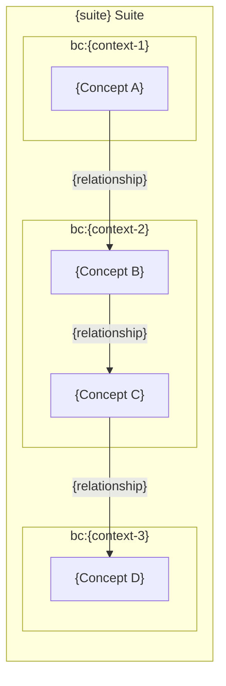
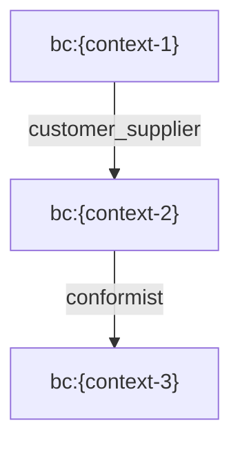
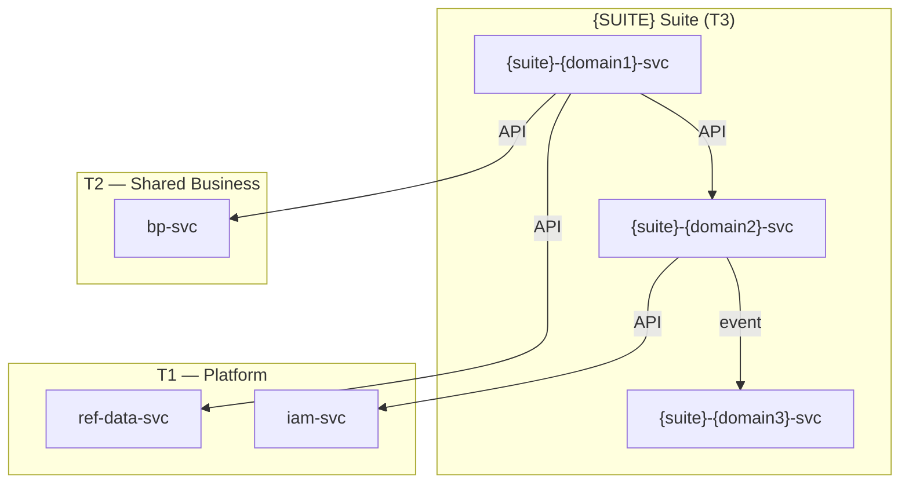
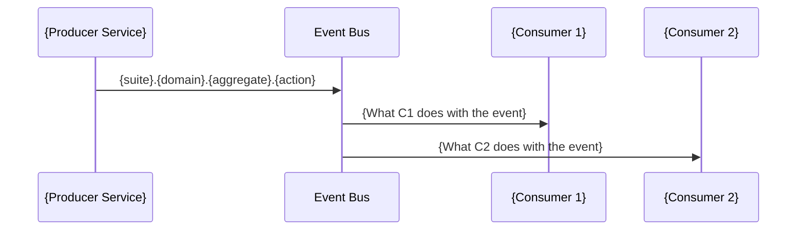
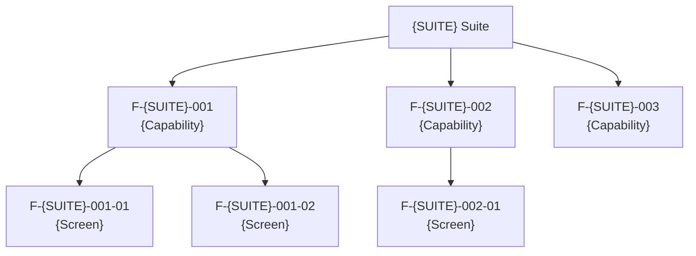
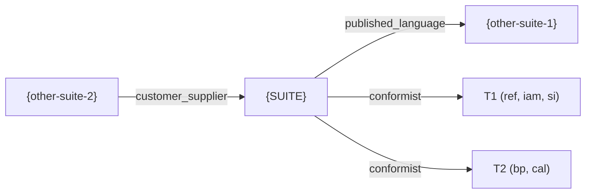

<!-- Template Meta
     Template-ID:   TPL-SUITE
     Version:       1.0.0
     Last Updated:  2026-04-03
     Changelog:
       1.0.0 (2026-04-03) — Initial versioned baseline.
-->

# {SUITE_NAME} Suite Specification

> **Conceptual Stack Layer:** Suite
> **Space:** Platform
> **Owner:** Domain Engineering Team
> **Schema alignment:** `suite-layer.schema.json`
> **Companion files:** `{suite}.catalog.uvl` (referenced in SS6)
> **Contains:** Domain/Service Specs, Platform-Feature Specs, Feature Catalog

> **Meta Information**
> - **Version:** YYYY-MM-DD
> - **Template:** `suite-spec.md` v1.0.0
> - **Template Compliance:** {score}% — {missing sections or "fully compliant"}
> - **Author(s):** Name(s)
> - **Status:** [DRAFT | REVIEW | APPROVED | DEPRECATED]
> - **Suite ID:** `{suite}` (pattern: `^[a-z]{2,4}$`, e.g., `fi`, `pps`, `sd`, `hr`)
> - **Suite Name:** {Full Name} (e.g., "Production, Planning & Shopfloor")
> - **Description:** {1-2 sentence description, min 10 chars}
> - **Semantic Version:** `{major}.{minor}.{patch}` (e.g., `1.0.0`)
> - **Team:**
>   - Name: `{team-name}`
>   - Email: `{team-email}`
>   - Slack: `{slack-channel}`
> - **Bounded Contexts:** `bc:{context-1}`, `bc:{context-2}`, ...

---

## Specification Guidelines

> **This specification MUST comply with the OpenLeap specification guidelines.**
>
> ### Non-Negotiables
> - Never invent facts. If required info is missing, add an **OPEN QUESTION** entry.
> - Preserve intent and decisions. Only change meaning when explicitly requested.
> - Keep the spec **self-contained**: no "see chat", no implicit context.
>
> ### Style Guide
> - Prefer short sentences and lists.
> - Use MUST/SHOULD/MAY for normative statements.
> - Keep terminology consistent with the Ubiquitous Language defined in SS1.
> - Avoid ambiguous words ("often", "maybe") unless explicitly noting uncertainty.

---

<!-- ═══════════════════════════════════════════════════════════════════
     SS0  SUITE IDENTITY & PURPOSE
     Schema alignment: metadata + purpose
     ═══════════════════════════════════════════════════════════════════ -->

## 0. Suite Identity & Purpose

<!-- This section establishes WHAT the suite is and WHY it exists.
     It answers: "If someone asks 'what does the {SUITE} suite do?', this is the answer."
     Schema fields: metadata.id, metadata.name, metadata.description, metadata.version,
     metadata.status, metadata.owner, purpose.business_purpose, purpose.in_scope,
     purpose.out_of_scope, purpose.target_users, purpose.business_value. -->

### 0.1 Suite Identity

| Field | Value |
|-------|-------|
| id | `{suite}` |
| name | {Suite Name} |
| description | {Short description, 1-2 sentences} |
| version | `{major}.{minor}.{patch}` |
| status | `draft` / `active` / `deprecated` |
| owner.team | `team-{suite}` |
| owner.email | `{suite}-team@openleap.io` |
| owner.slack | `#{suite}-team` |
| boundedContexts | `bc:{context-1}`, `bc:{context-2}`, ... |

### 0.2 Business Purpose

<!-- Schema field: purpose.business_purpose (min 50 chars).
     Write a paragraph explaining WHAT business problem this suite solves.
     This is the "elevator pitch" for the suite. -->

### 0.3 In Scope

<!-- Schema field: purpose.in_scope (array, minItems: 1).
     List the business capabilities this suite owns.
     Each item should be a concrete statement, not vague. -->

- {Capability 1: e.g., "Product master data: BOMs, routings, production versions"}
- {Capability 2}
- {Capability 3}

### 0.4 Out of Scope

<!-- Schema field: purpose.out_of_scope (array).
     Explicitly name what this suite does NOT do and point to the owning suite.
     This is critical for boundary clarity. Format: "{Capability} (-> {Suite} suite)" -->

- {Capability} (-> {other-suite} suite)
- {Capability} (-> {other-suite} suite)

### 0.5 Target Users

<!-- Schema field: purpose.target_users[].role / .interest.
     Who works with the features in this suite? -->

| Role | Interest |
|------|----------|
| {Role, e.g., Production Planner} | {What they do, e.g., MRP runs, production scheduling} |
| {Role} | {Interest} |

### 0.6 Business Value

<!-- Schema field: purpose.business_value (array of strings).
     Why does the business invest in this suite? Concrete value statements. -->

- {Value statement 1}
- {Value statement 2}

---

<!-- ═══════════════════════════════════════════════════════════════════
     SS1  UBIQUITOUS LANGUAGE
     Schema alignment: ubiquitous_language[]
     This is THE central chapter of the suite specification.
     ═══════════════════════════════════════════════════════════════════ -->

## 1. Ubiquitous Language

<!-- ┌──────────────────────────────────────────────────────────────────┐
     │  THIS IS THE MOST IMPORTANT SECTION OF THE SUITE SPECIFICATION  │
     │                                                                  │
     │  The Ubiquitous Language (UBL) DEFINES the suite boundary.       │
     │  Suite boundary = UBL boundary (Evans, 2003; Vernon, 2013).      │
     │                                                                  │
     │  PRINCIPLE: When two domains use the same term with the SAME     │
     │  meaning, they belong to the SAME suite. When two domains use    │
     │  the same term with DIFFERENT meanings, they belong to DIFFERENT │
     │  suites. When a term crosses a suite boundary, it MUST be        │
     │  explicitly translated (Anti-Corruption Layer).                  │
     │                                                                  │
     │  CONSEQUENCES OF SHARED UBL (same suite):                        │
     │  - Shared event namespace: {suite}.{domain}.events               │
     │  - Shared API path prefix: /api/{suite}/{domain}/v1              │
     │  - Aggregate references by ID without translation                │
     │  - Features spanning these domains are natural                   │
     │                                                                  │
     │  CONSEQUENCES OF DIFFERENT UBL (different suites):               │
     │  - Communication requires explicit translation                   │
     │  - Cross-suite references use foreign IDs with documented meaning│
     │  - Features spanning these domains require careful scoping       │
     │                                                                  │
     │  Schema field: ubiquitous_language[] (minItems: 1)               │
     │  Each entry: id, term, aliases, definition (min 20 chars),       │
     │  examples, related_terms, used_by_services, not_to_confuse_with  │
     └──────────────────────────────────────────────────────────────────┘ -->

### 1.1 Glossary

<!-- ID pattern: {suite}:glossary:{term-kebab-case}  (e.g., pps:glossary:material)
     Definition MUST be at least 20 characters.
     Include enough entries to fully characterize the suite's vocabulary.
     Every core domain concept from SS2 MUST appear here.
     Aliases are important: German terms, abbreviations, industry synonyms. -->

| ID | Term | Aliases | Definition |
|----|------|---------|------------|
| {suite}:glossary:{term} | {Term} | {Alias1, Alias2} | {Definition, min 20 chars. State what the term means in THIS suite, not in general.} |
| {suite}:glossary:{term} | {Term} | {Alias1} | {Definition} |
| {suite}:glossary:{term} | {Term} | — | {Definition} |

<!-- For each entry, optionally add detail below the table: -->

<!--
#### {suite}:glossary:{term} — {Term}

**Examples:**
- {Concrete example of this term in use}
- {Another example}

**Related terms:** `{suite}:glossary:{related-term-1}`, `{suite}:glossary:{related-term-2}`
**Used by services:** `{suite}-{domain1}-svc`, `{suite}-{domain2}-svc`
**Not to confuse with:** "{Same word in another suite} (in {other-suite}, this means {different meaning})"
-->

### 1.2 UBL Boundary Test

<!-- Provide at least one concrete example demonstrating that this suite's vocabulary
     is distinct from a related suite's vocabulary.
     This validates the suite boundary decision.
     Format: "In {this-suite}, '{Term}' means X. In {other-suite}, the same
     business event is expressed as '{Other Term}' meaning Y." -->

**{SUITE} vs. {other-suite}:**
{This suite} uses "{Term A}" to mean {meaning}. {Other suite} uses "{Term B}" for the same business event, meaning {different meaning}. This confirms {SUITE} and {other-suite} are separate suites.

---

<!-- ═══════════════════════════════════════════════════════════════════
     SS2  DOMAIN MODEL
     Schema alignment: domain_model
     ═══════════════════════════════════════════════════════════════════ -->

## 2. Domain Model

<!-- This section describes the conceptual model at the SUITE level.
     It does NOT repeat aggregate details (those are in Service Specs).
     It shows: which concepts exist, who owns them, how they relate,
     and what is shared across bounded contexts within the suite.
     Schema fields: domain_model.overview_diagram, domain_model.core_concepts[],
     domain_model.shared_kernel[], domain_model.bounded_context_map[] -->

### 2.1 Conceptual Overview

<!-- Schema field: domain_model.overview_diagram (Mermaid).
     A high-level diagram showing the major entities and their ownership.
     This is NOT a detailed class diagram — it is a conceptual map. -->



### 2.2 Core Concepts

<!-- Schema field: domain_model.core_concepts[] (name, owner, description, glossary_ref).
     Each concept MUST have a glossary_ref to SS1.
     Owner = the service-ID that owns this concept's lifecycle. -->

| Concept | Owner (Service) | Description | Glossary Ref |
|---------|----------------|-------------|-------------|
| {Concept} | `{suite}-{domain}-svc` | {What this concept represents} | `{suite}:glossary:{term}` |
| {Concept} | `{suite}-{domain}-svc` | {Description} | `{suite}:glossary:{term}` |

### 2.3 Shared Kernel

<!-- Schema field: domain_model.shared_kernel[] (concept, owner, shared_with, mechanism, type_definition).
     A shared kernel is a concept that multiple services within this suite need.
     The owner provides the canonical definition; others consume via the stated mechanism.

     For each shared concept, you MAY define an authoritative type_definition.
     If you do, service-level shared_types referencing this concept MUST conform to
     the attributes defined here. This ensures structural consistency across services. -->

| Concept | Owner | Shared With | Mechanism |
|---------|-------|-------------|-----------|
| {Shared Concept} | `{suite}-{domain1}-svc` | `{suite}-{domain2}-svc`, `{suite}-{domain3}-svc` | `event` / `api` / `shared_db` / `library` |

<!-- For shared concepts with authoritative type definitions, add detail: -->

<!--
#### Shared Type: {TypeName}

| Attribute | Type | Format | Required | Description | Constraints |
|-----------|------|--------|----------|-------------|-------------|
| {attr} | string | uuid | Yes | {Description} | — |
| {attr} | number | decimal | Yes | {Description} | precision: 2 |

**Validation rules:**
- {Invariant that all implementations must enforce}
-->

### 2.4 Bounded Context Map (Intra-Suite)

<!-- Schema field: domain_model.bounded_context_map[] (upstream, downstream, pattern, description, shared_artifacts).
     This maps relationships BETWEEN bounded contexts WITHIN this suite.
     For cross-suite relationships, see SS8.
     DDD patterns: conformist, customer_supplier, anticorruption_layer,
     shared_kernel, published_language, open_host_service, separate_ways. -->

| Upstream | Downstream | Pattern | Description |
|----------|-----------|---------|-------------|
| `bc:{context-1}` | `bc:{context-2}` | `customer_supplier` | {Why this relationship exists} |
| `bc:{context-2}` | `bc:{context-3}` | `conformist` | {Description} |



---

<!-- ═══════════════════════════════════════════════════════════════════
     SS3  SERVICE LANDSCAPE
     Schema alignment: service_landscape
     ═══════════════════════════════════════════════════════════════════ -->

## 3. Service Landscape

<!-- This section catalogs all microservices in the suite and their responsibilities.
     Each service maps 1:1 to a bounded context and has its own Domain/Service Spec.
     Schema fields: service_landscape.services[], .responsibility_matrix, .dependency_diagram -->

### 3.1 Service Catalog

<!-- Schema field: service_landscape.services[] (id, name, bounded_context, responsibility, status, spec_ref).
     Status values: planned, development, active, deprecated. -->

| Service ID | Name | Bounded Context | Status | Responsibility | Spec |
|-----------|------|----------------|--------|----------------|------|
| `{suite}-{domain1}-svc` | {Name} | `bc:{context-1}` | `active` | {Primary responsibility} | `{suite}_{domain1}-spec.md` |
| `{suite}-{domain2}-svc` | {Name} | `bc:{context-2}` | `planned` | {Primary responsibility} | `{suite}_{domain2}-spec.md` |

### 3.2 Responsibility Matrix

<!-- Schema field: service_landscape.responsibility_matrix.
     Maps high-level responsibilities to the service that owns them.
     Helps answer: "Who handles X?" -->

| Responsibility | Service |
|---------------|---------|
| {Responsibility, e.g., "Product master data"} | `{suite}-{domain}-svc` |
| {Responsibility} | `{suite}-{domain}-svc` |

### 3.3 Service Dependency Diagram

<!-- Schema field: service_landscape.dependency_diagram (Mermaid).
     Shows how services within this suite depend on each other
     and on T1/T2 services. Direction: caller -> callee. -->



---

<!-- ═══════════════════════════════════════════════════════════════════
     SS4  INTEGRATION PATTERNS
     Schema alignment: integration_patterns
     ═══════════════════════════════════════════════════════════════════ -->

## 4. Integration Patterns

<!-- This section documents HOW services in this suite communicate.
     It captures the foundational pattern decision and the reasoning behind it.
     Schema fields: integration_patterns.pattern_decision, .event_flows[],
     .sync_vs_async[], .error_handling[] -->

### 4.1 Pattern Decision

<!-- Schema field: integration_patterns.pattern_decision (pattern + rationale).
     Pattern values: event_driven, orchestration, hybrid.
     State the pattern AND why it was chosen for this suite. -->

| Field | Value |
|-------|-------|
| **Pattern** | `event_driven` / `orchestration` / `hybrid` |

**Rationale:**
<!-- Why this pattern? What characteristics of the suite's domains make this pattern appropriate? -->
- {Reason 1}
- {Reason 2}

### 4.2 Key Event Flows

<!-- Schema field: integration_patterns.event_flows[] (name, trigger, steps[], diagram).
     Document the major event-driven workflows within the suite.
     Each flow should show: trigger -> producer -> event -> consumer -> effect. -->

#### Flow 1: {Flow Name}

**Trigger:** {What initiates this flow}



<!-- Add more flows as needed. -->

### 4.3 Sync vs. Async Decisions

<!-- Schema field: integration_patterns.sync_vs_async[] (integration, type, reason).
     For each inter-service communication, document whether it is
     synchronous (REST API call) or asynchronous (event) and WHY. -->

| Integration | Type | Reason |
|------------|------|--------|
| {Service A reads from Service B} | `sync` | {Why sync, e.g., "Needed for real-time form lookup"} |
| {Service A notifies Service B} | `async` | {Why async, e.g., "Eventual consistency is acceptable"} |

### 4.4 Error Handling

<!-- Schema field: integration_patterns.error_handling[] (scenario, handling).
     How does the suite handle failures in inter-service communication? -->

| Scenario | Handling |
|----------|---------|
| {Event consumer fails} | {e.g., "Dead-letter queue + manual retry"} |
| {Sync API call times out} | {e.g., "Circuit breaker, 3 retries, then degrade"} |

---

<!-- ═══════════════════════════════════════════════════════════════════
     SS5  EVENT CONVENTIONS
     Schema alignment: event_conventions
     ═══════════════════════════════════════════════════════════════════ -->

## 5. Event Conventions

<!-- This section standardizes event naming, structure, and versioning for the entire suite.
     All services in this suite MUST follow these conventions.
     Schema fields: event_conventions.routing_key_pattern, .payload_envelope,
     .versioning, .event_catalog[] -->

### 5.1 Routing Key Pattern

<!-- Schema field: event_conventions.routing_key_pattern (pattern + segments[]).
     Define the naming convention for all events in this suite. -->

**Pattern:** `{suite}.{domain}.{aggregate}.{action}`

| Segment | Description | Examples |
|---------|-------------|---------|
| `{suite}` | Always `{suite}` | `{suite}` |
| `{domain}` | Domain short code | {domain1}, {domain2}, {domain3} |
| `{aggregate}` | Aggregate root name (lowercase) | {aggregate1}, {aggregate2} |
| `{action}` | Past-tense verb | `created`, `updated`, `deleted`, `posted`, `released` |

**Examples:**
- `{suite}.{domain1}.{aggregate1}.created`
- `{suite}.{domain2}.{aggregate2}.posted`

### 5.2 Payload Envelope

<!-- Schema field: event_conventions.payload_envelope.
     The standard envelope that wraps ALL events in this suite.
     This ensures consistent metadata across all producers. -->

```json
{
  "eventId": "uuid",
  "eventType": "{suite}.{domain}.{aggregate}.{action}",
  "timestamp": "ISO-8601",
  "tenantId": "string",
  "correlationId": "uuid",
  "causationId": "uuid",
  "producer": "{suite}-{domain}-svc",
  "schemaVersion": "{major}.{minor}.{patch}",
  "payload": { }
}
```

### 5.3 Versioning Strategy

<!-- Schema field: event_conventions.versioning (strategy + description).
     How are event schema changes managed? -->

| Field | Value |
|-------|-------|
| **Strategy** | {e.g., "Schema evolution with backward compatibility"} |
| **Description** | {e.g., "New optional fields are additive. Removing fields requires a new major version with parallel publishing during migration."} |

### 5.4 Event Catalog

<!-- Schema field: event_conventions.event_catalog[] (routing_key, producer, consumers[], description).
     Comprehensive list of all events in this suite.
     Each event published by any service MUST appear here. -->

| Routing Key | Producer | Consumer(s) | Description |
|------------|----------|-------------|-------------|
| `{suite}.{domain1}.{agg}.{action}` | `{suite}-{domain1}-svc` | `{suite}-{domain2}-svc`, `{other-suite}` | {What happened} |
| `{suite}.{domain2}.{agg}.{action}` | `{suite}-{domain2}-svc` | `{suite}-{domain3}-svc` | {What happened} |

---

<!-- ═══════════════════════════════════════════════════════════════════
     SS6  FEATURE CATALOG
     Schema alignment: (references companion {suite}.catalog.uvl)
     ═══════════════════════════════════════════════════════════════════ -->

## 6. Feature Catalog

<!-- This section provides the human-readable view of the suite's feature tree.
     The machine-readable counterpart is the companion file: {suite}.catalog.uvl
     Features follow the FODA hierarchy (Kang et al., 1990):
       Capability (composition) -> Use-Case (composition/leaf) -> Screen (leaf)
     Feature IDs: F-{SUITE}-{NNN} (composition) or F-{SUITE}-{NNN}-{NN} (leaf)
     Each leaf feature has its own Feature Spec (platform/feature-spec.md template). -->

### 6.1 Feature Tree

<!-- ASCII representation of the complete feature tree for this suite.
     Mark each node as [COMPOSITION] or [LEAF] and mandatory/optional. -->

```
{SUITE} Suite
├── F-{SUITE}-001  {Capability Name}                [COMPOSITION] [mandatory]
│   ├── F-{SUITE}-001-01  {Use-Case / Screen Name}  [LEAF]        [mandatory]
│   ├── F-{SUITE}-001-02  {Use-Case / Screen Name}  [LEAF]        [optional]
│   └── F-{SUITE}-001-03  {Use-Case / Screen Name}  [LEAF]        [optional]
├── F-{SUITE}-002  {Capability Name}                [COMPOSITION] [mandatory]
│   ├── F-{SUITE}-002-01  {Screen Name}             [LEAF]        [mandatory]
│   └── F-{SUITE}-002-02  {Screen Name}             [LEAF]        [optional]
└── F-{SUITE}-003  {Capability Name}                [COMPOSITION] [optional]
    └── F-{SUITE}-003-01  {Screen Name}             [LEAF]        [mandatory]
```



### 6.2 Mandatory Features

<!-- Features that MUST be included in any product that uses this suite.
     These represent the minimum viable suite. -->

| Feature ID | Name | Rationale |
|-----------|------|-----------|
| `F-{SUITE}-{NNN}` | {Name} | {Why this is mandatory} |

### 6.3 Cross-Suite Feature Dependencies

<!-- Features in this suite that require features from other suites.
     These create UVL `requires` constraints in the catalog.
     Rule: Read-Across, Mutate-Local (see Conceptual Stack SS6). -->

| This Suite Feature | Requires | From Suite | Reason |
|-------------------|----------|-----------|--------|
| `F-{SUITE}-{NNN}` | `F-{OTHER}-{NNN}` | `{other}` | {e.g., "Reads supplier data"} |

### 6.4 Feature Register

<!-- Summary table of all leaf features with their status and spec reference.
     This is the "master list" of all features in the suite. -->

| Feature ID | Name | Status | Spec Reference |
|-----------|------|--------|---------------|
| `F-{SUITE}-{NNN}-{NN}` | {Name} | `draft` / `approved` / `active` / `deprecated` | `features/{feature-id}/feature-spec.md` |

### 6.5 Variability Summary

<!-- High-level summary of variability across the suite's features.
     How many attributes, what binding times are used, what group types. -->

| Metric | Value |
|--------|-------|
| Total composition nodes | {N} |
| Total leaf features | {N} |
| Mandatory features | {N} |
| Optional features | {N} |
| Cross-suite `requires` | {N} |
| Attributes (total across leaves) | {N} |
| Binding times used | `compile`, `deploy`, `runtime` |

---

<!-- ═══════════════════════════════════════════════════════════════════
     SS7  CROSS-CUTTING CONCERNS
     Schema alignment: cross_cutting_concerns
     ═══════════════════════════════════════════════════════════════════ -->

## 7. Cross-Cutting Concerns

<!-- This section documents compliance, security, multi-tenancy, and audit
     requirements that apply to ALL services in this suite.
     Individual services inherit these; they may add but not weaken them.
     Schema fields: cross_cutting_concerns.compliance[], .security,
     .multi_tenancy, .audit -->

### 7.1 Compliance

<!-- Schema field: cross_cutting_concerns.compliance[] (regulation, requirement, implementation).
     List every regulatory or standard requirement that affects this suite. -->

| Regulation | Requirement | Implementation |
|-----------|-------------|----------------|
| {e.g., ISO 9001} | {What the regulation requires} | {How this suite fulfills it} |
| {e.g., GDPR} | {Requirement} | {Implementation} |
| {e.g., SOX} | {Requirement} | {Implementation} |

### 7.2 Security

<!-- Schema field: cross_cutting_concerns.security (authentication, authorization, data_classification). -->

| Aspect | Approach |
|--------|---------|
| **Authentication** | {e.g., "OAuth2 / OIDC via T1 iam-svc"} |
| **Authorization** | {e.g., "RBAC via T1 iam-svc, roles defined per service"} |
| **Data Classification** | {e.g., "Internal — no PII stored in this suite"} |

### 7.3 Multi-Tenancy

<!-- Schema field: cross_cutting_concerns.multi_tenancy (model, isolation, tenant_id_propagation, rules[]).
     Model values: single_tenant, shared_schema, schema_per_tenant, db_per_tenant. -->

| Aspect | Value |
|--------|-------|
| **Model** | `shared_schema` / `schema_per_tenant` / `db_per_tenant` / `single_tenant` |
| **Isolation** | {e.g., "Row-Level Security via tenant_id on all tables"} |
| **Tenant ID Propagation** | {e.g., "JWT claim tenant_id -> propagated in event envelope and X-Tenant-ID header"} |

**Rules:**
- {Rule 1, e.g., "All queries MUST include tenant_id filter"}
- {Rule 2, e.g., "Cross-tenant data access is forbidden at the API level"}

### 7.4 Audit

<!-- Schema field: cross_cutting_concerns.audit (requirements[], retention[]).
     What must be audited, and how long must audit data be retained? -->

**Audit Requirements:**
- {e.g., "All state changes on aggregates MUST be audit-logged"}
- {e.g., "Audit log entries MUST include: who, when, what, old value, new value"}

**Retention Policies:**

<!-- Schema field: cross_cutting_concerns.audit.retention[] (entity, period, legal_basis, action_after_expiry).
     action_after_expiry values: delete, anonymize, archive. -->

| Entity / Data Class | Retention Period | Legal Basis | Action After Expiry |
|--------------------|-----------------|-------------|-------------------|
| {e.g., Journal Entry} | {e.g., 10 years} | {e.g., HGB SS257} | `archive` / `delete` / `anonymize` |
| {e.g., Audit Log} | {e.g., 90 days} | {e.g., Internal policy} | `delete` |
| {e.g., User Session} | {e.g., 30 days} | {e.g., GDPR Art. 17} | `anonymize` |

---

<!-- ═══════════════════════════════════════════════════════════════════
     SS8  EXTERNAL INTERFACES
     Schema alignment: external_interfaces
     ═══════════════════════════════════════════════════════════════════ -->

## 8. External Interfaces

<!-- This section documents how this suite communicates with OTHER suites.
     For intra-suite communication, see SS4 (Integration Patterns).
     Cross-suite rule: Read-Across, Mutate-Local (Conceptual Stack SS6).
     Schema fields: external_interfaces.outbound[], .inbound[], .external_context_mapping[] -->

### 8.1 Outbound Interfaces ({SUITE} -> Other Suites)

<!-- Schema field: external_interfaces.outbound[] (target_suite, interface_type, interface_name, description).
     interface_type: event, api. -->

| Target Suite | Interface Type | Interface Name | Description |
|-------------|---------------|----------------|-------------|
| {other-suite} | `event` | `{suite}.{domain}.{agg}.{action}` | {What this event tells the other suite} |
| {other-suite} | `api` | `GET /api/{suite}/{domain}/v1/{resource}` | {What the other suite reads from us} |

### 8.2 Inbound Interfaces (Other Suites -> {SUITE})

<!-- Schema field: external_interfaces.inbound[] (target_suite, interface_type, interface_name, description). -->

| Source Suite | Interface Type | Interface Name | Description |
|-------------|---------------|----------------|-------------|
| {other-suite} | `event` | `{other}.{domain}.{agg}.{action}` | {What this suite does when it receives this event} |
| T1 ref | `api` | `GET /api/ref/ref/v1/catalogs/{catalog}` | Reference data lookup |
| T2 bp | `api` | `GET /api/shared/bp/v1/parties/{id}` | Business partner lookup |

### 8.3 External Context Mapping

<!-- Schema field: external_interfaces.external_context_mapping[] (upstream, downstream, pattern, description, shared_artifacts).
     DDD context mapping for CROSS-SUITE boundaries.
     Patterns: conformist, customer_supplier, anticorruption_layer,
     shared_kernel, published_language, open_host_service, separate_ways. -->

| Upstream | Downstream | Pattern | Description |
|----------|-----------|---------|-------------|
| `{suite}` | `{other-suite}` | `published_language` | {e.g., "Events published using shared schema"} |
| `{other-suite}` | `{suite}` | `anticorruption_layer` | {e.g., "Translates external vocabulary to suite UBL"} |



---

<!-- ═══════════════════════════════════════════════════════════════════
     SS9  ARCHITECTURE DECISIONS
     Schema alignment: adrs[]
     ═══════════════════════════════════════════════════════════════════ -->

## 9. Architecture Decisions

<!-- Suite-level ADRs that apply to ALL services in this suite.
     Service-level ADRs live in the Domain/Service Spec.
     ID pattern: ADR-{SUITE}-{NNN} (e.g., ADR-PPS-001).
     Schema fields: adrs[] (id, title, status, scope, context, decision, rationale[],
     consequences.positive[], consequences.negative[], affected_services[],
     supersedes, superseded_by).
     Status values: proposed, accepted, deprecated, superseded. -->

### ADR-{SUITE}-001: {Title}

| Field | Value |
|-------|-------|
| **ID** | `ADR-{SUITE}-001` |
| **Status** | `proposed` / `accepted` / `deprecated` / `superseded` |
| **Scope** | {Which services are affected, e.g., "All {SUITE} services"} |

**Context:**
<!-- What is the situation that requires a decision? -->

**Decision:**
<!-- What was decided? -->

**Rationale:**
- {Reason 1}
- {Reason 2}

**Consequences:**

| Positive | Negative |
|----------|----------|
| {Benefit 1} | {Cost/risk 1} |
| {Benefit 2} | {Cost/risk 2} |

**Affected Services:** `{suite}-{domain1}-svc`, `{suite}-{domain2}-svc`

<!-- Add more ADRs as needed using the same format: ADR-{SUITE}-002, ADR-{SUITE}-003, etc. -->

---

<!-- ═══════════════════════════════════════════════════════════════════
     SS10  ROADMAP
     Schema alignment: roadmap[]
     ═══════════════════════════════════════════════════════════════════ -->

## 10. Roadmap

<!-- Schema field: roadmap[] (phase, timeframe, items[]).
     Planned evolution of the suite: new services, new features,
     deprecations, major refactorings. -->

| Phase | Timeframe | Items |
|-------|-----------|-------|
| {Phase 1, e.g., "Foundation"} | {e.g., "Q2 2026"} | {Item 1}, {Item 2} |
| {Phase 2, e.g., "Extension"} | {e.g., "Q3 2026"} | {Item 1}, {Item 2} |
| {Phase 3, e.g., "Optimization"} | {e.g., "Q4 2026"} | {Item 1}, {Item 2} |

---

<!-- ═══════════════════════════════════════════════════════════════════
     SS11  APPENDIX
     ═══════════════════════════════════════════════════════════════════ -->

## 11. Appendix

### 11.1 Change Log

| Date | Version | Author | Changes |
|------|---------|--------|---------|
| YYYY-MM-DD | 1.0.0 | {Name} | Initial suite specification |

### 11.2 Review & Approval

**Status:** [DRAFT | REVIEW | APPROVED | DEPRECATED]

**Reviewers:**

| Role | Name | Date | Status |
|------|------|------|--------|
| Suite Architect | {Name} | YYYY-MM-DD | [ ] Reviewed |
| Domain Lead ({domain1}) | {Name} | YYYY-MM-DD | [ ] Reviewed |
| Domain Lead ({domain2}) | {Name} | YYYY-MM-DD | [ ] Reviewed |
| Product Owner | {Name} | YYYY-MM-DD | [ ] Reviewed |

**Approval:**

| Role | Name | Date | Approved |
|------|------|------|----------|
| Suite Architect | {Name} | YYYY-MM-DD | [ ] |
| Engineering Manager | {Name} | YYYY-MM-DD | [ ] |

---

## Authoring Checklist

> Before moving to REVIEW status, verify:

- [ ] Suite ID follows pattern `^[a-z]{2,4}$` (SS0)
- [ ] Business purpose is at least 50 characters (SS0)
- [ ] In-scope and out-of-scope are concrete and mutually exclusive (SS0)
- [ ] UBL glossary has entries for every core concept (SS1)
- [ ] Every glossary definition is at least 20 characters (SS1)
- [ ] UBL boundary test demonstrates vocabulary distinction from at least one related suite (SS1)
- [ ] Every core concept in SS2 has a glossary_ref back to SS1 (SS2)
- [ ] Shared kernel types define authoritative attributes (SS2, if applicable)
- [ ] Bounded context map uses valid DDD patterns (SS2)
- [ ] Service catalog lists all services with status and spec reference (SS3)
- [ ] Integration pattern decision has rationale (SS4)
- [ ] Event flows cover all major intra-suite workflows (SS4)
- [ ] Routing key pattern is documented with segments and examples (SS5)
- [ ] Payload envelope matches platform standard (SS5)
- [ ] Event catalog lists every published event (SS5)
- [ ] Feature tree is complete with mandatory/optional annotations (SS6)
- [ ] Cross-suite feature dependencies are listed (SS6)
- [ ] Companion `{suite}.catalog.uvl` is created and matches SS6 tree (SS6)
- [ ] Compliance requirements list all applicable regulations (SS7)
- [ ] Multi-tenancy model is specified (SS7)
- [ ] Retention policies have legal basis (SS7)
- [ ] External interfaces document all cross-suite communication (SS8)
- [ ] External context mapping uses valid DDD patterns (SS8)
- [ ] All ADRs have ID pattern `ADR-{SUITE}-NNN` (SS9)
- [ ] Roadmap covers at least the next two phases (SS10)
