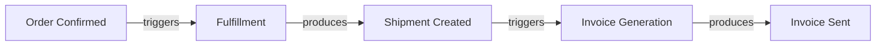
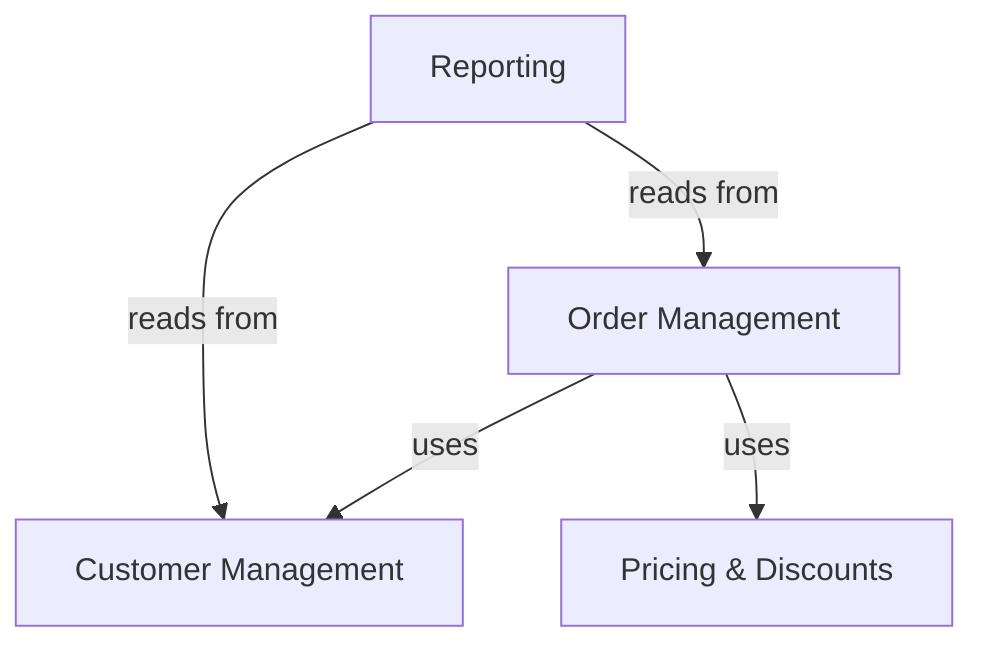

<!-- Template Meta
     Template-ID:   TPL-PROD
     Version:       1.1.0
     Last Updated:  2026-04-15
     Changelog:
       1.1.0 (2026-04-15) — Added §SS21 Compliance & Operational Requirements
                             (DORA). New section is optional (MINOR change per
                             GOV-TPL-001).
       1.0.0 (2026-04-03) — Initial versioned baseline.
-->

# {Product Name} --- Product Specification

> **Conceptual Stack Layer:** Product
> **Space:** Product (Application Engineering)
> **Owner:** Application Engineering Team
> **Companion files:** product-config.uvl (referenced in SS17)
> **References:** Platform Feature Catalog (SS16), Platform-Feature Specs (SS17)

> **Meta Information**
> - **Version:** YYYY-MM-DD
> - **Template:** `product-spec.md` v1.0.0
> - **Template Compliance:** {score}% — {missing sections or "fully compliant"}
> - **Author(s):** Name(s)
> - **Status:** [DRAFT | REVIEW | APPROVED | DEPRECATED]
> - **Product ID:** `{product-id}` (e.g., `sales-workbench`)
> - **Project:** `{project-name}` / `{customer-name}`
> - **Companion UVL:** `{product-id}.product-config.uvl`
> - **Validated against:** `catalog.uvl` version `{YYYY-MM-DD}`

> **What this document is --- THE consolidated product template**
>
> A Product Specification is the **single, comprehensive deliverable** of
> Application Engineering (Elara). It captures everything discovered about
> a customer's needs and everything decided about how the platform serves
> those needs.
>
> **Structure:**
> - **SS0-SS15** (Elara Discovery): Business reality --- processes, objects,
>   rules, capabilities, and vocabulary discovered during AI-guided interviews.
>   These sections are authored in Elara and frozen at Conceptual Freeze.
> - **SS16** (The Bridge): Required capabilities sent to Platform, resolution
>   returned --- matched, partial, or gap.
> - **SS17-SS20** (Product Configuration): How the platform is configured to
>   serve this customer --- feature selection, BFF setup, navigation, custom services.
> - **SS21** (Appendix): Change log, review, approval.
>
> **What does NOT live here:**
> - Feature journeys and screens --> Feature Specs in Telos
> - API contracts and business rules --> Backend domain specs in Telos
> - Platform navigation shell --> IAM / shell team
>
> **Decompose will:**
> 1. Validate this config against `catalog.uvl` (validity + completeness)
> 2. Check all cross-suite requires are satisfied within the selection
> 3. Report gap features --- selected leaf IDs with no `.md` spec yet

---

<!-- ================================================================
     PART I --- ELARA DISCOVERY (SS0-SS15)
     Business reality captured during AI-guided discovery interviews.
     These sections are authored in Elara and frozen at Conceptual Freeze.
     ================================================================ -->

<!-- ============================================================
     SS0 --- PRODUCT IDENTITY
     WHAT is this product, WHO is it for, and WHY does it exist?
     ============================================================ -->

## SS0. Product Identity

### 0.1 What This Product Is

<!-- 2-3 sentences: which frontend application is this?
     Who uses it? What is its core job?

     EXAMPLE:
     "The Sales Workbench is a desktop-first web application for sales
     clerks and sales managers. It consolidates order entry, customer
     lookup, and pipeline management into a single workspace." -->

### 0.2 Problem Statement

<!-- What is painful, broken, or impossible for users today without this product?
     Be concrete --- use data, user quotes, or process metrics where available.

     BAD:  "Users need a better way to manage orders."
     GOOD: "Sales clerks switch between 4 systems to enter one order.
            Average entry time: 12 minutes. Target: under 3 minutes." -->

### 0.3 Non-Goals

<!-- What does this product explicitly NOT do?
     Prevents scope creep and "why isn't X in here?" questions.

     EXAMPLE:
     - This product does NOT handle warehouse operations (separate product)
     - This product does NOT replace the existing pricing engine (integration only)
     - This product does NOT provide analytics dashboards (covered by BI product) -->

### 0.4 Success Metrics

<!-- Quantifiable measures of product success. Each metric must have a
     baseline (current state), target (desired state), and measurement method.

     These metrics are referenced in SS12 (KPIs) for ongoing tracking. -->

| Metric | Baseline | Target | How measured |
|---|---|---|---|
| {e.g., Order entry time} | {now} | {goal} | {method} |
| {e.g., Support tickets for X} | {now} | {goal} | {method} |

---

<!-- ============================================================
     SS1 --- PROJECT SCOPE
     WHAT is the boundary of this project?
     ============================================================ -->

## SS1. Project Scope

### 1.1 Business Problem

<!-- Describe the business problem this project addresses. This is the
     "why" behind the product --- the pain, inefficiency, or opportunity.

     Be specific. Reference concrete processes, costs, or user complaints.
     This section justifies the project's existence to stakeholders. -->

### 1.2 Goals

<!-- What must this project achieve to be considered successful?
     List 3-7 concrete, measurable goals.

     Each goal should be:
     - Specific (not vague)
     - Measurable (has a success criterion)
     - Time-bound (has a target date or phase) -->

| ID | Goal | Success criterion | Target phase |
|---|---|---|---|
| G-001 | {e.g., Reduce order entry time} | {< 3 minutes per order} | {Phase 1} |
| G-002 | {e.g., Eliminate duplicate data entry} | {Zero re-keying between systems} | {Phase 1} |

### 1.3 In Scope

<!-- What is explicitly included in this project?
     List the business areas, processes, and user groups covered. -->

- {e.g., Sales order creation and management}
- {e.g., Customer lookup and basic customer data maintenance}
- {e.g., Pricing inquiry (read-only, no pricing maintenance)}

### 1.4 Out of Scope

<!-- What is explicitly excluded from this project?
     Each exclusion should have a brief rationale. -->

| Excluded area | Rationale |
|---|---|
| {e.g., Warehouse operations} | {Separate project, different user group} |
| {e.g., Financial reporting} | {Covered by BI product} |

### 1.5 Constraints

<!-- Technical, organizational, or regulatory constraints that limit
     design choices. Each constraint should have a source (who imposed it)
     and an impact (what it prevents or requires). -->

| Constraint | Source | Impact |
|---|---|---|
| {e.g., Must run in IE11} | {Customer IT policy} | {Limits UI framework choices} |
| {e.g., Data must stay in EU} | {GDPR + customer policy} | {Deployment region restricted} |

### 1.6 Assumptions

<!-- What are we assuming to be true that, if false, would change the project?
     Each assumption should have a validation method and a risk if wrong. -->

| Assumption | Validation | Risk if wrong |
|---|---|---|
| {e.g., Users have stable internet} | {Confirm with IT} | {Need offline mode --- adds 3 months} |

---

<!-- ============================================================
     SS2 --- ACTORS & STAKEHOLDERS
     WHO interacts with or cares about this product?
     ============================================================ -->

## SS2. Actors & Stakeholders

### 2.1 Actors

<!-- People or systems that directly interact with the product.
     Each actor has a role, responsibilities, and decision authority.

     Actors discovered here feed into SS3 (Personas) where they are
     enriched with IAM roles, job-to-be-done, and UX characteristics. -->

| Actor | Type | Responsibilities | Decision authority |
|---|---|---|---|
| {e.g., Sales Clerk} | human | {Enter orders, manage customer contacts} | {Can approve orders up to 5000 EUR} |
| {e.g., Sales Manager} | human | {Approve discounts, review pipeline} | {Can approve any order amount} |
| {e.g., ERP System} | system | {Receives order data for financial posting} | {N/A} |

### 2.2 Stakeholders

<!-- People who have an interest in the product but do not directly
     use it. They influence requirements, priorities, or constraints. -->

| Stakeholder | Interest | Influence |
|---|---|---|
| {e.g., CFO} | {Revenue impact of faster order processing} | {Budget approval, priority setting} |
| {e.g., IT Security} | {Data protection compliance} | {Veto on architecture decisions} |

---

<!-- ============================================================
     SS3 --- PERSONAS
     WHO are the real users, and what do they need?
     Enriched from SS2 actors with IAM roles and UX characteristics.
     ============================================================ -->

## SS3. Personas

<!-- Personas are project-scoped and discovery-driven. They live here in Elara,
     not in Telos. Feature Specs reference role types generically; ProductConfigs
     map those to specific project personas.

     IAM role codes from _iam_suite.md. -->

| Persona | IAM Role(s) | Core job-to-be-done | Use frequency | Tech comfort |
|---|---|---|---|---|
| {e.g., Sales Clerk} | `SD_USER` | Enter and track customer orders | Daily | Medium |
| {e.g., Sales Manager} | `SD_MANAGER` | Approve discounts, review pipeline | Weekly | Medium |
| {e.g., Pricing Admin} | `SD_ADMIN` | Maintain pricing agreements | Occasional | High |
| {e.g., Controller} | `FI_VIEWER` | Read-only financial review | Occasional | Low |

**Primary persona:** {Name} --- all design decisions optimise for this persona first.

### 3.1 Persona Details

<!-- For each persona, provide a detailed profile. This drives UI design
     decisions, feature prioritization, and acceptance criteria.

     Only detail the primary persona and any persona with unusual needs.
     Secondary personas with straightforward needs can use the table above. -->

#### {Persona Name}

| Field | Value |
|---|---|
| IAM Roles | `{ROLE_CODE_1}`, `{ROLE_CODE_2}` |
| Primary job-to-be-done | {What is this person trying to accomplish?} |
| Use frequency | {Daily / Weekly / Occasional} |
| Tech comfort | {Low / Medium / High} |
| Pain points (current) | {What frustrates them today?} |
| Workarounds (current) | {How do they cope with the pain today?} |
| Key scenarios | {Which features does this persona use most?} |

---

<!-- ============================================================
     SS4 --- BUSINESS PROCESSES
     WHAT happens in the business, step by step?
     Discovered via AI-guided interviews in Elara.
     ============================================================ -->

## SS4. Business Processes

<!-- Processes at L0 (value chain), L1 (business process), L2 (sub-process).
     Primary input for feature identification. -->

### 4.1 Process Register

| Process ID | Name | Level | Actors | BPMN Reference |
|---|---|---|---|---|
| `BP-{NNN}` | {e.g., Order to Cash} | L0 | {Sales Clerk, Customer, ERP} | {link or "pending"} |
| `BP-{NNN}-{NN}` | {e.g., Create Sales Order} | L1 | {Sales Clerk} | {link or "pending"} |

### 4.2 Process Details

<!-- For each L1 process: trigger, outcome, actors, step table, BPMN diagram (Mermaid). -->

#### BP-{NNN}-{NN}: {Process Name}

**Trigger:** {What starts this process?}
**Outcome:** {What is the end state?}
**Actors:** {Who participates?}

| Step | Actor | Action | Gateway? | Data in | Data out |
|---|---|---|---|---|---|
| 1 | {Sales Clerk} | {Look up customer} | | | {Customer record} |
| 2 | {Sales Clerk} | {Enter order items} | | {Product catalog} | {Order lines} |
| 3 | {Sales Clerk} | {Check pricing} | Yes: discount > 10%? | {Pricing rules} | {Final price} |
| 4 | {Sales Manager} | {Approve discount} | | {Order + discount} | {Approval} |
| 5 | {Sales Clerk} | {Confirm order} | | {Complete order} | {Order confirmation} |

<!-- Include Mermaid BPMN diagram for complex processes. -->

### 4.3 Process-to-Feature Mapping Preview

<!-- This is a forward reference to SS16 (Required Capabilities).
     After all processes are documented, each process step will be
     mapped to a required capability, which is then resolved against
     the platform feature catalog.

     Do NOT fill this during initial discovery --- it is populated
     during the capability analysis phase. -->

<!-- Populated in SS16 after capability analysis. -->

---

<!-- ============================================================
     SS5 --- BUSINESS OBJECTS
     WHAT data entities does the business work with?
     ============================================================ -->

## SS5. Business Objects

<!-- Business-level data entities (not database tables). Key attributes,
     lifecycle states, and ownership for each. -->

### 5.1 Business Object Register

| Object ID | Name | Owner (process) | Lifecycle states | Key relationships |
|---|---|---|---|---|
| `BO-{NNN}` | {e.g., Sales Order} | {BP-{NNN}-{NN}} | {Draft, Confirmed, Shipped, Invoiced, Closed} | {contains Order Lines, references Customer} |
| `BO-{NNN}` | {e.g., Customer} | {BP-{NNN}-{NN}} | {Active, Blocked, Archived} | {referenced by Sales Order, Invoice} |

### 5.2 Business Object Details

<!-- For each significant business object, document definition, key
     attributes, lifecycle (Mermaid stateDiagram), ownership, and volume. -->

#### BO-{NNN}: {Object Name}

**Definition:** {1-2 sentences: what is this object in business terms?}

| Attribute | Type | Required? | Business meaning |
|---|---|---|---|
| {e.g., orderNumber} | {string} | {Yes} | {Unique identifier assigned at creation} |
| {e.g., totalAmount} | {money} | {Yes} | {Sum of all line items after discounts} |

**Lifecycle:** {Draft --> Confirmed --> Shipped --> Invoiced --> Closed}
**Ownership:** {Which actor/process creates and maintains this object?}
**Volume:** {Expected number of instances, growth rate}

---

<!-- ============================================================
     SS6 --- BUSINESS EVENTS
     WHAT happens that other parts of the business care about?
     ============================================================ -->

## SS6. Business Events

<!-- Business events (not technical domain events) that chain processes together.
     These inform technical event design in service specs. -->

### 6.1 Event Register

| Event ID | Name | Trigger type | Source (process/object) | Carries | Chains to |
|---|---|---|---|---|---|
| `BE-{NNN}` | {e.g., Order Confirmed} | {process step} | {BP-{NNN}-{NN}, step 5} | {Order ID, customer ID, total amount} | {Fulfillment process, Invoice generation} |
| `BE-{NNN}` | {e.g., Payment Received} | {external system} | {ERP posting} | {Invoice ID, amount, date} | {Order closure process} |

### 6.2 Event Chain Diagram

<!-- Show how events chain processes together. This reveals the
     end-to-end flow across process boundaries.

     EXAMPLE: Order Confirmed --> triggers Fulfillment --> which produces
     Shipment Created --> triggers Invoice Generation -->  which produces
     Invoice Sent --> ... -->



---

<!-- ============================================================
     SS7 --- BUSINESS RULES
     WHAT rules govern business behavior?
     ============================================================ -->

## SS7. Business Rules

<!-- Rule types: validation, calculation, authorization, policy, derivation, trigger.
     Discovered during interviews, later formalized in platform service specs. -->

### 7.1 Business Rule Register

| Rule ID | Name | Type | Enforcement | Source |
|---|---|---|---|---|
| `BR-{NNN}` | {e.g., Discount approval threshold} | {authorization} | {hard --- cannot be overridden} | {Company policy document X} |
| `BR-{NNN}` | {e.g., Order total calculation} | {calculation} | {hard} | {Finance department} |
| `BR-{NNN}` | {e.g., Credit check for large orders} | {policy} | {soft --- can be overridden with reason} | {Risk management} |

### 7.2 Rule Details

<!-- For each rule: type, enforcement, statement, rationale, examples, exceptions. -->

#### BR-{NNN}: {Rule Name}

**Type:** {validation | calculation | authorization | policy | derivation | trigger}
**Enforcement:** {hard | soft (can be overridden with documented reason)}
**Statement:** {Clear, unambiguous rule statement}
**Rationale:** {Why does this rule exist?}

| Scenario | Input | Expected result |
|---|---|---|
| {Normal case} | {Discount = 5%} | {Order proceeds without approval} |
| {Exceeded case} | {Discount = 15%} | {Order blocked, requires SD_MANAGER approval} |

**Exceptions:** {Cases where this rule does not apply, or "None"}

---

<!-- ============================================================
     SS8 --- BUSINESS CAPABILITIES
     WHAT can the business do?
     ============================================================ -->

## SS8. Business Capabilities

<!-- Business capabilities describe WHAT the business can do (not HOW).
     They are the stable, process-independent abilities of the organization.

     Capabilities are classified as:
     - core:        Differentiating capabilities (source of competitive advantage)
     - supporting:  Necessary but not differentiating
     - generic:     Commodity (could be outsourced or bought off-the-shelf)

     Each capability is fulfilled by one or more business processes (SS4). -->

### 8.1 Capability Map

| Capability ID | Name | Classification | Fulfilled by (processes) | Notes |
|---|---|---|---|---|
| `CAP-{NNN}` | {e.g., Order Management} | {core} | {BP-{NNN}-{NN}, BP-{NNN}-{NN}} | {Primary revenue driver} |
| `CAP-{NNN}` | {e.g., Customer Data Management} | {supporting} | {BP-{NNN}-{NN}} | {Shared across all sales processes} |
| `CAP-{NNN}` | {e.g., Email Notification} | {generic} | {BP-{NNN}-{NN}} | {Standard notification service} |

### 8.2 Capability-to-Process Matrix

<!-- Show which processes contribute to which capabilities.
     This matrix reveals gaps (capabilities without processes) and
     redundancies (multiple processes for the same capability). -->

| Capability | BP-{NNN}-01 | BP-{NNN}-02 | BP-{NNN}-03 | ... |
|---|---|---|---|---|
| {Order Management} | {primary} | | {supports} | |
| {Customer Data Mgmt} | {supports} | {primary} | | |

---

<!-- ============================================================
     SS9 --- DOMAIN VOCABULARY
     WHAT terms does this business use, and what do they mean?
     ============================================================ -->

## SS9. Domain Vocabulary

<!-- The domain vocabulary is the glossary of business terms discovered
     during interviews. It feeds into the platform's Ubiquitous Language
     (UBL) at the suite level.

     Terms here are BUSINESS terms as the customer uses them. They may
     differ from platform terms --- the mapping is documented in SS16. -->

### 9.1 Glossary

| Term | Aliases | Definition | Disambiguation |
|---|---|---|---|
| {e.g., Order} | {Sales Order, SO} | {A customer's request to purchase products at agreed prices} | {Not a Purchase Order (PO), which is outbound to suppliers} |
| {e.g., Customer} | {Client, Account} | {A business partner who purchases from us} | {In this product, "Account" always means customer, not ledger account} |
| {e.g., Discount} | {Rebate, Price Reduction} | {A percentage or absolute reduction from list price} | {"Rebate" here means order-level discount, not volume-based rebate program} |

---

<!-- ============================================================
     SS10 --- QUALITY REQUIREMENTS
     HOW well must the product perform?
     ============================================================ -->

## SS10. Quality Requirements

<!-- NFRs by ISO 25010 category (Performance, Availability, Scalability,
     Security, Usability, Maintainability, Portability). Measurable targets required. -->

### 10.1 Quality Requirement Register

| QR ID | Category | Requirement | Target | Rationale |
|---|---|---|---|---|
| `QR-{NNN}` | {Performance} | {Order search response time} | {< 500ms for p95} | {Sales clerks search 50+ times/day} |
| `QR-{NNN}` | {Availability} | {System uptime during business hours} | {99.9% (08:00-20:00 CET)} | {Revenue impact of downtime} |
| `QR-{NNN}` | {Security} | {Data encryption at rest} | {AES-256} | {GDPR + customer policy} |
| `QR-{NNN}` | {Usability} | {New user onboarding time} | {< 2 hours to first productive use} | {High turnover in sales team} |

---

<!-- ============================================================
     SS11 --- EXTERNAL INTERFACES
     WHAT systems, agencies, or channels does this product interact with?
     ============================================================ -->

## SS11. External Interfaces

<!-- Systems, services, or channels outside the OpenLeap platform that
     this product must interact with. Each interface has a direction
     (inbound, outbound, bidirectional) and a data description. -->

### 11.1 Interface Register

| Interface ID | External system | Direction | Data exchanged | Protocol | Notes |
|---|---|---|---|---|---|
| `EI-{NNN}` | {e.g., Legacy ERP} | {outbound} | {Order data for financial posting} | {REST API / File / EDI} | {Daily batch, not real-time} |
| `EI-{NNN}` | {e.g., Payment Gateway} | {bidirectional} | {Payment requests and confirmations} | {REST API} | {Real-time, PCI-DSS compliant} |
| `EI-{NNN}` | {e.g., Email Service} | {outbound} | {Order confirmations, notifications} | {SMTP / API} | |

---

<!-- ============================================================
     SS12 --- KPIs
     HOW do we measure ongoing success?
     ============================================================ -->

## SS12. KPIs

<!-- Key Performance Indicators for ongoing monitoring after launch.
     These are derived from SS0.4 (Success Metrics) but are more
     operational --- they define what is measured continuously. -->

| KPI ID | Name | Measurement method | Baseline | Target | Review frequency |
|---|---|---|---|---|---|
| `KPI-{NNN}` | {e.g., Order entry time} | {Application telemetry: time from "new order" to "confirm"} | {12 min} | {< 3 min} | {Monthly} |
| `KPI-{NNN}` | {e.g., User adoption rate} | {Active users / licensed users} | {N/A} | {> 80% within 3 months} | {Weekly} |
| `KPI-{NNN}` | {e.g., Error rate} | {Failed transactions / total transactions} | {N/A} | {< 0.5%} | {Daily} |

---

<!-- ============================================================
     SS13 --- FUNCTIONAL AREAS
     HOW is the product logically organized?
     ============================================================ -->

## SS13. Functional Areas

<!-- Functional areas are logical clusters of related capabilities
     within this product. They help organize the product for
     development, testing, and user navigation.

     Functional areas are NOT suites --- they are product-level
     groupings that may span multiple suites. -->

### 13.1 Functional Area Map

| Area ID | Name | Description | Boundaries | Dependencies |
|---|---|---|---|---|
| `FA-{NNN}` | {e.g., Order Management} | {Everything related to creating, editing, and tracking orders} | {Starts at order creation, ends at order confirmation} | {Depends on Customer Management for customer lookup} |
| `FA-{NNN}` | {e.g., Customer Management} | {Customer search, detail view, basic maintenance} | {Customer data only, no financial data} | {Independent} |

### 13.2 Functional Area Diagram

<!-- Show how functional areas relate to each other and where
     dependencies exist. -->



---

<!-- ============================================================
     SS14 --- DECISIONS
     WHAT structural choices have been made and why?
     ============================================================ -->

## SS14. Decisions

<!-- Product-level decisions that affect architecture, scope, or approach.
     These are NOT ADRs (which live in suite/service specs) but product-level
     choices made during discovery and configuration.

     Each decision should have context (why it was needed), the decision
     itself, rationale, and rejected alternatives. -->

### 14.1 Decision Register

| Decision ID | Title | Date | Decided by | Status |
|---|---|---|---|---|
| `PD-{NNN}` | {e.g., Desktop-first design} | {YYYY-MM-DD} | {Product Owner} | {Decided / Open / Superseded} |
| `PD-{NNN}` | {e.g., Phase 1 scope limited to SD + BP suites} | {YYYY-MM-DD} | {Steering Committee} | {Decided} |

### 14.2 Decision Details

#### PD-{NNN}: {Decision Title}

**Context:** {What situation prompted this decision?}
**Decision:** {What was decided?}
**Rationale:** {Why?}
**Alternatives considered:**
- {Alternative 1}: {Why rejected}
- {Alternative 2}: {Why rejected}
**Consequences:** {What are the implications for the product?}

---

<!-- ============================================================
     SS15 --- WORKFLOW CANDIDATES
     WHICH processes should become Temporal workflows in the Platform?
     ============================================================ -->

## SS15. Workflow Candidates

<!-- Processes flagged for extraction to Temporal (platform/workflow-spec.md).
     Heuristic: actors + decisions --> BPMN (Elara); scheduled + step-based --> Temporal (Telos). -->

### 15.1 Workflow Candidate Register

| Candidate ID | Name | Type | Originating process | Steps extracted | Rationale |
|---|---|---|---|---|---|
| `WFC-{NNN}` | {e.g., Order Fulfillment} | {saga} | {BP-{NNN}-{NN}, steps 4-7} | {Reserve stock, charge payment, create shipment, notify} | {No actors after confirmation --- pure orchestration} |
| `WFC-{NNN}` | {e.g., Nightly Invoice Batch} | {batch} | {BP-{NNN}-{NN}} | {Select orders, generate invoices, post to FI} | {Scheduled, no human interaction} |

### 15.2 Candidate Details

#### WFC-{NNN}: {Candidate Name}

**Originating process:** `BP-{NNN}-{NN}` --- {Process Name}
**Extracted steps:** {Steps N-M}
**Type:** {batch | saga | orchestration | etl | scheduled_job | integration}

**Why not BPMN:**
<!-- Explain why this does not belong in BPMN / Elara.
     EXAMPLE: "Steps 4-7 of Order Fulfillment have no human actors and no
     decision gateways. They are pure service orchestration with retry
     requirements. BPMN would over-model this; Temporal is the right fit." -->

**Handoff to Telos:**
<!-- Has this candidate been transferred to Telos as a Workflow Spec?
     If yes, reference the Workflow Spec ID. If not, note the status. -->

| Status | Telos Workflow ID | Notes |
|---|---|---|
| {Transferred / Pending / Rejected} | {wf-{name} or "N/A"} | {Any notes} |

---

<!-- ================================================================
     PART II --- THE BRIDGE (SS16)
     Required capabilities sent to Platform, resolution returned.
     This is WHERE Product Space meets Platform Space.
     ================================================================ -->

<!-- ============================================================
     SS16 --- REQUIRED CAPABILITIES & FEATURE RESOLUTION
     WHAT does this product need, and CAN the platform provide it?
     ============================================================ -->

## SS16. Required Capabilities & Feature Resolution

<!-- THE BRIDGE: capabilities from SS4/SS8 sent to Platform, resolution returned.
     Matched --> SS17. Partial/Gap --> negotiate or build custom (SS20). -->

### 16.1 Required Capabilities

<!-- List every capability this product needs from the platform.
     Each capability maps to one or more business processes (SS4)
     and business capabilities (SS8). -->

| Req ID | Required capability | Source (process/capability) | Priority | Notes |
|---|---|---|---|---|
| `RC-{NNN}` | {e.g., Create and manage sales orders} | {BP-{NNN}-{NN}, CAP-{NNN}} | {Must have} | |
| `RC-{NNN}` | {e.g., Search and view customer data} | {BP-{NNN}-{NN}, CAP-{NNN}} | {Must have} | |
| `RC-{NNN}` | {e.g., View invoice status (read-only)} | {BP-{NNN}-{NN}, CAP-{NNN}} | {Should have} | |

### 16.2 Feature Resolution

<!-- The Platform's response: which features match the required capabilities?

     RESOLUTION STATUS:
     - matched:  A platform feature fully covers this capability
     - partial:  A platform feature partially covers this capability (gaps noted)
     - gap:      No platform feature exists --- new feature needed or custom service

     This table is filled by the Platform team or by the Decompose tool. -->

| Req ID | Resolution | Platform Feature(s) | Coverage notes | Action needed |
|---|---|---|---|---|
| `RC-{NNN}` | matched | `F-SD-001-01`, `F-SD-001-02`, `F-SD-001-03-01` | {Fully covered by Order Management features} | {Proceed to SS17} |
| `RC-{NNN}` | matched | `F-BP-001-01`, `F-BP-001-02` | {Customer search + detail} | {Proceed to SS17} |
| `RC-{NNN}` | partial | `F-FI-002-01` | {Invoice overview exists, but missing status filter} | {Request enhancement to F-FI-002-01 or accept as-is} |
| `RC-{NNN}` | gap | --- | {No platform feature for custom pricing rules} | {Build as custom service (SS20) or request new platform feature} |

### 16.3 Gap Analysis Summary

<!-- Summarize the resolution results. This drives decisions about
     scope, timeline, and custom development. -->

| Status | Count | Action |
|---|---|---|
| Matched | {N} | Proceed to feature selection (SS17) |
| Partial | {N} | {Negotiate with Platform team or accept partial coverage} |
| Gap | {N} | {Build custom (SS20) or request new platform feature + timeline} |

---

<!-- ================================================================
     PART III --- PRODUCT CONFIGURATION (SS17-SS20)
     HOW the platform is configured to serve this customer.
     ================================================================ -->

<!-- ============================================================
     SS17 --- FEATURE SELECTION & CONFIGURATION
     WHICH platform features are included, and HOW are they configured?
     ============================================================ -->

## SS17. Feature Selection & Configuration

<!-- This section documents WHAT was selected and WHY.
     The companion .uvl file is the machine-readable source of truth.
     Keep this table in sync with the .uvl. -->

### 17.1 Selected Features

<!-- List every platform feature included in this product.
     Each feature must have a rationale --- why is it included?

     Inclusion modes:
     - Full:      All capabilities of this feature are available
     - Read-only: Only read operations; write endpoints blocked by BFF -->

| Feature ID | Feature Name | Suite | Inclusion | Rationale |
|---|---|---|---|---|
| `F-SD-001-01` | Order Overview & Search | sd | Full | Primary daily view for Sales Clerk |
| `F-SD-001-02` | Create Order | sd | Full | Core job-to-be-done |
| `F-SD-001-03-01` | Order Detail --- Full | sd | Full | Sales Clerk needs all lifecycle actions |
| `F-BP-001-01` | Customer Search | bp | Full | Required by F-SD-001-02 |
| `F-BP-001-02` | Customer Detail | bp | Full | Context navigation from order |
| `F-FI-002-01` | Invoice Overview | fi | Full | Controller read-only access |
| {`F-{SUITE}-{NNN}-{NN}`} | {Name} | {suite} | {Full / Read-only} | {Why included} |

### 17.2 Explicitly Excluded Optional Features

<!-- Document optional features that were considered and deliberately excluded.
     This prevents "why isn't X in here?" questions during development. -->

| Feature ID | Feature Name | Reason excluded |
|---|---|---|
| `F-SD-002-01` | Pricing Agreement Maintenance | Out of scope for this project --- customer uses central pricing |
| `F-SD-001-03-02` | Order Detail --- Read-Only | Not needed; all users in this product have write access |
| `{F-{SUITE}-{NNN}}` | {Name} | {Why excluded} |

### 17.3 Alternative Group Resolutions

<!-- For every `alternative` group in the selected subtree,
     document which variant was chosen and why. -->

| Composition node | Group | Chosen | Alternative | Rationale |
|---|---|---|---|---|
| `F-SD-001-03` | Order Detail variant | `F-SD-001-03-01` (Full) | `F-SD-001-03-02` (Read-Only) | All personas have write access |
| `F-{SUITE}-{NNN}` | {Group name} | `{chosen}` | `{rejected}` | {Why} |

### 17.4 Attribute Overrides

<!-- List every attribute where this product deviates from the
     Telos catalog default. If no override: the feature uses its
     Telos default (documented in the feature's .uvl and .attrs.md).

     The companion .uvl is the machine-readable source; this table
     documents the business rationale for each override. -->

| Feature ID | Attribute | Telos default | This product's value | Rationale |
|---|---|---|---|---|
| `F-SD-001-01` | `pagination.pageSize` | 50 | 25 | Customer's typical workflow uses smaller monitors |
| `F-SD-001-02` | `approval.requireComment` | false | true | Customer's audit policy requires documented approval reason |
| `{F-ID}` | `{attr}` | `{default}` | `{override}` | {Why} |

### 17.5 Extension Points Filled

<!-- Extension points declared in platform feature specs, filled here.
     Types: extension-zone, extension-field, extension-rule, extension-action, extension-event. -->

| Feature ID | Extension point | Type | Implementation | Description |
|---|---|---|---|---|
| `F-SD-001-02` | `ext.orderCreate.customFields` | extension-field | {custom-fields-service endpoint} | {Customer-specific order header fields: costCenter, projectCode} |
| `F-SD-001-03-01` | `ext.orderDetail.actions` | extension-action | {custom-actions-service endpoint} | {Custom "Export to Legacy" button} |

---

<!-- ============================================================
     SS18 --- BFF CONFIGURATION
     HOW does the product talk to the platform?
     ============================================================ -->

## SS18. BFF Configuration

<!-- The Backend for Frontend (BFF) is the runtime bridge between
     this product's frontend and the platform's backend services.
     It is configured by this product specification.

     See Conceptual Stack SS4.6 for BFF architecture details. -->

### 18.1 Deployment Model

<!-- per-product (default, on-premise), shared (SaaS), feature-module (SaaS, advanced). -->

**Deployment model:** [per-product | shared | feature-module]
**Rationale:** {Why this model was chosen}

### 18.2 Feature-Gating Configuration

<!-- How does the BFF enforce feature inclusion modes (Full, Read-only, Excluded)?

     For each feature, the BFF must know:
     - Which endpoints to expose (Full) or restrict (Read-only)
     - Which service calls to skip entirely (Excluded features)
     - How to handle requests for excluded features (404? redirect?) -->

| Feature ID | Mode | Write endpoints | Read endpoints | Gating behavior |
|---|---|---|---|---|
| `F-SD-001-01` | Full | {All exposed} | {All exposed} | {No restrictions} |
| `F-FI-002-01` | Read-only | {Blocked by BFF} | {All exposed} | {POST/PUT/DELETE return 403} |

### 18.3 Extension Routing

<!-- How does the BFF route calls to extension point implementations?
     Each filled extension point (from SS17.5) needs a BFF route. -->

| Extension point | Route to | Timeout | Failure mode |
|---|---|---|---|
| `ext.orderCreate.customFields` | `{custom-fields-service:8080/api/extensions/order-fields}` | {2s} | {Degrade: show form without custom fields} |

### 18.4 View-Model Overrides

<!-- Does this product need any BFF view-model shape changes beyond
     what the platform feature specs define?

     These should be rare --- most view-model shapes are defined in
     the Feature Spec SS5.2. Only document product-specific overrides. -->

| Feature ID | View-model field | Override | Rationale |
|---|---|---|---|
| `{F-ID}` | `{field}` | `{change}` | {Why --- e.g., "Add costCenter from extension service"} |

---

<!-- ============================================================
     SS19 --- NAVIGATION ARCHITECTURE
     HOW are features arranged in the UI?
     ============================================================ -->

## SS19. Navigation Architecture

### 19.1 Entry Points

<!-- How do users enter this product? List all entry points with
     their target feature and preconditions. -->

| Entry point | Navigates to | Precondition |
|---|---|---|
| Main nav --> "{Suite}" --> "{Product name}" | Product home | Any product role |
| Dashboard widget "{Widget name}" | `F-{SUITE}-{NNN}-{NN}` (filtered) | Same |
| Deep link `/{product-id}/{id}` | `F-{SUITE}-{NNN}-{NN}` (specific record) | Read permission |

### 19.2 Navigation Map

<!-- Show how features are connected in the product's navigation.
     This is the product-level information architecture. -->

```mermaid
graph TD
    HOME[Product Home]
    F_A[F-{SUITE}-{NNN}-{NN}: {Name}]
    F_B[F-{SUITE}-{NNN}-{NN}: {Name}]
    F_C[F-{SUITE}-{NNN}-{NN}: {Name}]
    EXT[External: {Other product}]

    HOME --> F_A
    HOME --> F_B
    F_A -->|click row| F_C
    F_B -->|on save| F_C
    F_C -->|navigate to customer| EXT
```

### 19.3 Cross-Product Navigation

<!-- If this product links to features in other products, document
     the navigation paths here. Cross-product navigation requires
     that the target feature is included in the target product's
     ProductConfig. -->

| From feature | To product | Via | Precondition |
|---|---|---|---|
| `F-SD-001-03-01` Order Detail | BP product --- Customer Detail | Customer name link | `F-BP-001-02` in ProductConfig |
| `F-SD-001-03-01` Order Detail | FI product --- Invoice Overview | Invoice number link | `F-FI-002-01` in ProductConfig |

---

<!-- ============================================================
     SS20 --- CUSTOM SERVICES
     WHAT customer-specific services are needed outside the platform?
     ============================================================ -->

## SS20. Custom Services

<!-- Customer-specific services outside the platform catalog. Custom services
     consume platform services but are not consumed by them. Create when:
     the capability is unique to one customer, cannot use extension points,
     or integrates with customer-specific external systems. -->

### 20.1 Custom Service Register

| Service ID | Name | Purpose | Consumes (platform) | Consumed by | Owner |
|---|---|---|---|---|---|
| `{cs-{name}}` | {e.g., Legacy Export Service} | {Export order data to customer's legacy ERP} | {sd-ord-svc (events)} | {BFF (extension route)} | {Project team} |
| `{cs-{name}}` | {e.g., Custom Pricing Rules} | {Customer-specific pricing logic not in platform} | {ref-data-svc (reference data)} | {BFF (extension route)} | {Project team} |

### 20.2 Custom Service Details

#### cs-{name}: {Service Name}

**Purpose:** {1-2 sentences: what does this service do and why is it custom?}

**Justification for custom (not platform):**
<!-- Why can't this be a platform feature or extension point?
     EXAMPLE: "This service integrates with the customer's proprietary legacy
     ERP via a custom file format. No other customer uses this format, and
     the integration logic is customer-specific." -->

**Platform dependencies:**

| Platform service | Direction | Endpoints/Events | Purpose |
|---|---|---|---|
| {sd-ord-svc} | {consumes events} | {sd.sd.order.confirmed} | {Triggers export when order is confirmed} |

**Technical specification:** {Link to custom service spec or "inline below"}

---

<!-- ============================================================
     SS21 --- COMPLIANCE & OPERATIONAL REQUIREMENTS (DORA)
     optional — DORA compliance (added in v1.1.0)
     ============================================================ -->

## SS21. Compliance & Operational Requirements

<!-- optional — DORA compliance (added in v1.1.0)
     Product-level DORA compliance posture. Documents which governance
     policies apply, what compliance evidence this product produces,
     and how the product maps to platform-level DORA controls.
     Governed by GOV-DORA-001 (DORA Compliance Framework). -->

### 21.1 Applicable Governance

| Governance Document | Applicability | Notes |
|--------------------|--------------:|-------|
| GOV-DORA-001 (DORA Compliance Framework) | ✓ | {Product serves regulated financial entity} |
| GOV-DORA-002 (ICT Risk Management) | ✓ | {Risks tracked in suite-level risk registers} |
| GOV-DORA-003 (Incident Management) | ✓ | {Incident response via suite-level IRS} |
| GOV-DORA-004 (Change Management) | ✓ | {All deployments follow deployment gates} |
| GOV-DORA-005 (Third-Party Governance) | ✓ | {Third-party providers assessed per TPL-TPR} |

### 21.2 Product Compliance Posture

<!-- Summarize how this product demonstrates DORA compliance through
     its selected platform features and custom services. -->

| DORA Pillar | Product Evidence | Reference |
|-------------|-----------------|-----------|
| ICT Risk Management | {e.g., All selected features come from risk-assessed suites} | {Risk register IDs} |
| Incident Reporting | {e.g., Product BFF routes health through platform monitoring} | {IRS IDs} |
| Resilience Testing | {e.g., Product participates in quarterly suite-level resilience tests} | {RES IDs} |
| Third-Party Risk | {e.g., Product uses {N} assessed third-party providers} | {TPR IDs} |
| Change Management | {e.g., Product follows standard deployment pipeline with all gates} | GOV-DORA-004 |

### 21.3 Product-Specific Compliance Requirements

<!-- Any compliance requirements unique to this product's customer or
     regulatory context that go beyond standard platform DORA controls. -->

| Requirement | Source | Implementation | Status |
|------------|--------|---------------|--------|
| {e.g., Data residency — EU only} | {Customer contract} | {Cloud region restriction} | {Implemented / Planned} |

---

<!-- ================================================================
     PART IV --- APPENDIX (SS22)
     ================================================================ -->

<!-- ============================================================
     SS22 --- APPENDIX
     Change log, validation status, review, and approval.
     ============================================================ -->

## SS22. Appendix

### 22.1 Decompose Validation Status

<!-- Updated by tooling after each validation run. -->

**Last validated:** {YYYY-MM-DD HH:MM}
**Catalog version:** {YYYY-MM-DD}

| Check | Status | Notes |
|---|---|---|
| UVL validity | {PASS / FAIL} | {Error details if FAIL} |
| Configuration completeness | {PASS / FAIL / WARNINGS} | {Undecided variability points if any} |
| Cross-suite requires satisfied | {PASS / FAIL} | {Unsatisfied requires if FAIL} |
| Feature gap analysis | {N gaps} | {List of selected leaf IDs without .md specs} |

### 22.2 Open Questions

| ID | Question | Impact | Owner | Needed by |
|---|---|---|---|---|
| Q-001 | {Question} | {Validity / completeness / scope} | {Name} | {Date} |

### 22.3 Change Log

| Date | Version | Author | Changes |
|---|---|---|---|
| YYYY-MM-DD | 1.0 | {Name} | Initial product specification |

### 22.4 Review & Approval

**Status:** [DRAFT | IN REVIEW | APPROVED]

**Reviewers:**
- Product Owner: {Name} --- {Date}
- UX Lead (project): {Name} --- {Date}
- Frontend Architect: {Name} --- {Date}
- Domain Expert: {Name} --- {Date}

**Approval:**
- Product Owner: {Name} --- {Date} --- [ ] Approved
- Frontend Architect: {Name} --- {Date} --- [ ] Approved
